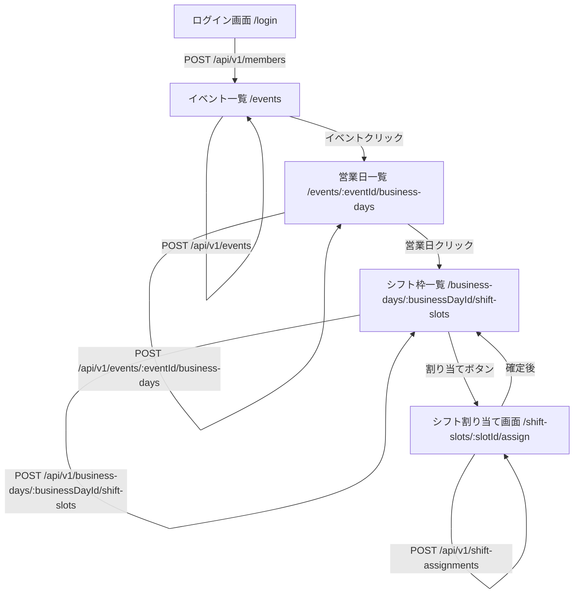

# VRC Shift Scheduler コードリーディング結果レポート

## 1. プロジェクト概要（STEP1の結果）

### このプロジェクトが解決しようとしている問題

- **問題**: VRChatイベント運営におけるシフト調整業務の複雑さ
  - 出演キャスト・スタッフの人数が多い
  - 通常営業と特別営業が混在
  - 外部サービスやスプレッドシートでの運用による情報分散
  - シフト調整の抜け漏れ、欠員対応の負荷

- **解決策**: シフト調整・シフト確定・関係者への共有を一元管理するWebアプリケーション

### 想定ユーザー

- **管理者（店長・副店長）**: イベント作成、営業日・シフト枠の設定、シフト割り当て
- **一般メンバー（キャスト・スタッフ）**: 自分のシフト確認

### ドキュメント上で明言されている主要機能

1. **テナント管理**: 複数のイベント運営チームを分離
2. **イベント管理**: 通常営業（反復パターン）と特別営業（単発日程）の両方に対応
3. **営業日管理**: イベントごとの営業日定義（深夜営業対応）
4. **シフト枠管理**: 営業日ごとの時間帯×インスタンス×ポジションの組み合わせ
5. **シフト割り当て**: メンバーへの手動割り当て（自動割り当ては将来実装予定）
6. **メンバー管理**: 表示名・Discord ID・メールアドレスによる識別
7. **通知・リマインド**: シフト確定通知、出勤前リマインド（現状はstub実装）
8. **監査ログ**: 重要操作の履歴記録（現状はstub実装）

### 今後やるべきタスクとして書かれているもの

- **Public Alpha テスト準備**: 一般人テスターが動作確認できる状態にする
- **インフラ整備**: Render/Railway へのデプロイ、データリセットスクリプト
- **UI/UX改善**: エラー表示の統一、ローディング表示、フォームバリデーション
- **機能追加**: イベント編集・削除、シフト割り当てキャンセル、日付範囲フィルタの完全実装
- **Discord Bot**: UI代替または補完としてのDiscord Bot実装（余裕があれば）

---

## 2. バックエンド構造とAPI一覧（STEP2の結果）

### (1) REST API 一覧表

| カテゴリ | HTTPメソッド | パス | 概要 | 関連ドメイン | 主に使う画面（推定可） |
|----------|--------------|------|------|--------------|------------------------|
| Health | GET | /health | ヘルスチェック | - | - |
| Event | POST | /api/v1/events | イベント作成 | Event | イベント一覧画面 |
| Event | GET | /api/v1/events | イベント一覧取得 | Event | イベント一覧画面 |
| Event | GET | /api/v1/events/{event_id} | イベント詳細取得 | Event | イベント詳細画面（未実装） |
| BusinessDay | POST | /api/v1/events/{event_id}/business-days | 営業日作成 | Event | 営業日一覧画面 |
| BusinessDay | GET | /api/v1/events/{event_id}/business-days | 営業日一覧取得 | Event | 営業日一覧画面 |
| BusinessDay | GET | /api/v1/business-days/{business_day_id} | 営業日詳細取得 | Event | 営業日詳細画面（未実装） |
| ShiftSlot | POST | /api/v1/business-days/{business_day_id}/shift-slots | シフト枠作成 | Shift | シフト枠一覧画面 |
| ShiftSlot | GET | /api/v1/business-days/{business_day_id}/shift-slots | シフト枠一覧取得 | Shift | シフト枠一覧画面 |
| ShiftSlot | GET | /api/v1/shift-slots/{slot_id} | シフト枠詳細取得 | Shift | シフト割り当て画面 |
| ShiftAssignment | POST | /api/v1/shift-assignments | シフト割り当て確定 | Shift | シフト割り当て画面 |
| ShiftAssignment | GET | /api/v1/shift-assignments | シフト割り当て一覧取得 | Shift | 自分のシフト一覧画面 |
| ShiftAssignment | GET | /api/v1/shift-assignments/{assignment_id} | シフト割り当て詳細取得 | Shift | シフト割り当て詳細画面（未実装） |
| Member | POST | /api/v1/members | メンバー作成 | Member | ログイン画面 |
| Member | GET | /api/v1/members | メンバー一覧取得 | Member | シフト割り当て画面 |
| Member | GET | /api/v1/members/{member_id} | メンバー詳細取得 | Member | メンバー詳細画面（未実装） |

**認証方式**: `X-Tenant-ID` ヘッダー必須、`X-Member-ID` ヘッダー（一部エンドポイントで必須）

### (2) 主要テーブル一覧表

| テーブル名 | 役割の概要 | 主なカラム例 |
|------------|------------|--------------|
| tenants | テナント情報（Multi-Tenant設計の基盤） | tenant_id, tenant_name, timezone, is_active, created_at, updated_at, deleted_at |
| events | イベント情報 | event_id, tenant_id, event_name, event_type, description, is_active, created_at, updated_at, deleted_at |
| recurring_patterns | 通常営業の定期パターン | pattern_id, tenant_id, event_id, pattern_type, config (JSONB), created_at, updated_at, deleted_at |
| event_business_days | 営業日（イベントごとの営業日定義） | business_day_id, tenant_id, event_id, target_date, start_time, end_time, occurrence_type, recurring_pattern_id, is_active, valid_from, valid_to, created_at, updated_at, deleted_at |
| positions | 役職（ポジション） | position_id, tenant_id, position_name, description, display_order, is_active, created_at, updated_at, deleted_at |
| shift_slots | シフト枠（役職・インスタンス・時間） | slot_id, tenant_id, business_day_id, position_id, slot_name, instance_name, start_time, end_time, required_count, priority, created_at, updated_at, deleted_at |
| shift_plans | シフト計画（集約ルート、現状は簡易実装） | plan_id, tenant_id, event_id, plan_name, plan_status, created_at, updated_at, deleted_at |
| shift_assignments | シフト割り当て | assignment_id, tenant_id, plan_id, slot_id, member_id, assignment_status, assignment_method, is_outside_preference, assigned_at, cancelled_at, created_at, updated_at, deleted_at |
| members | メンバー情報 | member_id, tenant_id, display_name, discord_user_id, email, is_active, created_at, updated_at, deleted_at |
| audit_logs | 監査ログ | log_id, tenant_id, entity_type, entity_id, action, actor_id, changed_data_before (JSONB), changed_data_after (JSONB), timestamp, created_at |
| notification_logs | 通知送信履歴（現状はテーブルのみ） | notification_log_id, tenant_id, member_id, notification_type, message_content, sent_status, sent_at, created_at |

**注意**: `shift_plans` テーブルは存在するが、現状のシフト割り当てAPIでは直接使用されていない（簡易実装のため）。

---

## 3. フロントエンド画面一覧（STEP3の結果）

### (1) 画面一覧表

| 画面ID | コンポーネント名 | URLパス例 | 主な目的 | 主な操作 | 呼び出すAPI（全て） |
|--------|------------------|-----------|----------|----------|---------------------|
| S01 | LoginPage | /login | ログイン（表示名による簡易認証） | 表示名入力, ログインボタン | POST /api/v1/members |
| S02 | EventListPage | /events | イベント一覧 | 新規作成ボタン, 詳細への遷移 | GET /api/v1/events, POST /api/v1/events |
| S03 | BusinessDayListPage | /events/:eventId/business-days | 営業日一覧 | 営業日追加, 詳細への遷移 | GET /api/v1/events/{eventId}/business-days, POST /api/v1/events/{eventId}/business-days |
| S04 | ShiftSlotListPage | /business-days/:businessDayId/shift-slots | シフト枠一覧 | シフト枠追加, 割り当てへの遷移 | GET /api/v1/business-days/{businessDayId}/shift-slots, POST /api/v1/business-days/{businessDayId}/shift-slots |
| S05 | AssignShiftPage | /shift-slots/:slotId/assign | シフト割り当て | メンバー選択, 確定ボタン | GET /api/v1/shift-slots/{slotId}, GET /api/v1/members, POST /api/v1/shift-assignments |
| S06 | MyShiftsPage | /my-shifts | 自分のシフト一覧 | 今後のシフト/過去のシフトのフィルタリング | GET /api/v1/shift-assignments?member_id={memberId} |

**認証**: 全画面（ログイン画面除く）で `localStorage.getItem('member_id')` による簡易認証チェック

**テナントID取得**: 
- URLパラメータ `?tenant_id=xxxxx` から取得（ログイン画面）
- 環境変数 `VITE_TENANT_ID` から取得（フォールバック）

---

## 4. ユーザーフロー図（Mermaid）（STEP4の結果）

### 管理者フロー（イベントを作り、営業日とシフト枠を作り、割り当てるまで）



### 一般メンバーフロー（ログインして、自分のシフトを確認するまで）

```mermaid
flowchart TD
    A[ログイン画面 /login] -->|POST /api/v1/members| B[イベント一覧 /events]
    B -->|GET /api/v1/events| B
    B -->|ナビゲーション| C[自分のシフト一覧 /my-shifts]
    C -->|GET /api/v1/shift-assignments?member_id={memberId}| C
    C -->|今後のシフト/過去のシフト タブ切り替え| C
```

---

## 5. 機能の抜け漏れチェック結果（STEP5の結果）

### 期待機能 vs 実装状況 一覧表

| 機能カテゴリ | 機能内容 | コード上の実装状況 | 関連画面ID | 関連APIパス | コメント（不足点や注意点など） |
|-------------|----------|-------------------|------------|-------------|------------------------------|
| ログイン・認証 | 表示名による簡易ログイン | **実装あり** | S01 | POST /api/v1/members | `web-frontend/src/pages/Login.tsx` で実装。メンバー作成APIをログインとして使用 |
| ログイン・認証 | テナントIDの自動取得 | **実装あり** | S01 | - | URLパラメータ `?tenant_id=xxxxx` または環境変数 `VITE_TENANT_ID` から取得（`Login.tsx` 14-19行目） |
| ログイン・認証 | メンバー自動登録機能 | **実装あり** | S01 | POST /api/v1/members | ログイン時に自動的にメンバーを作成（`Login.tsx` 40-43行目） |
| ログイン・認証 | ログアウト機能 | **実装あり** | - | - | `Layout.tsx` 7-11行目で実装。localStorage をクリアして `/login` にリダイレクト |
| イベント管理 | イベント一覧表示 | **実装あり** | S02 | GET /api/v1/events | `EventList.tsx` で実装。アクティブなイベントのみ表示（フィルタリングは未実装） |
| イベント管理 | イベント作成（通常/特別） | **実装あり** | S02 | POST /api/v1/events | `EventList.tsx` の `CreateEventModal` で実装。event_type で通常/特別を選択可能 |
| イベント管理 | イベント詳細表示 | **実装あり** | - | GET /api/v1/events/{event_id} | APIは実装済みだが、フロントエンドの詳細画面は未実装 |
| イベント管理 | イベント名・説明・種別の設定 | **実装あり** | S02 | POST /api/v1/events | 作成時に設定可能。編集機能は未実装（APIも未実装） |
| イベント管理 | イベント編集・削除 | **実装なし** | - | - | フロントエンドのAPIクライアントには `updateEvent`, `deleteEvent` が定義されているが、バックエンドAPIは未実装 |
| 営業日管理 | 営業日一覧表示 | **実装あり** | S03 | GET /api/v1/events/{eventId}/business-days | `BusinessDayList.tsx` で実装 |
| 営業日管理 | 営業日作成 | **実装あり** | S03 | POST /api/v1/events/{eventId}/business-days | `BusinessDayList.tsx` の `CreateBusinessDayModal` で実装。日付・開始時刻・終了時刻・種別を設定可能 |
| 営業日管理 | 営業日詳細表示 | **実装あり** | - | GET /api/v1/business-days/{business_day_id} | APIは実装済みだが、フロントエンドの詳細画面は未実装 |
| 営業日管理 | 通常営業/特別営業の区別 | **実装あり** | S03 | POST /api/v1/events/{eventId}/business-days | `occurrence_type` で `recurring` / `special` を区別 |
| 営業日管理 | 深夜営業対応 | **実装あり** | S03 | POST /api/v1/events/{eventId}/business-days | DBスキーマで `start_time < end_time OR end_time < start_time` の制約により対応（`002_create_event_business_days.up.sql` 32-34行目） |
| シフト枠管理 | シフト枠一覧表示 | **実装あり** | S04 | GET /api/v1/business-days/{businessDayId}/shift-slots | `ShiftSlotList.tsx` で実装 |
| シフト枠管理 | シフト枠作成 | **実装あり** | S04 | POST /api/v1/business-days/{businessDayId}/shift-slots | `ShiftSlotList.tsx` の `CreateShiftSlotModal` で実装。役職名・インスタンス名・時刻・必要人数を設定可能 |
| シフト枠管理 | シフト枠詳細表示 | **実装あり** | S05 | GET /api/v1/shift-slots/{slot_id} | `AssignShift.tsx` で使用 |
| シフト枠管理 | 割り当て状況の表示 | **部分実装** | S04 | GET /api/v1/business-days/{businessDayId}/shift-slots | `assigned_count` フィールドは存在するが、現状は常に 0 を返す（`shift_slot_handler.go` 231行目のTODOコメント） |
| シフト枠管理 | 満員状態の表示 | **実装なし** | S04 | - | `assigned_count` が実装されていないため、満員チェックができない |
| シフト割り当て | シフト割り当て画面 | **実装あり** | S05 | - | `AssignShift.tsx` で実装 |
| シフト割り当て | メンバー選択による手動割り当て | **実装あり** | S05 | POST /api/v1/shift-assignments | `AssignShift.tsx` で実装。プルダウンでメンバーを選択 |
| シフト割り当て | 備考の追加 | **実装あり** | S05 | POST /api/v1/shift-assignments | `note` フィールドで実装（`shift_assignment_handler.go` 33行目、108行目） |
| シフト割り当て | 割り当て確定機能 | **実装あり** | S05 | POST /api/v1/shift-assignments | `ShiftAssignmentService.ConfirmManualAssignment` 経由で実装（`shift_assignment_handler.go` 102-109行目） |
| シフト割り当て | 満員チェック機能 | **実装あり** | S05 | POST /api/v1/shift-assignments | サーバー側で実装。`required_count` を超えた場合は 409 Conflict を返す（`shift_assignment_service.go` で実装） |
| 自分のシフト管理 | 自分のシフト一覧表示 | **実装あり** | S06 | GET /api/v1/shift-assignments?member_id={memberId} | `MyShifts.tsx` で実装 |
| 自分のシフト管理 | 今後のシフト/過去のシフトのフィルタリング | **部分実装** | S06 | GET /api/v1/shift-assignments | `MyShifts.tsx` で `start_date` / `end_date` パラメータを使用してフィルタリングを試みているが、バックエンドAPIでは未実装（`shift_assignment_handler.go` 160行目のTODOコメント） |
| 自分のシフト管理 | シフト詳細情報表示 | **実装あり** | S06 | - | `MyShifts.tsx` で日付・時刻・役職・割り当て方法を表示 |
| 自分のシフト管理 | 確定済みシフトの確認 | **実装あり** | S06 | GET /api/v1/shift-assignments?assignment_status=confirmed | `MyShifts.tsx` 30行目で `assignment_status: 'confirmed'` を指定 |
| 認証まわり（重要） | パスワードによるログイン | **実装なし** | - | - | 現状は表示名のみの簡易認証。パスワード認証は未実装 |
| 認証まわり（重要） | 招待URLからのメンバー登録 | **実装あり** | S01 | - | URLパラメータ `?tenant_id=xxxxx` からテナントIDを取得して自動登録（`Login.tsx` 14-19行目） |

### 追加で見つかった機能（仕様メモに書かれていないが実装されているもの）

1. **ヘルスチェックエンドポイント**: `GET /health` - サーバーの稼働状況確認用
2. **シフト枠の優先度設定**: `priority` フィールドで優先度を設定可能（自動割り当て時に使用予定）
3. **シフト枠の深夜営業判定**: `is_overnight` フィールドで深夜営業かどうかを判定
4. **シフト割り当ての割り当て方法**: `assignment_method` で `auto` / `manual` を区別（現状は `manual` のみ）
5. **シフト割り当ての希望外フラグ**: `is_outside_preference` で希望外割り当てを記録（現状は未使用）
6. **メンバーのアクティブ状態**: `is_active` フィールドでメンバーの有効/無効を管理
7. **イベントのアクティブ状態**: `is_active` フィールドでイベントの有効/無効を管理
8. **論理削除（Soft Delete）**: 全テーブルで `deleted_at` カラムによる論理削除を実装

---

## 6. Public Alpha 前に優先すべき改善ポイント（箇条書き）

以下の改善点は、**コードを読んだ結果に基づいて**特定しました。

1. **シフト枠の割り当て状況表示の実装**
   - 現状: `assigned_count` が常に 0 を返す（`shift_slot_handler.go` 231行目）
   - 改善: `shift_assignments` テーブルを JOIN して実際の割り当て数を取得する実装が必要
   - 影響: 満員状態の表示ができない

2. **自分のシフト一覧の日付範囲フィルタリングの実装**
   - 現状: フロントエンドで `start_date` / `end_date` を送信しているが、バックエンドで未実装（`shift_assignment_handler.go` 160行目のTODO）
   - 改善: `GetAssignments` ハンドラーで日付範囲フィルタを実装
   - 影響: 「今後のシフト」「過去のシフト」のフィルタリングが正しく動作しない

3. **エラーハンドリングの統一とユーザーフレンドリーな表示**
   - 現状: エラーメッセージが技術的すぎる可能性がある
   - 改善: エラーメッセージを日本語化し、ユーザーが理解しやすい形式に統一
   - 影響: テスターがエラーの原因を理解しにくい

4. **入力バリデーションの強化**
   - 現状: 一部のバリデーションが不足している可能性がある（例: 日付形式、時刻形式）
   - 改善: フロントエンドとバックエンドの両方でバリデーションを強化
   - 影響: 不正なデータが登録される可能性がある

5. **ローディング状態の表示**
   - 現状: 一部の画面でローディング表示が未実装
   - 改善: 全画面でローディングスピナーを表示
   - 影響: ユーザーが処理中かどうか判断しにくい

6. **テナント境界の徹底確認**
   - 現状: 全リポジトリで `tenant_id` チェックが実装されているが、念のため確認が必要
   - 改善: 全クエリで `tenant_id` が確実に含まれているか確認（`TASKS_PUBLIC_ALPHA_RELEASE.md` A-5.1参照）
   - 影響: セキュリティリスク（他テナントのデータが見える可能性）

7. **シフト割り当ての同時実行テスト**
   - 現状: `ShiftAssignmentService` で `SELECT ... FOR UPDATE` を使用しているが、統合テストが未実装（`TASKS_PUBLIC_ALPHA_RELEASE.md` A-1.2参照）
   - 改善: 同時確定制御の統合テストを実装
   - 影響: 満員チェックが正しく動作しない可能性がある

8. **イベント編集・削除機能の実装**
   - 現状: フロントエンドのAPIクライアントには定義されているが、バックエンドAPIが未実装
   - 改善: `PUT /api/v1/events/{event_id}`, `DELETE /api/v1/events/{event_id}` を実装
   - 影響: 誤って作成したイベントを削除できない

9. **シフト割り当てキャンセル機能の実装**
   - 現状: フロントエンドのAPIクライアントには定義されているが、バックエンドAPIが未実装
   - 改善: `PATCH /api/v1/shift-assignments/{assignment_id}/status` または `DELETE /api/v1/shift-assignments/{assignment_id}` を実装
   - 影響: 誤って割り当てたシフトをキャンセルできない

10. **データリセットスクリプトの整備**
    - 現状: シードコマンドは実装済みだが、データリセットスクリプトが未実装（`TASKS_PUBLIC_ALPHA_RELEASE.md` C-2.2参照）
    - 改善: `scripts/reset_db.sh` を実装
    - 影響: テストデータのリセットが手動でしかできない

---

## 補足: コード上の実装詳細

### バックエンドの主要ファイル

- **ルーター**: `backend/internal/interface/rest/router.go`
- **認証ミドルウェア**: `backend/internal/interface/rest/middleware.go` (Auth関数)
- **イベントハンドラー**: `backend/internal/interface/rest/event_handler.go`
- **営業日ハンドラー**: `backend/internal/interface/rest/business_day_handler.go`
- **シフト枠ハンドラー**: `backend/internal/interface/rest/shift_slot_handler.go`
- **シフト割り当てハンドラー**: `backend/internal/interface/rest/shift_assignment_handler.go`
- **メンバーハンドラー**: `backend/internal/interface/rest/member_handler.go`
- **シフト割り当てサービス**: `backend/internal/app/shift_assignment_service.go` (Application Service)

### フロントエンドの主要ファイル

- **ルーティング**: `web-frontend/src/App.tsx`
- **APIクライアント**: `web-frontend/src/lib/apiClient.ts`
- **ログイン画面**: `web-frontend/src/pages/Login.tsx`
- **イベント一覧**: `web-frontend/src/pages/EventList.tsx`
- **営業日一覧**: `web-frontend/src/pages/BusinessDayList.tsx`
- **シフト枠一覧**: `web-frontend/src/pages/ShiftSlotList.tsx`
- **シフト割り当て**: `web-frontend/src/pages/AssignShift.tsx`
- **自分のシフト一覧**: `web-frontend/src/pages/MyShifts.tsx`

### ドメインモデル

- **Event**: `backend/internal/domain/event/event.go`
- **EventBusinessDay**: `backend/internal/domain/event/business_day.go`
- **Member**: `backend/internal/domain/member/member.go`
- **ShiftSlot**: `backend/internal/domain/shift/shift_slot.go`
- **ShiftAssignment**: `backend/internal/domain/shift/shift_assignment.go`

---

**作成日**: 2025-01-XX  
**作成者**: コードリーディングツール（Auto）

