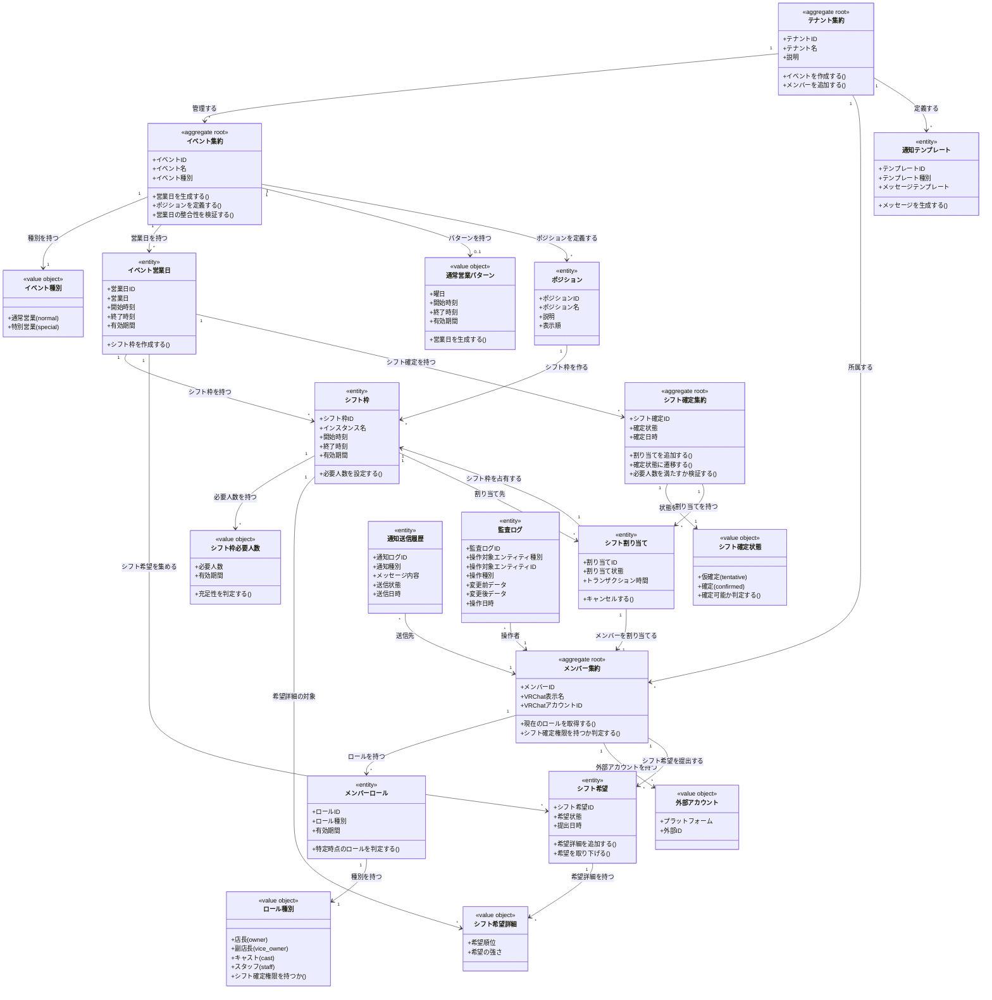

# VRC Shift Scheduler プロジェクト全体ドメインモデル

## 概要

VRC Shift Scheduler は、VRChatイベント運営におけるシフト調整業務を一元管理するシステムである。
本ドメインは、テナント（団体・店舗）を最上位の境界として、イベント・メンバー・シフト希望・シフト確定・通知・監査の全体像を統合的に管理する責務を持つ。
テナント境界を厳格に保ち、各テナント内で独立したシフト調整プロセスを実現する。

## 主要な概念

### テナント集約（Tenant Aggregate）（集約ルート）

VRChatで活動する1つの団体・店舗・イベント運営チームを表す集約ルート。
全てのイベント・メンバー・シフト情報の境界として機能し、テナント間でのデータ混在を防ぐ不変条件を保証する。
1つのテナントは通常1つのDiscordサーバに対応し、そのコミュニティ内でのシフト管理を完結させる。

### イベント集約（Event Aggregate）（集約ルート）

テナントが運営する営業・イベントの単位を表す集約ルート。
通常営業（反復パターン）と特別営業（単発日程）の両方を管理し、営業日・ポジション・シフト枠の生成と整合性を保証する責務を持つ。
イベント種別（通常営業/特別営業）によって異なるライフサイクル管理を行う。

### メンバー集約（Member Aggregate）（集約ルート）

テナントに所属するキャスト・店長・スタッフを表す集約ルート。
VRChatアカウント情報・ロール（店長/副店長/キャスト/スタッフ）・外部アカウント（Discord IDなど）を管理し、シフト確定権限の判定を行う。
ロール変更の履歴を保持し、特定時点でのメンバーの権限を正確に再現可能にする。

### シフト確定集約（Shift Plan Aggregate）（集約ルート）

運営が作成する最終的な配置計画を表す集約ルート。
特定の営業日に対するシフト割り当て全体を束ね、仮確定→確定の状態遷移と、各枠への人員配置の整合性を保証する。
必要人数の充足性チェック、重複配置の防止、希望との整合性確認を担う。

### シフト希望（Availability）（エンティティ）

メンバーが申告する出勤可能性を表すエンティティ。
特定の営業日に対する参加希望・希望時間帯・希望ポジション・優先度を保持し、シフト確定の入力情報として機能する。
提出済み/取下げの状態を持ち、締切管理と組み合わせて希望収集プロセスを制御する。

### イベント種別（Event Type）（区分オブジェクト）

イベントの反復パターンの有無を区別する区分オブジェクト。
通常営業（normal）と特別営業（special）を識別し、営業日生成ロジックの分岐を決定する。

### ロール種別（Role Type）（区分オブジェクト）

メンバーの権限レベルを表す区分オブジェクト。
店長（owner）・副店長（vice_owner）・キャスト（cast）・スタッフ（staff）を識別し、シフト確定権限の有無を判定する基準となる。

### シフト確定状態（Shift Plan Status）（区分オブジェクト）

シフト確定のライフサイクルを表す区分オブジェクト。
仮確定（tentative）・確定（confirmed）の状態を持ち、メンバーへの通知タイミングと変更可能性を制御する。

## イベント種別の詳細

### 1. 通常営業（Normal Event）

- **対象**: 毎週特定曜日に反復開催されるレギュラー営業
- **特徴**: `event_recurring_patterns`で曜日・時間帯パターンを定義し、営業日を自動生成する
- **例**: 「毎週木曜 21:30〜23:00 シトロン通常営業」

### 2. 特別営業（Special Event）

- **対象**: 特定日程のみの単発イベント（Vket期間の臨時営業、コラボイベントなど）
- **特徴**: 営業日を個別に登録し、通常営業とは独立したポジション・シフト枠を設定できる
- **例**: 「2025-11-11 Vket特別営業 21:30〜25:00」

## ロール種別の詳細

### 1. 店長（Owner）

- **対象**: テナントの最終責任者
- **特徴**: シフト確定権限を持ち、全てのシフト操作が可能
- **例**: テナント「シトロン」の店長アリス

### 2. 副店長（Vice Owner）

- **対象**: 店長を補佐し、シフト確定業務を分担するメンバー
- **特徴**: 店長と同等のシフト確定権限を持つ
- **例**: 店長不在時にシフト確定を行う副店長ボブ

### 3. キャスト（Cast）

- **対象**: お客さまと直接接客する出演者
- **特徴**: シフト希望を提出し、確定されたシフトに従って出勤する
- **例**: カウンター・テーブル担当のキャストメンバー

### 4. スタッフ（Staff）

- **対象**: 受付・場内案内・撮影補助などを行う裏方メンバー
- **特徴**: キャスト同様にシフト希望を提出し、裏方ポジションに配置される
- **例**: 受付スタッフ、カメラマンスタッフ

## シフト確定状態の詳細

### 1. 仮確定（Tentative）

- **対象**: シフト割り当てが完了したが、まだメンバーへの正式通知前の状態
- **特徴**: 変更が容易であり、最終調整が可能
- **例**: 店長が一旦割り当てを完了し、最終確認待ちの状態

### 2. 確定（Confirmed）

- **対象**: シフト割り当てが確定し、メンバーに通知済みの状態
- **特徴**: 変更には監査ログ記録と再通知が必要
- **例**: 全メンバーに確定通知が送信され、出勤準備が始まった状態

## テナント・イベント・営業日・シフト枠の階層構造

### 階層構造の理解

VRC Shift Schedulerのドメインモデルは、以下の4層構造で営業とシフトを管理する：

- **テナント（Tenant）**: 団体・店舗の単位（例: シトロン）
- **イベント（Event）**: テナントが開催する企画単位（通常営業/特別営業など）
- **イベント営業日（Event Business Day）**: イベントごとの営業日単位
- **シフト枠（Shift Slot）**: 営業日の中の時間帯×インスタンス×ポジションの組み合わせ（例: 21:30-23:00 第一インスタンス カウンターA）

### 具体例

```
シトロン（テナント）
├── シトロン通常営業（イベント: 通常営業種別）
│   ├── 通常営業パターン: 毎週木曜 21:30-23:00
│   ├── 2025-02-13（イベント営業日）
│   │   ├── 21:30-23:00 第一インスタンス カウンター枠（シフト枠）
│   │   └── 21:30-23:00 第一インスタンス テーブル枠（シフト枠）
│   └── 2025-02-20（イベント営業日）
│       ├── 21:30-23:00 第一インスタンス カウンター枠（シフト枠）
│       └── 21:30-23:00 第一インスタンス テーブル枠（シフト枠）
├── Vket特別営業（イベント: 特別営業種別）
│   └── 2025-11-11（イベント営業日）
│       ├── 21:30-23:00 第一インスタンス 司会枠（シフト枠）
│       └── 23:00-25:00 第一インスタンス カウンター枠（シフト枠）
└── メンバー
    ├── アリス（店長）
    ├── ボブ（キャスト）
    └── チャーリー（スタッフ）
```

この構造により、同一テナント内で複数種類のイベントを並行運営でき、それぞれ独立したシフト調整が可能になる。

## シフト希望からシフト確定までの業務フロー

### フロー概要

```
1. シフト募集開始通知（Notification）
   ↓
2. メンバーがシフト希望を提出（Availability）
   ↓
3. 締切到達
   ↓
4. 店長/副店長がシフト希望を確認
   ↓
5. シフト確定作成・割り当て実施（Shift Plan）
   ↓
6. 仮確定状態での最終調整
   ↓
7. 確定状態への遷移
   ↓
8. シフト確定通知送信（Notification）
   ↓
9. 出勤前リマインド送信（Notification）
```

### 欠員発生時のフロー

```
1. メンバーのシフト割り当てキャンセル（Shift Assignment Cancel）
   ↓
2. 監査ログ記録（Audit Log）
   ↓
3. 補欠募集通知送信（Urgent Help Request Notification）
   ↓
4. 代替メンバーのシフト希望提出（Availability）
   ↓
5. 代替メンバーのシフト割り当て（Shift Assignment）
   ↓
6. 確定通知送信（Notification）
```

## ドメインモデル図



## 制約条件と業務ルール

### テナント境界制約

1. **テナント分離**: 全てのシフト関連データは必ず1つのテナントに属し、テナント間でのデータ参照・変更は禁止される
2. **テナントIDの伝播**: イベント・メンバー・通知・監査ログは全てテナントIDを直接または間接的に保持する

### イベントと営業日制約

1. **営業日の一意性**: 同一テナント内で、同一イベント・同一日時に重複した営業定義を持つことはできない
2. **パターン整合性**: 通常営業イベントは`RecurringPattern`を持ち、特別営業イベントは個別の`EventBusinessDay`のみを持つ
3. **営業日生成ルール**: 通常営業パターンから生成された営業日は、パターンの有効期間内の該当曜日にのみ存在する

### シフト枠とポジション制約

1. **ポジションの所属**: シフト枠が参照するポジションは、そのシフト枠の営業日が属するイベントで定義されたポジションでなければならない
2. **必要人数の正数性**: シフト枠の必要人数は1以上の正の整数でなければならない
3. **時刻の順序性**: シフト枠の開始時刻は終了時刻よりも前でなければならない

### シフト希望とシフト確定制約

1. **希望の営業日整合性**: シフト希望詳細が参照するシフト枠は、シフト希望が対象とする営業日に属するシフト枠でなければならない
2. **確定の営業日整合性**: シフト確定のシフト割り当てが参照するシフト枠は、そのシフト確定が対象とする営業日に属するシフト枠でなければならない
3. **重複配置の防止**: 同一シフト枠に対して、確定状態のシフト割り当ては必要人数を超えてはならない
4. **状態遷移の順序性**: シフト確定は「仮確定」から「確定」への一方向遷移のみ許可される（確定後の仮確定への戻しは新規作成として扱う）

### メンバーとロール制約

1. **ロール有効期間の重複禁止**: 同一メンバーに対して、有効期間が重複する同一ロール種別のロールは存在してはならない
2. **シフト確定権限**: シフト確定の作成者は、作成時点で店長または副店長ロールを持つメンバーでなければならない
3. **外部アカウントの一意性**: 同一プラットフォーム・同一外部IDの組み合わせは、テナント内で一意でなければならない

### 監査ログ制約

1. **全操作の記録**: シフト確定の作成・更新・削除、シフト割り当ての変更は必ず監査ログに記録される
2. **操作者の記録**: 監査ログには操作を行ったメンバーIDが必須で記録される
3. **変更履歴の保持**: 更新・削除操作では変更前データと変更後データの両方が記録される

