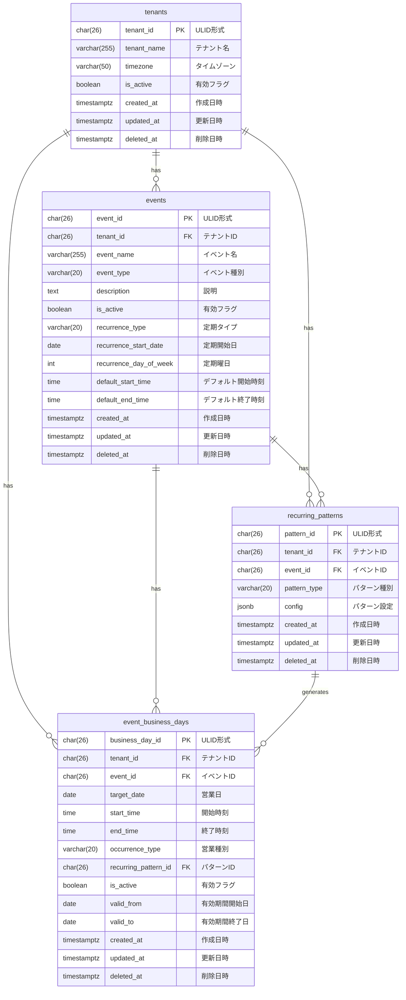

# テナントとイベント データモデル

## 概要

テナントとイベントドメインのデータベーススキーマを定義する。
PostgreSQLを使用し、マルチテナント設計を実現する。

## ER図



## テーブル定義

### tenants テーブル

テナント（組織）を管理するテーブル。全てのデータの最上位境界。

| カラム名 | データ型 | NULL | デフォルト | 説明 |
|----------|----------|------|------------|------|
| tenant_id | CHAR(26) | NO | - | 主キー（ULID形式） |
| tenant_name | VARCHAR(255) | NO | - | テナント名（1文字以上） |
| timezone | VARCHAR(50) | NO | 'Asia/Tokyo' | タイムゾーン |
| is_active | BOOLEAN | NO | true | 有効フラグ |
| created_at | TIMESTAMPTZ | NO | CURRENT_TIMESTAMP | 作成日時 |
| updated_at | TIMESTAMPTZ | NO | CURRENT_TIMESTAMP | 更新日時 |
| deleted_at | TIMESTAMPTZ | YES | NULL | 削除日時（ソフトデリート） |

**制約**:
- `tenants_tenant_name_check`: `LENGTH(tenant_name) >= 1`

**インデックス**:
- `idx_tenants_is_active`: `(is_active) WHERE deleted_at IS NULL`
- `idx_tenants_deleted_at`: `(deleted_at) WHERE deleted_at IS NOT NULL`

### events テーブル

イベント（営業ブランド・企画）を管理するテーブル。集約ルート。

| カラム名 | データ型 | NULL | デフォルト | 説明 |
|----------|----------|------|------------|------|
| event_id | CHAR(26) | NO | - | 主キー（ULID形式） |
| tenant_id | CHAR(26) | NO | - | テナントID（FK） |
| event_name | VARCHAR(255) | NO | - | イベント名（1文字以上） |
| event_type | VARCHAR(20) | NO | 'normal' | イベント種別 |
| description | TEXT | YES | NULL | 説明 |
| is_active | BOOLEAN | NO | true | 有効フラグ |
| recurrence_type | VARCHAR(20) | NO | 'none' | 定期タイプ |
| recurrence_start_date | DATE | YES | NULL | 定期開始日 |
| recurrence_day_of_week | INT | YES | NULL | 定期曜日（0-6） |
| default_start_time | TIME | YES | NULL | デフォルト開始時刻 |
| default_end_time | TIME | YES | NULL | デフォルト終了時刻 |
| created_at | TIMESTAMPTZ | NO | CURRENT_TIMESTAMP | 作成日時 |
| updated_at | TIMESTAMPTZ | NO | CURRENT_TIMESTAMP | 更新日時 |
| deleted_at | TIMESTAMPTZ | YES | NULL | 削除日時（ソフトデリート） |

**外部キー**:
- `fk_events_tenant`: `tenant_id` → `tenants(tenant_id)` ON DELETE CASCADE

**制約**:
- `events_event_type_check`: `event_type IN ('normal', 'special')`
- `events_event_name_check`: `LENGTH(event_name) >= 1`
- `events_recurrence_type_check`: `recurrence_type IN ('none', 'weekly', 'biweekly')`
- `events_recurrence_day_of_week_check`: `recurrence_day_of_week IS NULL OR (recurrence_day_of_week >= 0 AND recurrence_day_of_week <= 6)`

**インデックス**:
- `idx_events_tenant_event_name_unique`: `UNIQUE (tenant_id, event_name) WHERE deleted_at IS NULL`
- `idx_events_tenant_is_active`: `(tenant_id, is_active) WHERE deleted_at IS NULL`

### recurring_patterns テーブル

定期パターン（営業日生成ルール）を管理するテーブル。

| カラム名 | データ型 | NULL | デフォルト | 説明 |
|----------|----------|------|------------|------|
| pattern_id | CHAR(26) | NO | - | 主キー（ULID形式） |
| tenant_id | CHAR(26) | NO | - | テナントID（FK） |
| event_id | CHAR(26) | NO | - | イベントID（FK） |
| pattern_type | VARCHAR(20) | NO | - | パターン種別 |
| config | JSONB | NO | - | パターン設定 |
| created_at | TIMESTAMPTZ | NO | CURRENT_TIMESTAMP | 作成日時 |
| updated_at | TIMESTAMPTZ | NO | CURRENT_TIMESTAMP | 更新日時 |
| deleted_at | TIMESTAMPTZ | YES | NULL | 削除日時（ソフトデリート） |

**外部キー**:
- `fk_recurring_patterns_tenant`: `tenant_id` → `tenants(tenant_id)` ON DELETE CASCADE
- `fk_recurring_patterns_event`: `event_id` → `events(event_id)` ON DELETE CASCADE

**制約**:
- `recurring_patterns_type_check`: `pattern_type IN ('weekly', 'monthly_date', 'custom')`

**インデックス**:
- `idx_recurring_patterns_tenant_event_unique`: `UNIQUE (tenant_id, event_id) WHERE deleted_at IS NULL`
- `idx_recurring_patterns_event`: `(event_id) WHERE deleted_at IS NULL`

**config JSONB の例**:
```json
// Weekly パターン
{
  "day_of_weeks": ["MON", "FRI"],
  "start_time": "21:30",
  "end_time": "23:00"
}

// MonthlyDate パターン
{
  "dates": [1, 15],
  "start_time": "21:30",
  "end_time": "23:00"
}
```

### event_business_days テーブル

イベント営業日（シフト対象となる1回分の営業日）を管理するテーブル。

| カラム名 | データ型 | NULL | デフォルト | 説明 |
|----------|----------|------|------------|------|
| business_day_id | CHAR(26) | NO | - | 主キー（ULID形式） |
| tenant_id | CHAR(26) | NO | - | テナントID（FK） |
| event_id | CHAR(26) | NO | - | イベントID（FK） |
| target_date | DATE | NO | - | 営業日 |
| start_time | TIME | NO | - | 開始時刻 |
| end_time | TIME | NO | - | 終了時刻 |
| occurrence_type | VARCHAR(20) | NO | - | 営業種別 |
| recurring_pattern_id | CHAR(26) | YES | NULL | 生成元パターンID（FK） |
| is_active | BOOLEAN | NO | true | 有効フラグ |
| valid_from | DATE | YES | NULL | 有効期間開始日 |
| valid_to | DATE | YES | NULL | 有効期間終了日 |
| created_at | TIMESTAMPTZ | NO | CURRENT_TIMESTAMP | 作成日時 |
| updated_at | TIMESTAMPTZ | NO | CURRENT_TIMESTAMP | 更新日時 |
| deleted_at | TIMESTAMPTZ | YES | NULL | 削除日時（ソフトデリート） |

**外部キー**:
- `fk_event_business_days_tenant`: `tenant_id` → `tenants(tenant_id)` ON DELETE CASCADE
- `fk_event_business_days_event`: `event_id` → `events(event_id)` ON DELETE CASCADE
- `fk_event_business_days_pattern`: `recurring_pattern_id` → `recurring_patterns(pattern_id)` ON DELETE SET NULL

**制約**:
- `event_business_days_time_check`: `start_time < end_time OR end_time < start_time`（深夜営業対応）
- `event_business_days_occurrence_type_check`: `occurrence_type IN ('recurring', 'special')`
- `event_business_days_pattern_consistency_check`:
  - `(occurrence_type = 'recurring' AND recurring_pattern_id IS NOT NULL) OR (occurrence_type = 'special' AND recurring_pattern_id IS NULL)`
- `event_business_days_valid_period_check`:
  - `(valid_from IS NULL AND valid_to IS NULL) OR (valid_from IS NOT NULL AND valid_to IS NOT NULL AND valid_from <= valid_to)`

**インデックス**:
- `idx_event_business_days_tenant_event_date_time_unique`: `UNIQUE (tenant_id, event_id, target_date, start_time) WHERE deleted_at IS NULL`
- `idx_event_business_days_tenant_date`: `(tenant_id, target_date) WHERE deleted_at IS NULL`
- `idx_event_business_days_event_date`: `(event_id, target_date) WHERE deleted_at IS NULL`
- `idx_event_business_days_event_active`: `(event_id, is_active, target_date) WHERE deleted_at IS NULL`

## 区分値

### event_type

| 値 | 説明 |
|----|------|
| normal | 通常営業 |
| special | 特別イベント |

### recurrence_type

| 値 | 説明 |
|----|------|
| none | 定期なし |
| weekly | 毎週 |
| biweekly | 隔週 |

### pattern_type

| 値 | 説明 |
|----|------|
| weekly | 曜日指定 |
| monthly_date | 月内日付指定 |
| custom | カスタム |

### occurrence_type

| 値 | 説明 |
|----|------|
| recurring | 定期営業（パターンから生成） |
| special | 特別営業（明示的登録） |

## マイグレーションファイル

- `001_create_tenants_events_and_patterns.up.sql`: tenants, events, recurring_patterns テーブル作成
- `002_create_event_business_days.up.sql`: event_business_days テーブル作成
- `017_add_recurrence_to_events.up.sql`: events テーブルに定期設定カラム追加
