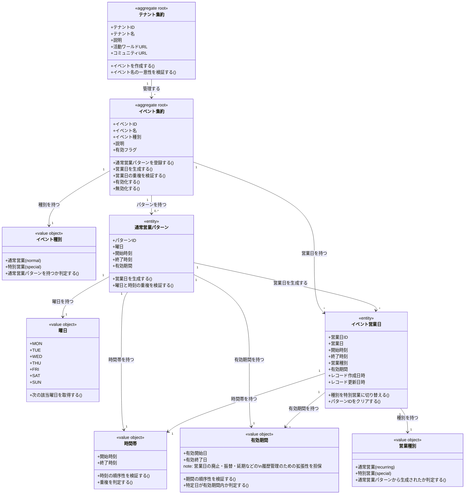

# テナントとイベントドメインモデル

## 概要

テナントとイベントドメインは、VRChatイベント運営における営業スケジュールの土台を提供する。
テナント（箱・団体）を最上位の境界として、その配下で複数のイベント（通常営業・特別営業）を統合管理し、シフト調整の対象となる営業日を一元的に生成・管理する責務を持つ。
通常営業パターン（反復スケジュール）と特別営業日（単発日程）の両方に対応し、3ヶ月単位での営業日自動生成を実現する。

## 主要な概念

### テナント集約（Tenant Aggregate）（集約ルート）

VRChatで活動するひとつのコンカフェ・イベント運営チームを表す集約ルート。
全てのイベント・メンバー・シフト情報の境界として機能し、テナント間でのデータ混在を厳格に防ぐ不変条件を保証する。
通常は1つのDiscordサーバに対応し、名称・説明・活動ワールドURL・コミュニティURLを保持する。

### イベント集約（Event Aggregate）（集約ルート）

テナントが継続的に行う営業ブランド・企画の単位を表す集約ルート。
通常営業（反復パターン）と特別営業（単発日程）の両方を管理し、営業日の生成・変更・削除の整合性を保証する責務を持つ。
同一テナント内では一意の名称を持ち、有効/無効の状態を管理する。

### イベント種別（Event Type）（区分オブジェクト）

イベントの反復パターンの有無を区別する区分オブジェクト。
通常営業（normal）と特別営業（special）を識別し、営業日生成ロジックの分岐を決定する。

### 通常営業パターン（Recurring Pattern）（エンティティ）

曜日・時間帯が反復する営業の定義を表すエンティティ。
曜日（MON-SUN）・開始時刻・終了時刻・有効期間を保持し、3ヶ月単位での営業日自動生成の入力情報として機能する。
同一イベント内で、曜日と時間帯が完全に重複する通常営業パターンを二重に定義することは禁止される。

### イベント営業日（Event Business Day）（エンティティ）

実際にシフトを組む対象となる「1回分の営業日」を表すエンティティ。
通常営業パターンから自動生成される日付と、特別営業日として明示的に登録された日付の両方を含む。
営業日・開始時刻・終了時刻・営業種別（recurring/special）・有効期間を保持し、シフト枠作成の基盤となる。

**有効期間（ValidPeriod）の用途**:  
営業日エンティティの有効期間は、営業日の廃止・振替・延期などの履歴管理を可能にする。
現時点では営業日（business_date）と同じ日付を設定するが、将来的に「この営業日は○月○日から○月○日まで有効だった」という履歴を記録する拡張性を担保している。

### 営業種別（Occurrence Type）（区分オブジェクト）

営業日の生成元を区別する区分オブジェクト。
通常営業（recurring）と特別営業（special）を識別し、営業日の管理方法を決定する。
通常営業と特別営業が同一日時に重複する場合、種別のみを「special」に切り替える。

## イベント種別の詳細

### 1. 通常営業（Normal Event）

- **対象**: 週1回など、曜日と時間帯が反復するレギュラー営業
- **特徴**: `RecurringPattern`を定義し、3ヶ月単位で営業日を自動生成する
- **例**: 「シトロンヴェール」毎週木曜 21:30〜23:00

### 2. 特別営業（Special Event）

- **対象**: Vket期間の臨時営業やコラボイベントなど、特定日程のみの単発営業
- **特徴**: 営業日を個別に登録し、通常営業とは独立した時間帯設定が可能
- **例**: 「Vketラウンジ営業」2025-11-11 21:30〜25:00

## 営業種別の詳細

### 1. 通常営業（Recurring）

- **対象**: 通常営業パターンから自動生成された営業日
- **特徴**: `recurring_pattern_id`を保持し、パターン変更時に再生成の対象となる
- **例**: 毎週木曜のパターンから生成された2025-12-05の営業日

### 2. 特別営業（Special）

- **対象**: 明示的に登録された単発の営業日、または通常営業を上書きした営業日
- **特徴**: `recurring_pattern_id`がNULLであり、個別の時間帯設定が可能
- **例**: Vket期間の特別営業として登録された2025-11-11の営業日

## 通常営業と特別営業の同一日時重複の扱い

### 重複時の動作

通常営業パターンから生成された営業日と同一日時に特別営業を定義する場合、以下のルールに従う：

1. **営業日は重複せず1件のみ**: 同一テナント・同一イベント・同一日時の営業日は1件のみ存在する
2. **種別の切り替え**: 既存の営業日の `occurrence_type` を `recurring` から `special` に更新する
3. **パターンIDのクリア**: `recurring_pattern_id` を NULL に設定し、通常営業パターンとの紐づきを解除する

### 具体例

```
【初期状態】
2025-12-04（木） 21:30-23:00 （通常営業パターンから生成）
  - occurrence_type: recurring
  - recurring_pattern_id: 毎週木曜パターンのID

【特別営業として定義後】
2025-12-04（木） 21:30-23:00 （クリスマス特別営業）
  - occurrence_type: special
  - recurring_pattern_id: NULL
```

この設計により、「この日はクリスマス営業だった」という情報を営業日レベルで表現できる。

## テナント・イベント・営業日の階層構造

### 階層構造の理解

テナントとイベントドメインは、以下の3層構造で営業スケジュールを管理する：

- **テナント（Tenant）**: 団体・店舗の単位（例: シトロン）
- **イベント（Event）**: テナントが開催する営業ブランド単位（例: シトロンヴェール）
- **イベント営業日（Event Business Day）**: イベントの具体的な営業日単位（例: 2025-12-05 21:30-23:00）

### 具体例

```
シトロン（テナント）
├── シトロンヴェール（イベント: 通常営業種別）
│   ├── 通常営業パターン: 毎週木曜 21:30-23:00
│   ├── 営業日: 2025-12-05（木） 21:30-23:00 [通常営業]
│   ├── 営業日: 2025-12-12（木） 21:30-23:00 [通常営業]
│   ├── 営業日: 2025-12-19（木） 21:30-23:00 [通常営業]
│   └── 営業日: 2025-12-26（木） 21:30-23:00 [通常営業]
└── Vketラウンジ営業（イベント: 特別営業種別）
    ├── 営業日: 2025-11-11（月） 21:30-25:00 [特別営業]
    └── 営業日: 2025-11-12（火） 21:30-25:00 [特別営業]
```

この構造により、同一テナント内で複数種類のイベントを並行運営でき、それぞれ独立した営業スケジュールを持つことができる。

## 営業日自動生成の業務フロー

### 通常営業パターンからの営業日生成フロー

```
1. 通常営業パターン登録（Recurring Pattern）
   ↓
2. 3ヶ月単位での営業日生成対象期間の決定
   ↓
3. 曜日と時間帯に基づいた営業日の自動生成（Event Business Day）
   ↓
4. 営業日に対するシフト枠作成（別ドメイン）
```

### 特別営業日の追加フロー

```
1. イベント選択
   ↓
2. 特別営業日の日付・時間帯を指定
   ↓
3. 既存の営業日との重複チェック
   ↓
4a. 重複なし: 新規営業日レコード作成
   ↓
4b. 重複あり: 既存営業日の種別を「special」に切り替え
```

### 通常営業パターン変更時の再生成フロー

```
1. 通常営業パターンの更新（曜日・時刻変更）
   ↓
2. 未来の営業日のうち、該当パターンから生成された営業日を削除
   ↓
3. 新しいパターンに基づいた営業日を再生成
   ↓
4. 過去の営業日は履歴として保持（削除しない）
```

## ドメインモデル図



## 制約条件と業務ルール

### テナント境界制約

1. **テナント分離**: 全てのイベント・営業日は必ず1つのテナントに属し、テナント間でのデータ参照・変更は禁止される
2. **イベント名の一意性**: 同一テナント内でイベント名称は一意でなければならない
3. **テナントIDの伝播**: イベント営業日は `tenant_id` を直接保持し、テナント境界をDBレベルで表現する

### イベント制約

1. **イベントの所属**: イベントは必ず1つのテナントに属する
2. **イベント種別の適切性**: 通常営業イベントは通常営業パターンを持ち、特別営業イベントは個別営業日のみを持つ
3. **有効フラグ**: 無効化されたイベントに対しては、新規営業日の生成・シフト募集を行ってはならない

### 通常営業パターン制約

1. **パターンの所属**: 通常営業パターンは必ず1つのイベントに属する
2. **曜日と時刻の一意性**: 同一イベント内で、曜日・開始時刻・終了時刻が完全に一致する通常営業パターンを二重に定義してはならない
3. **時刻の順序性**: 開始時刻は終了時刻よりも前でなければならない（ただし、深夜営業では日付をまたぐ場合を考慮）
4. **有効期間の順序性**: 有効開始日は有効終了日よりも前でなければならない

### イベント営業日制約

1. **営業日の所属**: 営業日は必ず1つのイベントに属する
2. **営業日の一意性**: 同一テナント・同一イベント内で、同一日付・同一開始時刻の営業日は1件のみ存在する
3. **営業種別の整合性**: `occurrence_type` が `recurring` の場合、`recurring_pattern_id` は NULL であってはならない
4. **営業種別の整合性**: `occurrence_type` が `special` の場合、`recurring_pattern_id` は NULL でなければならない
5. **パターンの所属整合性**: `recurring_pattern_id` が NULL でない場合、そのパターンは営業日が属するイベントのパターンでなければならない
6. **有効期間と営業日の整合性**: 営業日の有効期間（valid_from, valid_to）は営業日（business_date）と同じ日付を設定する（将来の廃止・振替・延期などの履歴管理のための拡張性を考慮）

### 営業日生成ルール

1. **生成期間**: 通常営業パターンから営業日を生成する際、3ヶ月単位で未来の営業日を生成する
2. **曜日の一致**: 通常営業パターンから生成される営業日は、パターンで指定された曜日にのみ生成される
3. **有効期間内の生成**: 通常営業パターンの有効期間内の該当曜日にのみ営業日を生成する
4. **重複時の動作**: 通常営業日と同一日時に特別営業日を定義する場合、既存営業日の種別を `special` に切り替え、`recurring_pattern_id` を NULL にする

### 履歴管理ルール

1. **レコード作成日時**: 営業日レコードの作成日時（created_at）を記録し、いつ営業日が追加されたかを追跡可能にする
2. **レコード更新日時**: 営業日レコードの最終更新日時（updated_at）を記録し、種別切り替えなどの変更履歴を追跡可能にする
3. **過去営業日の保持**: 通常営業パターン変更時、過去の営業日は削除せず履歴として保持する
4. **未来営業日の再生成**: 通常営業パターン変更時、未来の営業日のうち該当パターンから生成された営業日を再生成する

