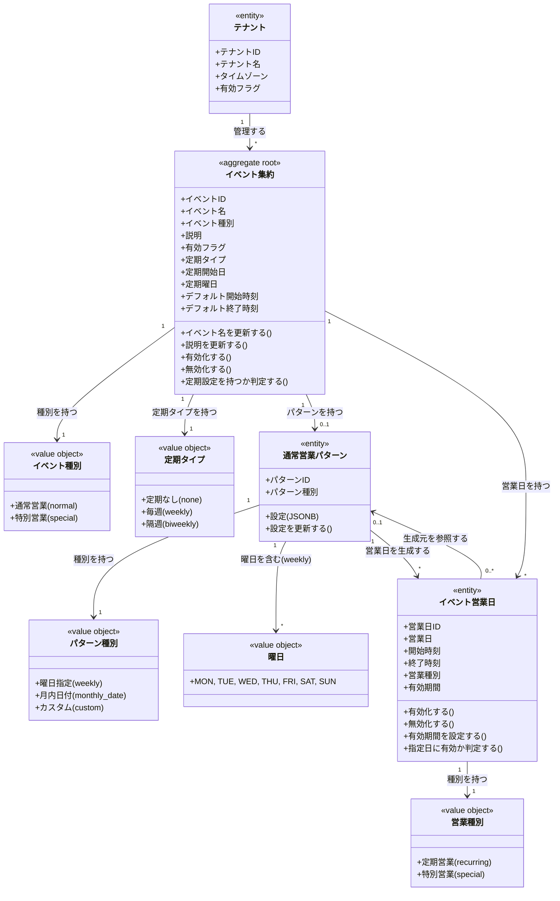

# テナントとイベントドメインモデル

## 概要

テナントとイベントドメインは、VRChatイベント運営における営業スケジュールの土台を提供する。
テナント（箱・団体）を最上位の境界として、その配下で複数のイベント（通常営業・特別営業）を統合管理し、シフト調整の対象となる営業日を一元的に生成・管理する責務を持つ。

イベントには2種類の定期設定が存在する：
1. **イベント自体の定期設定（簡易版）**: Event に直接定期情報（recurrenceType, recurrenceDayOfWeek 等）を持つ
2. **RecurringPattern（詳細版）**: より柔軟なパターン定義（複数曜日、月内日付指定など）

## 主要な概念

### テナント（Tenant）

VRChatで活動するひとつのコンカフェ・イベント運営チームを表すエンティティ。
全てのイベント・メンバー・シフト情報の境界として機能し、テナント間でのデータ混在を厳格に防ぐ。
通常は1つのDiscordサーバに対応し、名称・タイムゾーン・活動状態を保持する。

### イベント集約（Event Aggregate）（集約ルート）

テナントが継続的に行う営業ブランド・企画の単位を表す集約ルート。
通常営業（反復パターン）と特別営業（単発日程）の両方を管理し、営業日の生成・変更・削除の整合性を保証する責務を持つ。
同一テナント内では一意の名称を持ち、有効/無効の状態を管理する。

**属性**:
- eventID: ULID形式の一意識別子
- tenantID: 所属するテナントのID
- eventName: イベント名（必須、255文字以内）
- eventType: イベント種別（normal/special）
- description: 説明（オプション）
- isActive: 有効フラグ
- recurrenceType: 定期タイプ（none/weekly/biweekly）
- recurrenceStartDate: 定期開始日
- recurrenceDayOfWeek: 定期曜日（0-6: 日曜=0）
- defaultStartTime: デフォルト開始時刻
- defaultEndTime: デフォルト終了時刻

**ドメインメソッド**:
- `UpdateEventName(name)`: イベント名を更新
- `UpdateDescription(desc)`: 説明を更新
- `Activate()`: イベントを有効化
- `Deactivate()`: イベントを無効化
- `Delete()`: ソフトデリート
- `HasRecurrence()`: 定期設定を持つか判定

### イベント種別（EventType）（区分オブジェクト）

イベントの反復パターンの有無を区別する区分オブジェクト。

| 種別 | 説明 |
|------|------|
| normal | 通常営業（RecurringPatternを持つ可能性あり） |
| special | 特別イベント（単発日程のみ） |

### 定期タイプ（RecurrenceType）（区分オブジェクト）

イベント自体に設定する簡易的な定期設定の種別。

| 種別 | 説明 |
|------|------|
| none | 定期なし |
| weekly | 毎週同じ曜日 |
| biweekly | 隔週同じ曜日 |

### 通常営業パターン（RecurringPattern）（エンティティ）

より柔軟な定期パターンを定義するエンティティ。1イベントに1パターンを基本とする。
曜日指定、月内日付指定、カスタムの3種類のパターンタイプをサポートする。

**属性**:
- patternID: ULID形式の一意識別子
- tenantID: 所属するテナントのID
- eventID: 関連するイベントのID
- patternType: パターン種別（weekly/monthly_date/custom）
- config: パターン設定（JSONB）

**パターン種別（PatternType）**:

| 種別 | 説明 | config例 |
|------|------|----------|
| weekly | 曜日指定 | `{"day_of_weeks": ["MON", "FRI"], "start_time": "21:30", "end_time": "23:00"}` |
| monthly_date | 月内日付指定 | `{"dates": [1, 15], "start_time": "21:30", "end_time": "23:00"}` |
| custom | カスタム | 任意のJSON |

**設定インターフェース（RecurringPatternConfig）**:
- `WeeklyPatternConfig`: 曜日指定の設定（day_of_weeks, start_time, end_time）
- `MonthlyDatePatternConfig`: 月内日付指定の設定（dates, start_time, end_time）
- `CustomPatternConfig`: カスタム設定（任意のJSON）

### 曜日（DayOfWeek）（区分オブジェクト）

| 値 | 説明 |
|----|------|
| MON | 月曜日 |
| TUE | 火曜日 |
| WED | 水曜日 |
| THU | 木曜日 |
| FRI | 金曜日 |
| SAT | 土曜日 |
| SUN | 日曜日 |

### イベント営業日（EventBusinessDay）（エンティティ）

実際にシフトを組む対象となる「1回分の営業日」を表すエンティティ。
RecurringPattern から自動生成される日付と、特別営業日として明示的に登録された日付の両方を含む。
Event集約には含まれず、独立したエンティティとして管理される。

**属性**:
- businessDayID: ULID形式の一意識別子
- tenantID: 所属するテナントのID
- eventID: 関連するイベントのID
- targetDate: 営業日（DATE）
- startTime: 開始時刻（TIME）
- endTime: 終了時刻（TIME）
- occurrenceType: 営業種別（recurring/special）
- recurringPatternID: 生成元パターンID（recurringの場合のみ）
- isActive: 有効フラグ
- validFrom: 有効期間開始日
- validTo: 有効期間終了日

**ドメインメソッド**:
- `Activate()`: 営業日を有効化
- `Deactivate()`: 営業日を無効化
- `SetValidPeriod(from, to)`: 有効期間を設定
- `Delete()`: ソフトデリート
- `IsValidOn(date)`: 指定日に有効か判定
- `DayOfWeek()`: 曜日を取得
- `DayOfWeekString()`: 曜日を文字列で取得

### 営業種別（OccurrenceType）（区分オブジェクト）

| 種別 | 説明 |
|------|------|
| recurring | 定期営業（RecurringPatternから生成） |
| special | 特別営業（明示的に登録、またはrecurringから切り替え） |

## ドメインモデル図

## 制約条件と業務ルール

### テナント境界制約

1. **テナント分離**: 全てのイベント・営業日は必ず1つのテナントに属し、テナント間でのデータ参照・変更は禁止される
2. **イベント名の一意性**: 同一テナント内でイベント名称は一意でなければならない（論理削除されていないもののみ）
3. **テナントIDの伝播**: イベント営業日は `tenant_id` を直接保持し、テナント境界をDBレベルで表現する

### イベント制約

1. **イベントの所属**: イベントは必ず1つのテナントに属する
2. **イベント種別の適切性**: 通常営業イベントはRecurringPatternを持つ可能性があり、特別営業イベントは個別営業日のみを持つ
3. **有効フラグ**: 無効化されたイベントに対しては、新規営業日の生成・シフト募集を行ってはならない
4. **定期曜日の範囲**: recurrenceDayOfWeek は 0-6 の範囲（日曜=0, 土曜=6）

### RecurringPattern制約

1. **パターンの所属**: RecurringPattern は必ず1つのイベントに属する
2. **1イベント1パターン**: 同一イベント内で RecurringPattern は1件のみ存在する（論理削除されていないもののみ）
3. **設定の必須性**: config は必須であり、patternType に応じた適切な設定が必要
4. **曜日指定の検証**: weekly パターンの場合、day_of_weeks は1-7件の有効な曜日が必要

### イベント営業日制約

1. **営業日の所属**: 営業日は必ず1つのイベントに属する
2. **営業日の一意性**: 同一テナント・同一イベント内で、同一日付・同一開始時刻の営業日は1件のみ存在する
3. **営業種別の整合性**:
   - `occurrence_type` が `recurring` の場合、`recurring_pattern_id` は必須
   - `occurrence_type` が `special` の場合、`recurring_pattern_id` は NULL
4. **有効期間の整合性**: valid_from と valid_to は両方NULLまたは両方設定され、valid_from <= valid_to
5. **深夜営業対応**: 終了時刻が開始時刻より前の場合、日付をまたぐシフトとして扱う

### 営業日生成ルール

1. **recurring営業日**: RecurringPattern から自動生成された営業日は occurrence_type が `recurring`
2. **special営業日**: 明示的に登録された営業日、または recurring から切り替えられた営業日は `special`
3. **重複時の動作**: 通常営業日と同一日時に特別営業を定義する場合、既存営業日の種別を `special` に切り替え、`recurring_pattern_id` を NULL にする
