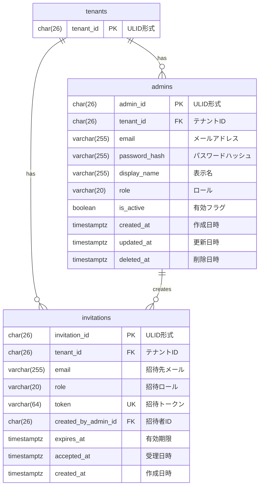

# 認証・管理者 データモデル

## 概要

認証・管理者ドメインのデータベーススキーマを定義する。
管理者認証とテナント内の権限管理を実現する。

## ER図



## テーブル定義

### admins テーブル

管理者（店長/副店長）を管理するテーブル。

| カラム名 | データ型 | NULL | デフォルト | 説明 |
|----------|----------|------|------------|------|
| admin_id | CHAR(26) | NO | - | 主キー（ULID形式） |
| tenant_id | CHAR(26) | NO | - | テナントID（FK） |
| email | VARCHAR(255) | NO | - | メールアドレス（ログインID） |
| password_hash | VARCHAR(255) | NO | - | bcryptハッシュ化されたパスワード |
| display_name | VARCHAR(255) | NO | - | 表示名 |
| role | VARCHAR(20) | NO | 'manager' | ロール |
| is_active | BOOLEAN | NO | true | 有効フラグ |
| created_at | TIMESTAMPTZ | NO | CURRENT_TIMESTAMP | 作成日時 |
| updated_at | TIMESTAMPTZ | NO | CURRENT_TIMESTAMP | 更新日時 |
| deleted_at | TIMESTAMPTZ | YES | NULL | 削除日時（ソフトデリート） |

**外部キー**:
- `fk_admins_tenant`: `tenant_id` → `tenants(tenant_id)` ON DELETE CASCADE

**制約**:
- `uq_admins_tenant_email`: `UNIQUE (tenant_id, email)`
- `admins_role_check`: `role IN ('owner', 'manager')`

**インデックス**:
- `idx_admins_tenant`: `(tenant_id) WHERE deleted_at IS NULL`
- `idx_admins_email`: `(tenant_id, email) WHERE deleted_at IS NULL`

### invitations テーブル

管理者招待を管理するテーブル。

| カラム名 | データ型 | NULL | デフォルト | 説明 |
|----------|----------|------|------------|------|
| invitation_id | CHAR(26) | NO | - | 主キー（ULID形式） |
| tenant_id | CHAR(26) | NO | - | テナントID（FK） |
| email | VARCHAR(255) | NO | - | 招待先メールアドレス |
| role | VARCHAR(20) | NO | - | 招待されるロール |
| token | VARCHAR(64) | NO | - | セキュアランダムトークン |
| created_by_admin_id | CHAR(26) | NO | - | 招待した管理者ID（FK） |
| expires_at | TIMESTAMPTZ | NO | - | 有効期限 |
| accepted_at | TIMESTAMPTZ | YES | NULL | 受理日時 |
| created_at | TIMESTAMPTZ | NO | CURRENT_TIMESTAMP | 作成日時 |

**外部キー**:
- `fk_invitations_tenant`: `tenant_id` → `tenants(tenant_id)` ON DELETE CASCADE
- `fk_invitations_created_by`: `created_by_admin_id` → `admins(admin_id)` ON DELETE CASCADE

**制約**:
- `invitations_role_check`: `role IN ('owner', 'manager')`

**インデックス**:
- `idx_invitations_token`: `UNIQUE (token)`
- `idx_invitations_tenant_email`: `(tenant_id, email) WHERE accepted_at IS NULL`
- `idx_invitations_tenant`: `(tenant_id, created_at DESC)`

## 区分値

### role

| 値 | 説明 |
|----|------|
| owner | 店長（テナントの最高権限者） |
| manager | 副店長（管理権限を持つが一部制限あり） |

## マイグレーションファイル

- `007_create_admins.up.sql`: admins テーブル作成
- `011_create_invitations.up.sql`: invitations テーブル作成

## 認証関連

### パスワードハッシュ

パスワードは bcrypt でハッシュ化して保存する。ハッシュ化処理は Infra層（Repository）で行う。

```go
// ハッシュ化（保存時）
hash, err := bcrypt.GenerateFromPassword([]byte(password), bcrypt.DefaultCost)

// 検証（認証時）
err := bcrypt.CompareHashAndPassword([]byte(passwordHash), []byte(password))
```

### JWT トークン

認証成功時に JWT トークンを発行する。トークンに含む情報:
- admin_id: 管理者ID
- tenant_id: テナントID
- role: ロール
- exp: 有効期限
- nbf: 有効開始日時
- iat: 発行日時
