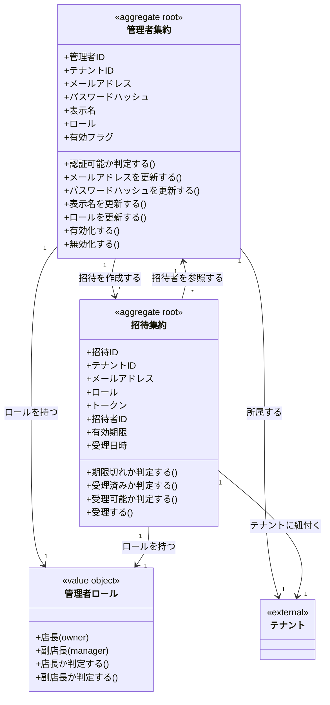

# 認証・管理者ドメインモデル

## 概要

認証・管理者ドメインは、テナント内の管理操作を行う権限を持つ管理者（Admin）の認証・認可と、新しい管理者を招待する仕組みを定義する。
メールアドレスとパスワードによる認証を行い、JWTトークンでセッションを管理する。

## 主要な概念

### 管理者集約（Admin Aggregate）（集約ルート）

管理者（店長/副店長）はテナント内の管理操作を行う権限を持つユーザー。
メールアドレスとパスワードでログインし、テナント内のリソースを管理する。

**属性**:
- adminID: ULID形式の一意識別子
- tenantID: 所属するテナントのID
- email: メールアドレス（ログインID、テナント内一意）
- passwordHash: bcryptハッシュ化されたパスワード
- displayName: 表示名（例: 店長 田中）
- role: ロール（owner/manager）
- isActive: 有効フラグ（falseの場合ログイン不可）
- createdAt: 作成日時
- updatedAt: 更新日時
- deletedAt: 削除日時（ソフトデリート）

**ドメインメソッド**:
- `CanLogin()`: 認証可能か判定（isActive=true かつ deletedAt=null）
- `UpdateEmail(now, email)`: メールアドレスを更新
- `UpdatePasswordHash(now, hash)`: パスワードハッシュを更新
- `UpdateDisplayName(now, name)`: 表示名を更新
- `UpdateRole(now, role)`: ロールを更新
- `Activate(now)`: 管理者を有効化
- `Deactivate(now)`: 管理者を無効化
- `Delete(now)`: ソフトデリート

**設計ノート**:
- ドメイン層ではハッシュ化された値を受け取る（bcrypt処理はInfra層で行う）
- 時刻は App層から注入（Domain層で time.Now() を呼ばない）

### 管理者ロール（Role）（区分オブジェクト）

管理者の権限レベルを表す区分オブジェクト。

| ロール | 説明 |
|--------|------|
| owner | 店長（テナントの最高権限者） |
| manager | 副店長（管理権限を持つが一部制限あり） |

**ドメインメソッド**:
- `IsOwner()`: 店長かどうかを判定
- `IsManager()`: 副店長かどうかを判定

### 招待集約（Invitation Aggregate）（集約ルート）

新しい管理者を招待するためのエンティティ。
招待者（Admin）のテナントに自動紐付けされ、セキュアなトークンで招待URLを生成する。

**属性**:
- invitationID: ULID形式の一意識別子
- tenantID: 招待者のテナントID（自動設定）
- email: 招待先メールアドレス
- role: 招待されるロール
- token: セキュアランダムトークン（64文字hex）
- createdByAdminID: 招待した管理者のID
- expiresAt: 有効期限
- acceptedAt: 受理日時（NULL=未受理）
- createdAt: 作成日時

**ドメインメソッド**:
- `IsExpired(now)`: 期限切れか判定
- `IsAccepted()`: 既に受理されているか判定
- `CanAccept(now)`: 受理可能か判定（未受理かつ有効期限内）
- `Accept(now)`: 招待を受理（状態遷移）

**ビジネスルール**:
- 招待者（createdByAdmin）は有効なアクティブ管理者である必要がある
- トークンは暗号学的に安全なランダム値（32バイト = 64文字hex）
- 有効期限はデフォルト7日間

## ドメインモデル図



## 認証フロー

### ログインフロー

```
1. メールアドレス + パスワードを受信
   ↓
2. Admin をメールアドレスで検索
   ↓
3. CanLogin() で認証可能か検証
   ↓
4. bcrypt でパスワードを検証（Infra層）
   ↓
5. JWT トークンを発行
   ↓
6. トークンを返却
```

### 招待フロー

```
1. 管理者（招待者）が招待を作成
   ↓
2. 招待者のテナントIDを自動設定
   ↓
3. セキュアトークンを生成
   ↓
4. 招待URLを生成（/invite/{token}）
   ↓
5. 被招待者がURLにアクセス
   ↓
6. CanAccept() で受理可能か検証
   ↓
7. Accept() で招待を受理
   ↓
8. 新しい Admin を作成（招待のテナント・ロールを継承）
```

## 制約条件と業務ルール

### テナント境界制約

1. **テナント分離**: 管理者は必ず1つのテナントに属し、他テナントのリソースにはアクセスできない
2. **メールアドレスの一意性**: 同一テナント内でメールアドレスは一意
3. **招待のテナント継承**: 招待は招待者のテナントに自動紐付けされる

### 管理者制約

1. **メールアドレス必須**: メールアドレスは必須、255文字以内
2. **パスワードハッシュ必須**: パスワードハッシュは必須
3. **表示名必須**: 表示名は必須、255文字以内
4. **ロール必須**: owner または manager のいずれか

### 招待制約

1. **招待者の有効性**: 招待者は有効（isActive=true）かつ未削除の管理者である必要がある
2. **有効期限**: 有効期限は作成日時より後でなければならない
3. **受理の一意性**: 一度受理された招待は再度受理できない
4. **期限切れ検証**: 有効期限を過ぎた招待は受理できない

### 認証制約

1. **認証可能条件**: isActive=true かつ deletedAt=null の管理者のみログイン可能
2. **パスワードハッシュ**: bcryptでハッシュ化（Infra層で処理）
3. **JWT**: 認証成功時にJWTトークンを発行
