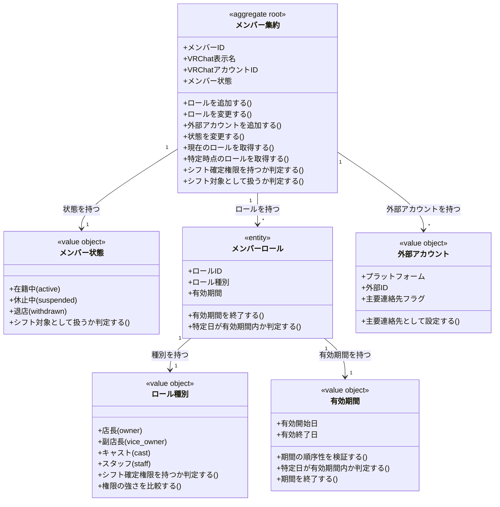

# メンバーとロールドメインモデル

## 概要

メンバーとロールドメインは、テナントに所属するキャスト・店長・スタッフの属性とロール、およびシフト管理上必要となる識別情報を管理する。
VRChatにおける表示名変更・アバター変更に関わらず同一人物を追跡可能にし、ロールに基づいた権限制御（シフト確定権限など）を実現する責務を持つ。
メンバー状態（在籍中・休止中・退店）の管理により、シフト対象として扱うかを柔軟に制御する。

## 主要な概念

### メンバー集約（Member Aggregate）（集約ルート）

テナントに所属する人物を表す集約ルート。
VRChat表示名・VRChatアカウントID・メンバー状態を保持し、表示名変更にも耐えうる一意識別子（UUID）で同一人物を追跡する。
ロール変更履歴・外部アカウント情報を管理し、シフト確定権限の判定とメンバーへの通知送信を可能にする。

### メンバー状態（Member Status）（区分オブジェクト）

メンバーがシフト対象として扱われるかどうかの状態を表す区分オブジェクト。
在籍中（active）・休止中（suspended）・退店（withdrawn）を識別し、シフト希望提出の対象者選定に影響を与える。

### メンバーロール（Member Role）（エンティティ）

メンバーに付与される役割区分を履歴管理するエンティティ。
ロール種別（店長・副店長・キャスト・スタッフ）・有効期間を保持し、特定時点でのメンバーの権限を正確に再現可能にする。
複数ロールの同時保持を許可し、最も強い権限が適用される原則を実現する。

### ロール種別（Role Type）（区分オブジェクト）

メンバーの権限レベルを表す区分オブジェクト。
店長（owner）・副店長（vice_owner）・キャスト（cast）・スタッフ（staff）を識別し、シフト確定権限の有無を判定する基準となる。

### 外部アカウント（External Account）（値オブジェクト）

メンバーの外部連絡手段を表す値オブジェクト。
プラットフォーム（Discord/LINE/Twitterなど）・外部ID・主要連絡先フラグを保持し、通知送信先の決定に使用される。

## メンバー状態の詳細

### 1. 在籍中（Active）

- **対象**: 通常どおりシフト希望と配置の対象となるメンバー
- **特徴**: シフト希望提出の対象者一覧に含まれ、シフト確定の割り当て先として選択可能
- **例**: 通常のキャスト・スタッフ・店長メンバー

### 2. 休止中（Suspended）

- **対象**: 一時的にシフト対象から外すメンバー
- **特徴**: シフト希望提出の対象者一覧に含まれず、シフト確定の割り当て先としても選択不可
- **例**: 長期休暇中のキャスト、試験期間中の学生スタッフ

### 3. 退店（Withdrawn）

- **対象**: 過去の実績は保持するが、新規のシフト対象にはならないメンバー
- **特徴**: 過去のシフト履歴は参照可能だが、新規のシフト希望提出や割り当ては行えない
- **例**: 卒業・引退したキャスト、退職した店長

## ロール種別の詳細

### 1. 店長（Owner）

- **対象**: テナントの最終責任者
- **特徴**: シフト確定権限を持ち、全てのシフト操作が可能。運営方針決定権も持つ
- **例**: テナント「シトロン」の店長アリス

### 2. 副店長（Vice Owner）

- **対象**: 店長を補佐し、シフト確定業務を分担するメンバー
- **特徴**: 店長と同等のシフト確定権限を持ち、店長不在時に代行可能
- **例**: 店長不在時にシフト確定を行う副店長ボブ

### 3. キャスト（Cast）

- **対象**: お客さまと直接接客する出演者
- **特徴**: シフト希望の提出と自身のシフト確認のみを行う。シフト確定権限は持たない
- **例**: カウンター・テーブル担当のキャストメンバー

### 4. スタッフ（Staff）

- **対象**: 受付・場内案内・撮影補助などを行う裏方メンバー
- **特徴**: キャスト同様にシフト希望を提出し、裏方ポジションに配置される。シフト確定権限は持たない
- **例**: 受付スタッフ、カメラマンスタッフ

## 複数ロール保持の扱い

### 複数ロール保持の原則

一人のメンバーが複数のロールを同時に持つことは許可される。この場合、以下の原則に従う：

1. **最も強い権限の適用**: 複数ロールを持つ場合、最も強い権限が適用される
2. **権限の優先順位**: 店長 > 副店長 > キャスト ≧ スタッフ
3. **シフト確定権限の判定**: いずれかのロールが店長または副店長であれば、シフト確定権限を持つ

### 具体例

```
【ケース1: キャスト兼副店長】
- 保持ロール: キャスト、副店長
- 適用される権限: 副店長（シフト確定権限あり）
- シフト希望: 提出可能（キャストとして）
- シフト確定: 実行可能（副店長として）

【ケース2: キャスト兼スタッフ】
- 保持ロール: キャスト、スタッフ
- 適用される権限: キャスト（シフト確定権限なし）
- シフト希望: 提出可能（キャストまたはスタッフとして）
- シフト確定: 実行不可
```

## メンバー識別の一貫性

### 識別子による追跡

メンバーは内部識別子（UUID）で一意に識別され、以下の変更に対して一貫性を保つ：

- **表示名の変更**: VRChat表示名を変更しても、メンバーIDは変更されない
- **アバターの変更**: VRChatアバターを変更しても、メンバーIDは変更されない
- **外部アカウントの変更**: Discord IDなどの外部IDを変更しても、メンバーIDは変更されない

### 具体例

```
【初期状態】
メンバーID: 018f1234-0000-0000-0000-0000000000A1
VRChat表示名: らっと
VRChatアカウントID: usr_xxxxxxxx-xxxx-xxxx-xxxx-xxxxxxxxxxxx

【表示名変更後】
メンバーID: 018f1234-0000-0000-0000-0000000000A1（変更なし）
VRChat表示名: らっと改（変更）
VRChatアカウントID: usr_xxxxxxxx-xxxx-xxxx-xxxx-xxxxxxxxxxxx（変更なし）

【結果】
- 過去のシフト履歴も「らっと」の時期のものを含めて、メンバーID経由で一続きで参照できる
- シフト表には最新の表示名「らっと改」が表示される
```

## メンバーロールの履歴管理

### 履歴管理の仕組み

メンバーロールは有効期間（valid_from, valid_to）を持ち、ロール変更の履歴を保持する：

1. **ロール変更時**: 既存ロールの有効期間を終了し、新しいロールを作成
2. **特定時点の権限判定**: 指定日時に有効なロールを検索し、権限を判定
3. **履歴の保持**: 過去のロールも削除せず保持し、履歴を追跡可能にする

### 具体例

```
【ボブのロール履歴】
2025-01-01 〜 2025-06-30: キャスト
2025-07-01 〜 9999-12-31: 副店長

【2025-03-15時点の権限判定】
- 該当ロール: キャスト
- シフト確定権限: なし

【2025-08-01時点の権限判定】
- 該当ロール: 副店長
- シフト確定権限: あり
```

## ドメインモデル図



## 制約条件と業務ルール

### メンバー識別制約

1. **メンバーの一意性**: 同一テナント内でVRChatアカウントIDは一意でなければならない
2. **識別子の不変性**: メンバーIDは作成後変更されず、表示名変更にも耐えうる一貫した識別子として機能する
3. **VRChatアカウントの必須性**: メンバーは必ずVRChatアカウントIDを持たなければならない

### メンバー状態制約

1. **状態の遷移**: メンバー状態は「在籍中 → 休止中」「休止中 → 在籍中」「在籍中 → 退店」などの遷移が可能
2. **退店後の制限**: 退店状態のメンバーは在籍中・休止中に戻すことはできない（新規メンバーとして再登録）
3. **シフト対象の制限**: 在籍中のメンバーのみがシフト希望提出の対象となる

### メンバーロール制約

1. **ロールの所属**: メンバーロールは必ず1つのメンバーに属する
2. **同一ロールの重複禁止**: 同一メンバーが同一期間に同じロール種別を複数持つことはできない
3. **有効期間の順序性**: ロールの有効開始日は有効終了日よりも前でなければならない
4. **複数ロール保持の許可**: 同一メンバーが同時期に異なるロール種別（例: キャストとスタッフ）を複数持つことは許可される
5. **ロール履歴の保持**: ロール変更時、既存ロールは削除せず有効期間を終了し、新規ロールを作成することで履歴を保持する

### シフト確定権限制約

1. **権限ロールの限定**: シフト確定権限を持つのは、店長ロールまたは副店長ロールのみ
2. **複数ロール時の権限**: いずれかのロールが店長または副店長であれば、シフト確定権限を持つ
3. **特定時点の権限判定**: シフト確定操作時点で有効なロールに基づいて権限を判定する

### 外部アカウント制約

1. **外部IDの一意性**: 同一プラットフォーム・同一外部IDの組み合わせは、システム全体で一意でなければならない
2. **主要連絡先の唯一性**: 各メンバーにつき、主要連絡先フラグがtrueの外部アカウントは1つのみ存在する
3. **プラットフォームの多様性**: 同一メンバーが複数のプラットフォーム（Discord、LINEなど）に外部アカウントを持つことは許可される

### テナント境界制約

1. **メンバーの所属**: メンバーは必ず1つのテナントに属する
2. **テナント間の分離**: 異なるテナントのメンバー情報は相互に参照・変更できない
3. **VRChatアカウントの重複**: 同一VRChatアカウントIDが異なるテナントに所属するメンバーとして登録されることは許可される（複数店舗に所属する場合）

