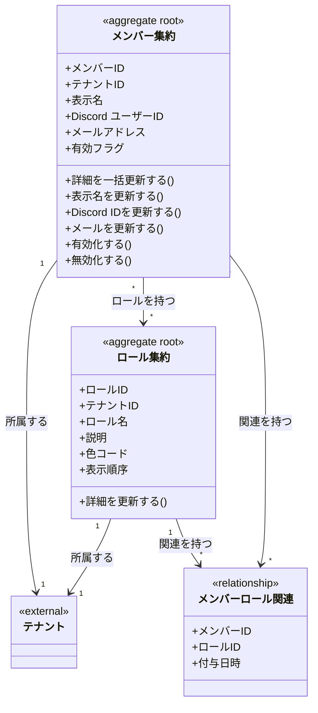

# メンバー・ロールドメインモデル

## 概要

メンバー・ロールドメインは、シフトに参加するメンバーと、メンバーに付与される役割・属性（ロール）を定義する。
メンバーはシフト割り当ての対象となり、ロールはメンバーの分類やフィルタリングに使用される。

**重要**: ここでの「ロール」は管理者の権限ロール（owner/manager）とは異なり、メンバーに付与される属性タグ（例: リーダー、新人、ベテラン）を指す。

## 主要な概念

### メンバー集約（Member Aggregate）（集約ルート）

シフトに参加するメンバー情報を表す集約ルート。
テナント内でシフト割り当ての対象となる人物を管理する。

**属性**:
- memberID: ULID形式の一意識別子
- tenantID: 所属するテナントのID
- displayName: 表示名（必須、255文字以内）
- discordUserID: Discord ユーザーID（オプション、100文字以内）
- email: メールアドレス（オプション、255文字以内）
- isActive: 有効フラグ
- createdAt: 作成日時
- updatedAt: 更新日時
- deletedAt: 削除日時（ソフトデリート）

**ドメインメソッド**:
- `UpdateDetails(displayName, discordUserID, email, isActive)`: 複数のフィールドを一括更新
- `UpdateDisplayName(name)`: 表示名を更新
- `UpdateDiscordUserID(id)`: Discord ユーザーIDを更新
- `UpdateEmail(email)`: メールアドレスを更新
- `Activate()`: メンバーを有効化
- `Deactivate()`: メンバーを無効化
- `Delete()`: ソフトデリート

### ロール集約（Role Aggregate）（集約ルート）

メンバーに付与される役割・属性を表す集約ルート。
権限制御ではなく、メンバーの分類・タグ付けに使用される。

**属性**:
- roleID: ULID形式の一意識別子
- tenantID: 所属するテナントのID
- name: ロール名（必須、100文字以内）
- description: 説明（オプション、500文字以内）
- color: UI表示用の色コード（オプション、例: #FF5733）
- displayOrder: 表示順序
- createdAt: 作成日時
- updatedAt: 更新日時
- deletedAt: 削除日時（ソフトデリート）

**ドメインメソッド**:
- `UpdateDetails(name, description, color, displayOrder)`: 詳細を一括更新
- `Delete()`: ソフトデリート

**ロールの用途例**:
- 「リーダー」: グループのリーダー
- 「サブリーダー」: 副リーダー
- 「新人」: 新規メンバー
- 「ベテラン」: 経験豊富なメンバー
- 「早番可」: 早番シフト対応可能
- 「夜勤可」: 夜勤対応可能

### メンバーロール関連（MemberRole）

メンバーとロールの多対多の関連を管理する。
1人のメンバーに複数のロールを付与でき、1つのロールを複数のメンバーに付与できる。

**属性**:
- memberID: メンバーID
- roleID: ロールID
- assignedAt: 付与日時

## ドメインモデル図

## 制約条件と業務ルール

### テナント境界制約

1. **テナント分離**: メンバーとロールは必ず1つのテナントに属する
2. **Discord ユーザーIDの一意性**: 同一テナント内でDiscord ユーザーIDは一意（NULLは除く）
3. **メールアドレスの一意性**: 同一テナント内でメールアドレスは一意（NULLは除く）
4. **ロール名の一意性**: 同一テナント内でロール名は一意（論理削除されていないもののみ）

### メンバー制約

1. **表示名必須**: 表示名は必須、255文字以内
2. **Discord ユーザーID**: オプション、100文字以内
3. **メールアドレス**: オプション、255文字以内

### ロール制約

1. **ロール名必須**: ロール名は必須、100文字以内
2. **説明**: オプション、500文字以内
3. **色コード**: オプション、20文字以内

### メンバーロール関連制約

1. **一意性**: 同一メンバー・ロールの組み合わせは1件のみ
2. **参照整合性**: メンバーまたはロールが削除された場合、関連も削除（CASCADE）

## ロールの設計思想

### 権限ロール vs 属性ロール

本システムには2種類の「ロール」が存在する：

| 種類 | パッケージ | 説明 | 例 |
|------|-----------|------|-----|
| 権限ロール | auth.Role | 管理者の権限レベル | owner, manager |
| 属性ロール | role.Role | メンバーの分類タグ | リーダー, 新人 |

**属性ロール（role.Role）の特徴**:
- 権限制御には使用しない
- メンバーの分類・フィルタリングに使用
- UI上でバッジやラベルとして表示
- シフト割り当て時の参考情報として活用
