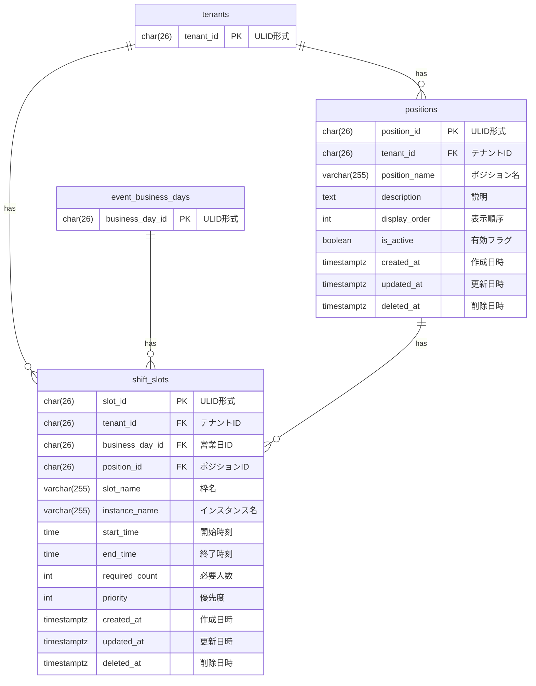

# シフト枠とポジション データモデル

## 概要

シフト枠とポジションドメインのデータベーススキーマを定義する。
営業日ごとのシフト枠管理と、役割（ポジション）の管理を実現する。

## ER図

## テーブル定義

### positions テーブル

役職（ポジション）を管理するテーブル。

| カラム名 | データ型 | NULL | デフォルト | 説明 |
|----------|----------|------|------------|------|
| position_id | CHAR(26) | NO | - | 主キー（ULID形式） |
| tenant_id | CHAR(26) | NO | - | テナントID（FK） |
| position_name | VARCHAR(255) | NO | - | ポジション名 |
| description | TEXT | YES | NULL | 説明 |
| display_order | INT | NO | 0 | 表示順序 |
| is_active | BOOLEAN | NO | true | 有効フラグ |
| created_at | TIMESTAMPTZ | NO | CURRENT_TIMESTAMP | 作成日時 |
| updated_at | TIMESTAMPTZ | NO | CURRENT_TIMESTAMP | 更新日時 |
| deleted_at | TIMESTAMPTZ | YES | NULL | 削除日時（ソフトデリート） |

**外部キー**:
- `fk_positions_tenant`: `tenant_id` → `tenants(tenant_id)` ON DELETE CASCADE

**制約**:
- `positions_name_check`: `LENGTH(position_name) >= 1`

**インデックス**:
- `idx_positions_tenant_name_unique`: `UNIQUE (tenant_id, position_name) WHERE deleted_at IS NULL`
- `idx_positions_tenant_order`: `(tenant_id, display_order, position_name) WHERE deleted_at IS NULL`

### shift_slots テーブル

シフト枠を管理するテーブル。

| カラム名 | データ型 | NULL | デフォルト | 説明 |
|----------|----------|------|------------|------|
| slot_id | CHAR(26) | NO | - | 主キー（ULID形式） |
| tenant_id | CHAR(26) | NO | - | テナントID（FK） |
| business_day_id | CHAR(26) | NO | - | 営業日ID（FK） |
| position_id | CHAR(26) | NO | - | ポジションID（FK） |
| slot_name | VARCHAR(255) | NO | - | 枠名 |
| instance_name | VARCHAR(255) | YES | NULL | インスタンス名 |
| start_time | TIME | NO | - | 開始時刻 |
| end_time | TIME | NO | - | 終了時刻 |
| required_count | INT | NO | 1 | 必要人数 |
| priority | INT | NO | 0 | 優先度 |
| created_at | TIMESTAMPTZ | NO | CURRENT_TIMESTAMP | 作成日時 |
| updated_at | TIMESTAMPTZ | NO | CURRENT_TIMESTAMP | 更新日時 |
| deleted_at | TIMESTAMPTZ | YES | NULL | 削除日時（ソフトデリート） |

**外部キー**:
- `fk_shift_slots_tenant`: `tenant_id` → `tenants(tenant_id)` ON DELETE CASCADE
- `fk_shift_slots_business_day`: `business_day_id` → `event_business_days(business_day_id)` ON DELETE CASCADE
- `fk_shift_slots_position`: `position_id` → `positions(position_id)` ON DELETE RESTRICT

**制約**:
- `shift_slots_time_check`: `start_time < end_time OR end_time < start_time`（深夜営業対応）
- `shift_slots_required_count_check`: `required_count >= 1`
- `shift_slots_name_check`: `LENGTH(slot_name) >= 1`

**インデックス**:
- `idx_shift_slots_tenant_business_day`: `(tenant_id, business_day_id) WHERE deleted_at IS NULL`
- `idx_shift_slots_business_day_time`: `(business_day_id, start_time, priority) WHERE deleted_at IS NULL`
- `idx_shift_slots_position`: `(position_id) WHERE deleted_at IS NULL`

## マイグレーションファイル

- `003_create_members_and_shift_slots.up.sql`: positions, shift_slots テーブル作成（members も含む）

## 備考

### 深夜営業対応

時刻チェック制約 `shift_slots_time_check` は以下のどちらかを許可:
- `start_time < end_time`: 通常営業（例: 21:00-23:00）
- `end_time < start_time`: 深夜営業（例: 23:00-01:00）

これにより、日付をまたぐシフト枠を表現できる。

### ポジション削除時の挙動

`fk_shift_slots_position` に `ON DELETE RESTRICT` を設定しているため、
シフト枠が参照しているポジションは削除できない。
これにより、参照整合性を保証している。
