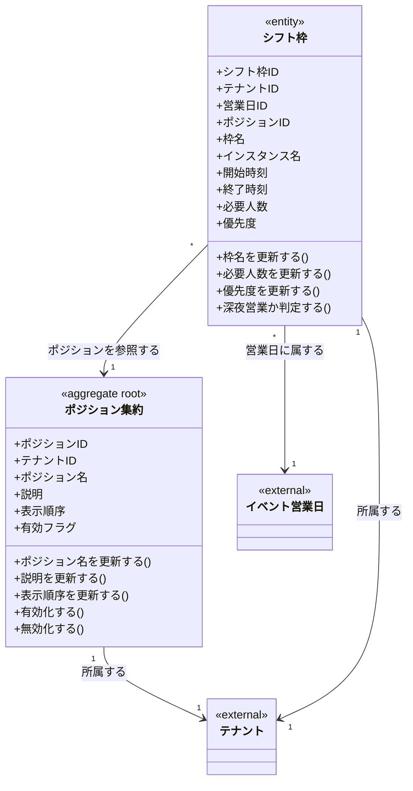

# シフト枠とポジション定義ドメインモデル

## 概要

シフト枠とポジション定義ドメインは、営業日において必要となる「シフト枠（ShiftSlot）」と「ポジション（Position）」を定義する。
シフト枠はメンバーを配置する「席」であり、ポジションは役職・役割の種別である。

## 主要な概念

### ポジション集約（Position Aggregate）（集約ルート）

営業時に必要となる役割の種別を表す集約ルート。
シフト枠を作成する際のカテゴリとして使用される。

**属性**:
- positionID: ULID形式の一意識別子
- tenantID: 所属するテナントのID
- positionName: ポジション名（必須、255文字以内）
- description: 説明（オプション）
- displayOrder: 表示順序
- isActive: 有効フラグ
- createdAt: 作成日時
- updatedAt: 更新日時
- deletedAt: 削除日時（ソフトデリート）

**ドメインメソッド**:
- `UpdatePositionName(name)`: ポジション名を更新
- `UpdateDescription(desc)`: 説明を更新
- `UpdateDisplayOrder(order)`: 表示順序を更新
- `Activate()`: ポジションを有効化
- `Deactivate()`: ポジションを無効化
- `Delete()`: ソフトデリート

**ポジションの用途例**:
- 「受付」: 来場者の受付担当
- 「案内」: 場内の案内担当
- 「配信」: 配信オペレーション担当
- 「MC」: 司会進行担当
- 「カウンター」: カウンター席担当
- 「テーブル」: テーブル席担当

### シフト枠（ShiftSlot）（エンティティ）

特定の営業日における、時間帯・ポジションを組み合わせた「複数人分の席」を表すエンティティ。
EventBusinessDay に属するが、EventBusinessDay集約には含まれない独立したエンティティ。

**属性**:
- slotID: ULID形式の一意識別子
- tenantID: 所属するテナントのID
- businessDayID: 関連する営業日のID
- positionID: 関連するポジションのID
- slotName: 枠名（必須、255文字以内）
- instanceName: インスタンス名（例: 第1インスタンス）
- startTime: 開始時刻（TIME）
- endTime: 終了時刻（TIME）
- requiredCount: 必要人数（1以上）
- priority: 優先度（割り当て順序の参考）
- createdAt: 作成日時
- updatedAt: 更新日時
- deletedAt: 削除日時（ソフトデリート）

**ドメインメソッド**:
- `UpdateSlotName(name)`: 枠名を更新
- `UpdateRequiredCount(count)`: 必要人数を更新
- `UpdatePriority(priority)`: 優先度を更新
- `Delete()`: ソフトデリート
- `IsOvernight()`: 深夜営業かどうかを判定
- `StartTimeString()`: 開始時刻を HH:MM 形式で返す
- `EndTimeString()`: 終了時刻を HH:MM 形式で返す

### 深夜営業対応

- 終了時刻が開始時刻より前の場合、日付をまたぐシフトとして扱う
- 例: 23:00-01:00 は深夜営業として扱われる

## ドメインモデル図

## 制約条件と業務ルール

### テナント境界制約

1. **テナント分離**: ポジションとシフト枠は必ず1つのテナントに属する
2. **ポジション名の一意性**: 同一テナント内でポジション名は一意（論理削除されていないもののみ）
3. **参照整合性**: シフト枠には同じテナント内のポジションのみ指定可能

### ポジション制約

1. **ポジション名必須**: ポジション名は必須、255文字以内
2. **表示順**: displayOrder でソートして表示順序を管理

### シフト枠制約

1. **営業日との関連**: シフト枠は必ず1つの営業日に属する
2. **営業日削除時**: 営業日が削除されると、関連するシフト枠も削除される（CASCADE）
3. **必要人数**: requiredCount は 1 以上でなければならない
4. **枠名必須**: slotName は必須、255文字以内
5. **深夜営業対応**: startTime と endTime は必須。終了時刻 < 開始時刻の場合、日付をまたぐ営業として扱う

### ポジションの削除制約

1. **ポジション削除時**: ポジション削除時、関連するシフト枠のポジション参照は維持される（RESTRICT）
2. **新規作成制限**: 削除されたポジションを新規シフト枠に指定することはできない
