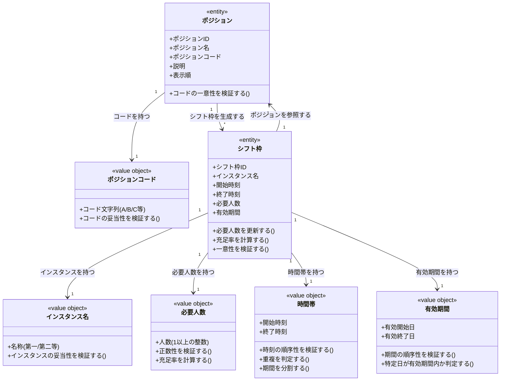

# シフト枠とスロット定義ドメインモデル

## 概要

シフト枠とスロット定義ドメインは、イベントの各営業日において必要となる「インスタンス」「ポジション」「人数」を構造化し、シフト希望とシフト確定の対象となる枠を定義する。
ポジション（IL、カウンター、テーブルなど）の定義から、営業日×インスタンス×ポジション×時間帯の組み合わせでシフト枠を生成し、各枠の必要人数を管理する責務を持つ。
営業枠テンプレートからの自動生成と、個別営業日での微調整の両方に対応する。

## 主要な概念

### ポジション（Position）（エンティティ）

営業時に必要となる役割（IL、カウンターA、テーブルE、受付など）を表すエンティティ。
イベントごとに定義され、名称・コード・説明・表示順を保持する。
シフト枠の生成元として機能し、イベント内で一意に識別可能なコードで管理される。

### シフト枠（Shift Slot）（エンティティ）

営業日インスタンスとポジションの組み合わせで定義される「1人分の席」を表すエンティティ。
営業日・インスタンス名・ポジション・時間帯・必要人数を保持し、シフト希望とシフト確定の対象単位として機能する。
有効期間を持ち、特定の営業日に対してのみ有効なシフト枠を表現する。

### インスタンス名（Instance Name）（値オブジェクト）

VRChatの営業における物理的な部屋の単位を表す値オブジェクト。
「第一インスタンス」「第二インスタンス」など、同時刻に複数の部屋で営業を行う場合の識別に使用される。

### 必要人数（Required Headcount）（値オブジェクト）

各シフト枠に必要なメンバー数を表す値オブジェクト。
1以上の正の整数で表され、シフト充足率の計算とシフト割り当ての上限判定に使用される。

### 時間帯（Time Range）（値オブジェクト）

シフト枠の開始時刻と終了時刻を表す値オブジェクト。
時刻の順序性を検証し、営業日の時間帯を細分化して管理する（例: 21:30-23:00、23:00-25:00）。

## ポジションの種類例

### 1. カウンター（Counter）

- **対象**: カウンター席での接客を担当するポジション
- **特徴**: 複数席が存在し、コード（A、B、C、Dなど）で識別される
- **例**: カウンターA、カウンターB、カウンターC、カウンターD

### 2. テーブル（Table）

- **対象**: テーブル席での接客を担当するポジション
- **特徴**: 複数席が存在し、コード（E、F、G、Hなど）で識別される
- **例**: テーブルE、テーブルF、テーブルG、テーブルH

### 3. IL（Instance Leader）

- **対象**: インスタンス全体を管理・統括するポジション
- **特徴**: 通常各インスタンスに1名配置され、入退室管理や全体進行を担う
- **例**: 第一インスタンス IL

### 4. 受付（Reception）

- **対象**: お客さまの受付・案内を担当するポジション
- **特徴**: 営業全体で1〜2名配置され、複数インスタンスを横断的に担当
- **例**: 受付スタッフ

### 5. カメラ（Camera）

- **対象**: 撮影補助を担当するポジション
- **特徴**: 特別営業やイベント時に追加されることが多い
- **例**: カメラマンスタッフ

### 6. 司会（MC: Master of Ceremonies）

- **対象**: 特別営業時の進行・司会を担当するポジション
- **特徴**: 特別営業にのみ設定され、通常営業では存在しない
- **例**: 特別イベント司会

## シフト枠の生成パターン

### パターン1: 通常営業の基本シフト枠

```
営業日: 2025-11-13（木）
時間帯: 21:30-23:00
インスタンス: 第一インスタンス、第二インスタンス
ポジション: カウンターA〜D、テーブルE〜H

生成される枠:
- 第一インスタンス カウンターA 21:30-23:00 [必要人数: 1]
- 第一インスタンス カウンターB 21:30-23:00 [必要人数: 1]
- ... （カウンターC、D、テーブルE〜H）
- 第二インスタンス カウンターA 21:30-23:00 [必要人数: 1]
- 第二インスタンス カウンターB 21:30-23:00 [必要人数: 1]
- ... （カウンターC、D、テーブルE〜H）

合計: 16枠（2インスタンス × 8ポジション × 1人）
```

### パターン2: 特別営業の追加ポジション

```
営業日: 2025-11-11（月）【Vket特別営業】
時間帯: 21:30-25:00
インスタンス: 第一インスタンス
ポジション: カウンターA〜D、テーブルE〜H、司会

生成される枠:
- 第一インスタンス カウンターA 21:30-23:00 [必要人数: 1]
- 第一インスタンス カウンターB 21:30-23:00 [必要人数: 1]
- ... （カウンターC、D、テーブルE〜H）
- 第一インスタンス 司会 21:30-23:00 [必要人数: 1] ← 特別営業のみ
- 第一インスタンス カウンターA 23:00-25:00 [必要人数: 1]
- ... （以下同様）

特徴: 司会ポジションが追加され、時間帯が長い（25時まで）
```

### パターン3: 必要人数が2名以上の枠

```
営業日: 2025-12-05（木）
時間帯: 21:30-23:00
インスタンス: 第一インスタンス
ポジション: IL（インスタンスリーダー）

生成される枠:
- 第一インスタンス IL 21:30-23:00 [必要人数: 2]

特徴: 1つの枠に対して2名の割り当てが必要
```

## 営業枠テンプレートとシフト枠生成の関係

### テンプレートからの自動生成フロー

```
1. 営業枠テンプレート定義
   - イベント: シトロンヴェール
   - テンプレート名: 九龍想定
   - ポジション構成: カウンターA〜D、テーブルE〜H
   - 必要人数デフォルト: 各1名

2. 営業日選択
   - 営業日: 2025-11-13（木） 21:30-23:00

3. シフト枠自動生成
   - 各ポジション × 各インスタンス × 営業日の時間帯でシフト枠を生成
   - 必要人数をテンプレートのデフォルト値で設定

4. 個別調整（必要に応じて）
   - 特定ポジションの必要人数を変更
   - 特定ポジションの枠を追加・削除
```

### 個別営業日での微調整例

```
【基本テンプレート】
- カウンターA〜D、テーブルE〜H（各1名）

【特定営業日の調整】
- 2025-12-24（クリスマス特別営業）
  - カウンターAの必要人数を2名に増やす（混雑予想のため）
  - 司会ポジションを追加（特別イベント進行のため）
  - テーブルHを削除（レイアウト変更のため）
```

## シフト枠の一意性制約

### 一意性の単位

シフト枠は以下の組み合わせで一意に識別される：

```
テナントID × 営業日ID × ポジションID × インスタンス名 × 開始時刻 × 終了時刻
```

### 具体例

```
【枠1】
- テナント: シトロン
- 営業日: 2025-11-13
- ポジション: カウンターA
- インスタンス: 第一インスタンス
- 時間帯: 21:30-23:00

【枠2】
- テナント: シトロン
- 営業日: 2025-11-13
- ポジション: カウンターA
- インスタンス: 第二インスタンス ← 異なるインスタンス
- 時間帯: 21:30-23:00

結果: 枠1と枠2は別の枠として扱われる
```

## ドメインモデル図



## 制約条件と業務ルール

### ポジション制約

1. **ポジションの所属**: ポジションは必ず1つのテナントと1つのイベントに属する
2. **コードの一意性**: 同一テナント・同一イベント内でポジションコードは一意でなければならない
3. **名称の適切性**: ポジション名は営業時の役割を明確に表す名称でなければならない
4. **表示順の管理**: ポジションは表示順によってソートされ、シフト表の表示順序を決定する

### シフト枠制約

1. **シフト枠の所属**: シフト枠は必ず1つのテナント・1つの営業日・1つのポジションに属する
2. **シフト枠の一意性**: 同一テナント・同一営業日・同一ポジション・同一インスタンス・同一時間帯のシフト枠は1件のみ存在する
3. **ポジション所属整合性**: シフト枠が参照するポジションは、その営業日が属するイベントで定義されたポジションでなければならない
4. **時刻の順序性**: シフト枠の開始時刻は終了時刻よりも前でなければならない（深夜営業での日付またぎを考慮）
5. **有効期間と営業日の整合性**: シフト枠の有効期間（valid_from, valid_to）は営業日（business_date）と同じ日付を設定する

### 必要人数制約

1. **正数性**: 必要人数は1以上の正の整数でなければならない
2. **現実的な上限**: 必要人数は現実的な範囲内（例: 1〜10名程度）でなければならない
3. **割り当て上限**: シフト枠への割り当て人数は必要人数を超えてはならない

### インスタンス名制約

1. **命名規則**: インスタンス名は「第一インスタンス」「第二インスタンス」などの明確な命名規則に従う
2. **識別可能性**: 同一営業日内で異なるインスタンス名は明確に区別可能でなければならない

### 時間帯制約

1. **時刻の順序性**: 開始時刻は終了時刻よりも前でなければならない
2. **営業日の時間帯範囲**: シフト枠の時間帯は営業日の時間帯範囲内でなければならない
3. **時間帯の分割**: 営業日の時間帯を複数のシフト枠に分割する場合、時間帯は連続的または重複なく分割される

### テンプレート生成制約

1. **テンプレートの所属**: 営業枠テンプレートはイベント単位で定義される
2. **ポジション構成の定義**: テンプレートは最低1つ以上のポジションを含まなければならない
3. **デフォルト必要人数**: テンプレートは各ポジションのデフォルト必要人数を定義する
4. **生成対象の存在**: テンプレートからシフト枠を生成する際、対象営業日とポジションが事前に定義されている必要がある

### テナント境界制約

1. **テナント分離**: シフト枠とポジションは必ず1つのテナントに属し、テナント間でのデータ参照・変更は禁止される
2. **一貫性の保証**: ポジション→シフト枠の参照は同一テナント内でのみ許可される

