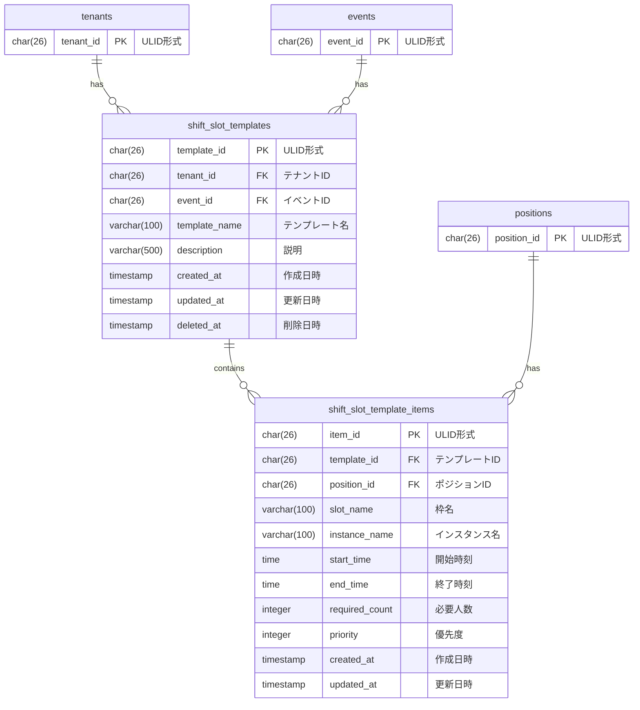

# シフト枠テンプレート データモデル

## 概要

シフト枠テンプレートドメインのデータベーススキーマを定義する。
よく使うシフト枠構成の保存と再利用を実現する。

## ER図

## テーブル定義

### shift_slot_templates テーブル

シフト枠テンプレートのメタ情報を管理するテーブル。

| カラム名 | データ型 | NULL | デフォルト | 説明 |
|----------|----------|------|------------|------|
| template_id | CHAR(26) | NO | - | 主キー（ULID形式） |
| tenant_id | CHAR(26) | NO | - | テナントID（FK） |
| event_id | CHAR(26) | NO | - | イベントID（FK） |
| template_name | VARCHAR(100) | NO | - | テンプレート名 |
| description | VARCHAR(500) | YES | NULL | 説明 |
| created_at | TIMESTAMP | NO | NOW() | 作成日時 |
| updated_at | TIMESTAMP | NO | NOW() | 更新日時 |
| deleted_at | TIMESTAMP | YES | NULL | 削除日時（ソフトデリート） |

**外部キー**:
- `fk_shift_slot_templates_tenant`: `tenant_id` → `tenants(tenant_id)` ON DELETE CASCADE
- `fk_shift_slot_templates_event`: `event_id` → `events(event_id)` ON DELETE CASCADE

**インデックス**:
- `uq_template_name_per_event`: `UNIQUE (event_id, template_name) WHERE deleted_at IS NULL`
- `idx_shift_slot_templates_event`: `(event_id) WHERE deleted_at IS NULL`

### shift_slot_template_items テーブル

テンプレート内の個別シフト枠を管理するテーブル。

| カラム名 | データ型 | NULL | デフォルト | 説明 |
|----------|----------|------|------------|------|
| item_id | CHAR(26) | NO | - | 主キー（ULID形式） |
| template_id | CHAR(26) | NO | - | テンプレートID（FK） |
| position_id | CHAR(26) | NO | - | ポジションID（FK） |
| slot_name | VARCHAR(100) | NO | - | 枠名 |
| instance_name | VARCHAR(100) | NO | - | インスタンス名 |
| start_time | TIME | NO | - | 開始時刻 |
| end_time | TIME | NO | - | 終了時刻 |
| required_count | INTEGER | NO | 1 | 必要人数 |
| priority | INTEGER | NO | 1 | 優先度 |
| created_at | TIMESTAMP | NO | NOW() | 作成日時 |
| updated_at | TIMESTAMP | NO | NOW() | 更新日時 |

**外部キー**:
- `fk_shift_slot_template_items_template`: `template_id` → `shift_slot_templates(template_id)` ON DELETE CASCADE
- `fk_shift_slot_template_items_position`: `position_id` → `positions(position_id)` ON DELETE RESTRICT

**制約**:
- `chk_required_count_positive`: `required_count > 0`

**インデックス**:
- `idx_shift_slot_template_items_template`: `(template_id)`

## マイグレーションファイル

- `015_create_shift_slot_templates.up.sql`: shift_slot_templates, shift_slot_template_items テーブル作成

## 備考

### テンプレート削除時の挙動

テンプレートを削除（ソフトデリート）すると:
- テンプレート本体の `deleted_at` が設定される
- アイテムは物理的に削除されない（CASCADE ではない）
- ただし、アイテムはテンプレート経由でのみアクセスされるため、実質的に無効化される

### ポジション削除時の挙動

`fk_shift_slot_template_items_position` に `ON DELETE RESTRICT` を設定しているため、
テンプレートアイテムが参照しているポジションは削除できない。
これにより、テンプレートの整合性を保証している。
