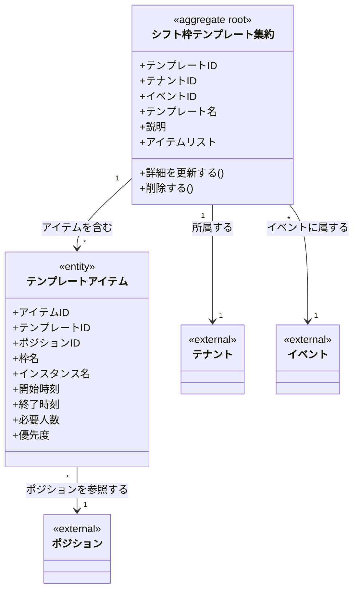

# シフト枠テンプレートドメインモデル

## 概要

シフト枠テンプレートドメインは、よく使うシフト枠の組み合わせをテンプレートとして保存し、営業日に適用する機能を定義する。
テンプレートを使用することで、繰り返し同じシフト構成を簡単に再現できる。

## 主要な概念

### シフト枠テンプレート集約（ShiftSlotTemplate Aggregate）（集約ルート）

イベントに紐づくシフト枠の雛形を表す集約ルート。
複数のテンプレートアイテムを含む。

**属性**:
- templateID: ULID形式の一意識別子
- tenantID: 所属するテナントのID
- eventID: 関連するイベントのID
- templateName: テンプレート名（必須、100文字以内）
- description: 説明（オプション、500文字以内）
- items: テンプレートアイテムのリスト
- createdAt: 作成日時
- updatedAt: 更新日時
- deletedAt: 削除日時（ソフトデリート）

**ドメインメソッド**:
- `UpdateDetails(templateName, description, items)`: テンプレート情報を一括更新
- `Delete()`: ソフトデリート

### シフト枠テンプレートアイテム（ShiftSlotTemplateItem）（エンティティ）

テンプレート内の1つのシフト枠定義を表すエンティティ。

**属性**:
- itemID: ULID形式の一意識別子
- templateID: 親テンプレートのID
- positionID: 関連するポジションのID
- slotName: 枠名（必須）
- instanceName: インスタンス名（例: 第1インスタンス）
- startTime: 開始時刻（TIME）
- endTime: 終了時刻（TIME）
- requiredCount: 必要人数（1以上）
- priority: 優先度
- createdAt: 作成日時
- updatedAt: 更新日時

## ドメインモデル図



## テンプレート適用フロー

```
1. テンプレート選択
   ↓
2. 適用先の営業日を選択
   ↓
3. テンプレートアイテムをもとにシフト枠を生成
   ↓
4. 生成されたシフト枠を確認・必要に応じて調整
```

### 適用時の動作

- 既存のシフト枠がある営業日にもテンプレートを適用可能
- 適用により、テンプレートアイテムの数だけ新しいシフト枠が追加される
- 既存のシフト枠は削除されない（追加のみ）

## 制約条件と業務ルール

### テナント境界制約

1. **テナント分離**: テンプレートは必ず1つのテナントに属する
2. **ポジション参照**: テンプレートには同じテナント内のポジションのみ指定可能
3. **イベント参照**: テンプレートには同じテナント内のイベントのみ指定可能

### イベントとの関連制約

1. **イベント所属**: テンプレートは必ず1つのイベントに属する
2. **複数テンプレート**: 同一イベントに複数のテンプレートを作成可能
3. **イベント削除時**: イベント削除時、関連するテンプレートも削除される（CASCADE）
4. **テンプレート名一意性**: 同一イベント内でテンプレート名は一意（論理削除されていないもののみ）

### テンプレートアイテム制約

1. **作成時**: アイテムが0件でも可（後から追加）
2. **更新時**: UpdateDetails時は1件以上のアイテムが必要
3. **必要人数**: requiredCount は 1 以上
4. **枠名必須**: slotName は必須

### テンプレート名制約

1. **必須**: templateName は必須、100文字以内
2. **重複許可**: 同一イベント内でテンプレート名の重複は不許可（UNIQUE制約）
