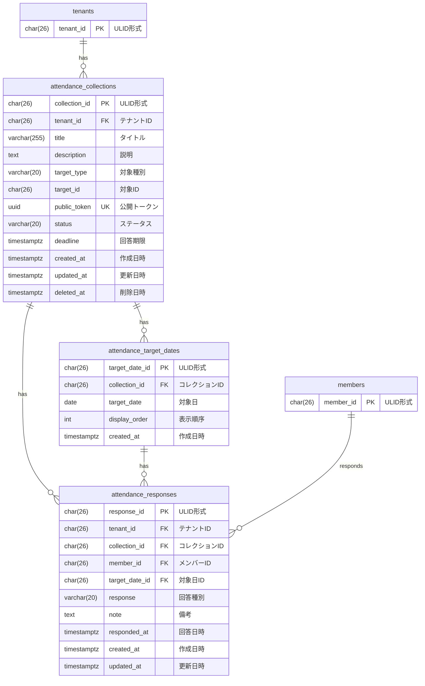

# 出欠確認 データモデル

## 概要

出欠確認ドメインのデータベーススキーマを定義する。
公開トークンによる回答収集と、複数対象日への回答管理を実現する。

## ER図

## テーブル定義

### attendance_collections テーブル

出欠確認コレクションを管理するテーブル。

| カラム名 | データ型 | NULL | デフォルト | 説明 |
|----------|----------|------|------------|------|
| collection_id | CHAR(26) | NO | - | 主キー（ULID形式） |
| tenant_id | CHAR(26) | NO | - | テナントID（FK） |
| title | VARCHAR(255) | NO | - | タイトル |
| description | TEXT | YES | NULL | 説明 |
| target_type | VARCHAR(20) | NO | - | 対象種別（event/business_day） |
| target_id | CHAR(26) | YES | NULL | 対象ID（event_id または business_day_id） |
| public_token | UUID | NO | - | 公開トークン（UUID v4、一意） |
| status | VARCHAR(20) | NO | 'open' | ステータス（open/closed） |
| deadline | TIMESTAMPTZ | YES | NULL | 回答期限 |
| created_at | TIMESTAMPTZ | NO | CURRENT_TIMESTAMP | 作成日時 |
| updated_at | TIMESTAMPTZ | NO | CURRENT_TIMESTAMP | 更新日時 |
| deleted_at | TIMESTAMPTZ | YES | NULL | 削除日時（ソフトデリート） |

**外部キー**:
- `fk_attendance_collections_tenant`: `tenant_id` → `tenants(tenant_id)` ON DELETE CASCADE

**制約**:
- `attendance_collections_status_check`: `status IN ('open', 'closed')`
- `attendance_collections_target_type_check`: `target_type IN ('event', 'business_day')`
- `UNIQUE(public_token)`

**インデックス**:
- `idx_attendance_collections_tenant`: `(tenant_id) WHERE deleted_at IS NULL`
- `idx_attendance_collections_token`: `(public_token)`

### attendance_target_dates テーブル

出欠確認の対象日を管理するテーブル。

| カラム名 | データ型 | NULL | デフォルト | 説明 |
|----------|----------|------|------------|------|
| target_date_id | CHAR(26) | NO | - | 主キー（ULID形式） |
| collection_id | CHAR(26) | NO | - | コレクションID（FK） |
| target_date | DATE | NO | - | 対象日 |
| display_order | INT | NO | 0 | 表示順序 |
| created_at | TIMESTAMPTZ | NO | CURRENT_TIMESTAMP | 作成日時 |

**外部キー**:
- `fk_attendance_target_dates_collection`: `collection_id` → `attendance_collections(collection_id)` ON DELETE CASCADE

**インデックス**:
- `idx_attendance_target_dates_collection`: `(collection_id, display_order)`

### attendance_responses テーブル

出欠回答を管理するテーブル。

| カラム名 | データ型 | NULL | デフォルト | 説明 |
|----------|----------|------|------------|------|
| response_id | CHAR(26) | NO | - | 主キー（ULID形式） |
| tenant_id | CHAR(26) | NO | - | テナントID（FK） |
| collection_id | CHAR(26) | NO | - | コレクションID（FK） |
| member_id | CHAR(26) | NO | - | メンバーID（FK） |
| target_date_id | CHAR(26) | NO | - | 対象日ID（FK） |
| response | VARCHAR(20) | NO | - | 回答種別（attending/absent） |
| note | TEXT | YES | NULL | 備考 |
| responded_at | TIMESTAMPTZ | NO | CURRENT_TIMESTAMP | 回答日時 |
| created_at | TIMESTAMPTZ | NO | CURRENT_TIMESTAMP | 作成日時 |
| updated_at | TIMESTAMPTZ | NO | CURRENT_TIMESTAMP | 更新日時 |

**外部キー**:
- `fk_attendance_responses_tenant`: `tenant_id` → `tenants(tenant_id)` ON DELETE CASCADE
- `fk_attendance_responses_collection`: `collection_id` → `attendance_collections(collection_id)` ON DELETE CASCADE
- `fk_attendance_responses_member`: `member_id` → `members(member_id)` ON DELETE RESTRICT
- `fk_attendance_responses_target_date`: `target_date_id` → `attendance_target_dates(target_date_id)` ON DELETE CASCADE

**制約**:
- `uq_attendance_response_member_target_date`: `UNIQUE(collection_id, member_id, target_date_id)`
- `attendance_responses_response_check`: `response IN ('attending', 'absent')`

**インデックス**:
- `idx_attendance_responses_collection`: `(collection_id)`
- `idx_attendance_responses_member`: `(tenant_id, member_id, responded_at DESC)`
- `idx_attendance_responses_target_date`: `(target_date_id)`

## マイグレーションファイル

- `008_create_attendance_tables.up.sql`: attendance_collections, attendance_responses テーブル作成
- `012_add_attendance_target_dates.up.sql`: attendance_target_dates テーブル作成
- `013_add_target_date_to_responses.up.sql`: attendance_responses に target_date_id カラム追加

## 備考

### 公開トークンについて

公開トークンはUUID v4形式を使用し、認証なしでアクセス可能なURLを生成するために使用する。
推測困難なランダム値であるため、URLを知っている人のみがアクセスできる。

### 回答の上書き仕様

同一コレクション×メンバー×対象日の組み合わせはUNIQUE制約により1件のみ。
回答を更新する場合はUPSERT（ON CONFLICT DO UPDATE）で上書きする。

### 対象日の削除時の挙動

`fk_attendance_responses_target_date` に `ON DELETE CASCADE` を設定しているため、
対象日を削除すると、その対象日に対する回答も削除される。

### メンバー削除時の挙動

`fk_attendance_responses_member` に `ON DELETE RESTRICT` を設定しているため、
回答が存在するメンバーは削除できない。
回答履歴を残すための設計判断である。
