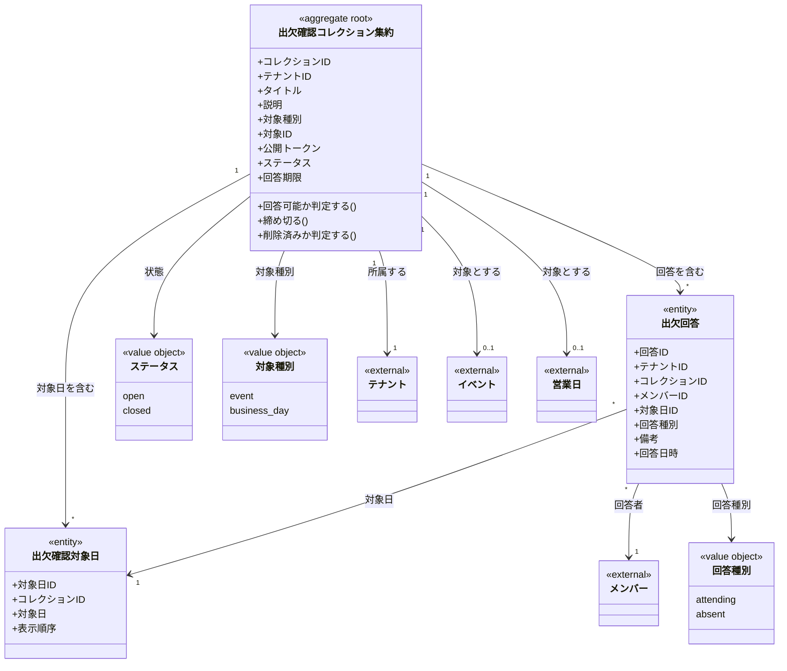

# 出欠確認ドメインモデル

## 概要

出欠確認ドメインは、メンバーの出欠を公開トークンで収集する機能を定義する。
特定のイベントや営業日に対して、メンバーが出席・欠席を回答できる仕組みを提供する。

## 主要な概念

### 出欠確認コレクション集約（AttendanceCollection Aggregate）（集約ルート）

出欠確認の回答を収集するための集約ルート。
公開トークンを使用して、認証なしで回答を受け付ける。

**属性**:
- collectionID: ULID形式の一意識別子
- tenantID: 所属するテナントのID
- title: タイトル（必須、255文字以内）
- description: 説明（オプション）
- targetType: 対象種別（event/business_day）
- targetID: 対象ID（event_id または business_day_id、オプション）
- publicToken: 公開トークン（UUID v4形式、一意）
- status: ステータス（open/closed）
- deadline: 回答期限（オプション）
- createdAt: 作成日時
- updatedAt: 更新日時
- deletedAt: 削除日時（ソフトデリート）

**ドメインメソッド**:
- `CanRespond(now)`: 回答可能かどうかを判定（ステータスと期限をチェック）
- `Close(now)`: ステータスをclosedに変更
- `IsDeleted()`: 論理削除されているかを判定

### 出欠確認対象日（TargetDate）（エンティティ）

出欠確認の対象となる日付を表すエンティティ。
1つのコレクションに複数の対象日を設定できる。

**属性**:
- targetDateID: ULID形式の一意識別子
- collectionID: 親コレクションのID
- targetDate: 対象日（DATE）
- displayOrder: 表示順序
- createdAt: 作成日時

### 出欠回答（AttendanceResponse）（エンティティ）

メンバーの出欠回答を表すエンティティ。
各対象日に対して個別に回答を保持する。

**属性**:
- responseID: ULID形式の一意識別子
- tenantID: 所属するテナントのID
- collectionID: 親コレクションのID
- memberID: 回答者のメンバーID
- targetDateID: 対象日ID
- response: 回答種別（attending/absent）
- note: 備考（オプション）
- respondedAt: 回答日時
- createdAt: 作成日時
- updatedAt: 更新日時

## 値オブジェクト

### Status（ステータス）

出欠確認コレクションのステータスを表す値オブジェクト。

| 値 | 説明 |
|-----|------|
| open | 回答受付中 |
| closed | 締切 |

**メソッド**:
- `IsOpen()`: 受付中かどうかを判定
- `IsClosed()`: 締切かどうかを判定

### TargetType（対象種別）

出欠確認の対象種別を表す値オブジェクト。

| 値 | 説明 |
|-----|------|
| event | イベント全体 |
| business_day | 特定の営業日 |

### ResponseType（回答種別）

出欠回答の種別を表す値オブジェクト。

| 値 | 説明 |
|-----|------|
| attending | 出席 |
| absent | 欠席 |

## ドメインモデル図



## 出欠回答フロー

```
1. 管理者が出欠確認コレクションを作成
   ↓
2. 対象日を設定
   ↓
3. 公開トークンを含むURLをメンバーに共有
   ↓
4. メンバーが公開URLにアクセス（認証不要）
   ↓
5. 各対象日に対して出欠を回答
   ↓
6. 回答はUPSERTで保存（同一メンバー×対象日で上書き）
   ↓
7. 管理者が結果を確認
```

## 制約条件と業務ルール

### テナント境界制約

1. **テナント分離**: コレクションは必ず1つのテナントに属する
2. **メンバー参照**: 回答を提出できるのは同じテナント内のメンバーのみ

### コレクション制約

1. **タイトル必須**: title は必須、255文字以内
2. **公開トークン一意性**: publicToken は全体で一意（UUID v4）
3. **ステータス遷移**: open → closed のみ可能（逆方向は不可）

### 回答制約

1. **一意性**: 同一コレクション×メンバー×対象日で1回答のみ
2. **上書き可能**: 既存回答がある場合はUPSERTで上書き
3. **回答可否**: statusがopenかつ期限内の場合のみ回答可能
4. **対象日必須**: 回答には必ず対象日IDが必要

### 公開トークンの特性

1. **UUID v4形式**: 推測困難なランダムトークン
2. **認証不要**: トークンさえあれば誰でもアクセス可能
3. **直接アクセス**: URLに含めて共有可能

### メンバー削除時の挙動

`fk_attendance_responses_member` に `ON DELETE RESTRICT` を設定しているため、
回答が存在するメンバーは削除できない。
これにより、回答履歴の整合性を保証している。
