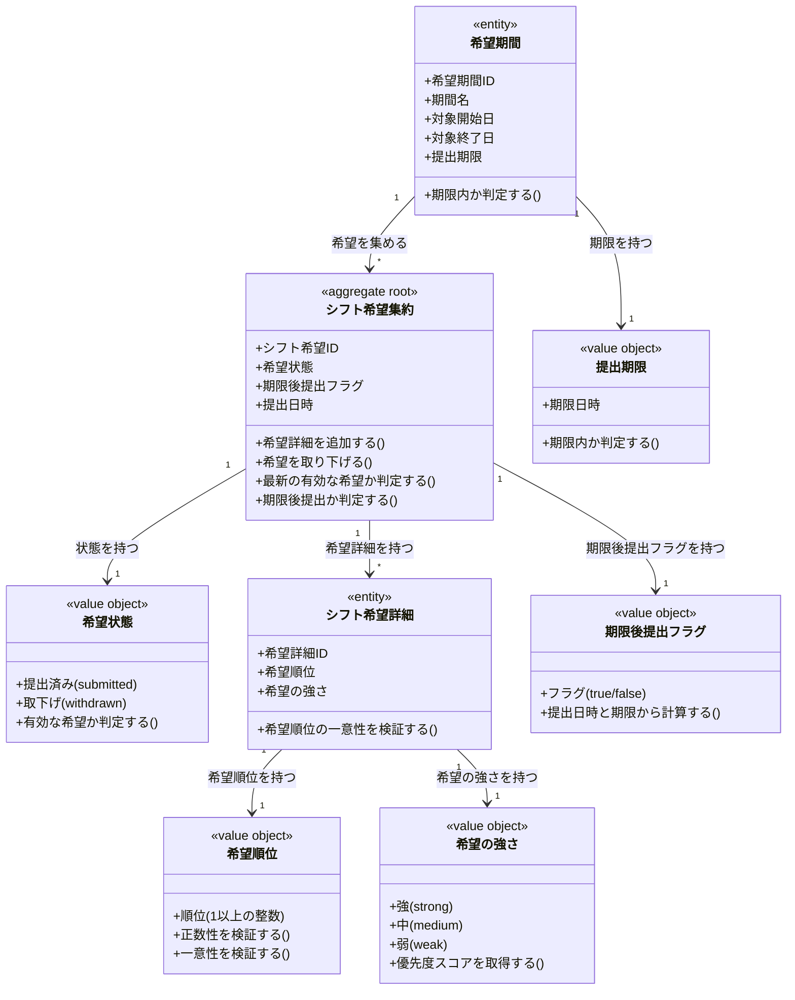

# シフト希望ドメインモデル

## 概要

シフト希望ドメインは、キャスト・スタッフが出勤可能な日・時間帯・ポジションを事前に申告し、運営がシフト案を作成するための入力情報を管理する。
希望期間（まとめてシフト希望を提出する単位）を設定し、提出期限を管理することで、運営の調整作業をスムーズにする責務を持つ。
希望ポジション・優先度を含めた構造化された希望情報を扱い、希望の修正履歴を保持することで、希望の変更経緯を追跡可能にする。

## 主要な概念

### 希望期間（Availability Period）（エンティティ）

まとめてシフト希望を提出する単位の期間を表すエンティティ。
期間名・対象日範囲・提出期限を保持し、従来の「調整さん」の1枚に該当するものをシステム上で表現する。
提出期限を管理することで、期限後の希望を明確に識別する。

### シフト希望集約（Shift Availability Aggregate）（集約ルート）

メンバーが特定の営業日に対して提出する「出勤可能」の申告を表す集約ルート。
対象営業日・希望状態（提出済/取下げ）・期限後提出フラグ・提出日時を保持し、希望詳細（希望ポジション・優先度）を管理する。
同一営業日への希望の上書き処理と履歴管理を担い、最新の有効な希望を判定する。

### 希望状態（Availability Status）（区分オブジェクト）

シフト希望のライフサイクルを表す区分オブジェクト。
提出済み（submitted）・取下げ（withdrawn）を識別し、希望の有効性を判定する基準となる。

### シフト希望詳細（Availability Detail）（エンティティ）

シフト希望の詳細（希望時間帯・ポジション・優先度）を表すエンティティ。
特定の営業日の、特定時間帯・特定ポジションの枠に対する希望を保持し、希望順位（第1希望/第2希望など）と希望の強さ（強/中/弱）を管理する。

### 希望順位（Preference Order）（値オブジェクト）

シフト希望詳細の優先順位を表す値オブジェクト。
1以上の整数で表され、第1希望・第2希望などの順序を示す。
同一シフト希望内で重複しない一意性を保証する。

### 希望の強さ（Preference Strength）（区分オブジェクト）

シフト希望の強度を表す区分オブジェクト。
強（strong）・中（medium）・弱（weak）を識別し、シフト確定時の優先度判定に使用される。

## 希望状態の詳細

### 1. 提出済み（Submitted）

- **対象**: メンバーが希望を提出し、シフト確定の対象となる状態
- **特徴**: 最新の提出済み希望がシフト確定時の入力情報として使用される
- **例**: ボブが12月5日のカウンターAを第1希望として提出した状態

### 2. 取下げ（Withdrawn）

- **対象**: メンバーが希望を修正する際、古い希望を取り下げた状態
- **特徴**: 履歴として保持されるが、シフト確定の対象にはならない
- **例**: ボブが12月5日の希望を修正した際、古い希望が取下げ状態になる

## 希望の強さの詳細

### 1. 強（Strong）

- **対象**: 必ず出勤したい、強い希望を持つ場合
- **特徴**: シフト確定時に最優先で考慮される
- **例**: 「この日は絶対に出勤したい」という強い希望

### 2. 中（Medium）

- **対象**: 出勤できれば出勤したいという通常の希望
- **特徴**: シフト確定時に考慮されるが、強い希望よりは優先度が低い
- **例**: 「出られたら出たい」という通常の希望

### 3. 弱（Weak）

- **対象**: 他に適任者がいなければ出勤可能という弱い希望
- **特徴**: シフト確定時に最後に考慮される
- **例**: 「他の人が埋まらなければヘルプで入ります」という弱い希望

## 希望期間の管理

### 希望期間の設定例

```
【12月通常営業分】
- 期間名: 12月通常営業分
- 対象日範囲: 2025-12-05 〜 2025-12-26（4回の木曜日）
- 提出期限: 2025-11-29 23:59

【Vket特別営業分】
- 期間名: Vket特別営業分
- 対象日範囲: 2025-11-11 〜 2025-11-12（2日間）
- 提出期限: 2025-11-05 23:59
```

### 提出期限の扱い

```
【期限内提出】
- 提出日時: 2025-11-28 15:00
- 提出期限: 2025-11-29 23:59
- 期限後提出フラグ: false
- 結果: 通常の希望として集計対象

【期限後提出】
- 提出日時: 2025-11-30 10:00
- 提出期限: 2025-11-29 23:59
- 期限後提出フラグ: true
- 結果: 期限後提出として運営判断で集計対象にするか決定
```

## シフト希望の提出と修正の流れ

### 初回提出フロー

```
1. 希望期間選択
   - 対象: 12月通常営業分
   - 営業日: 2025-12-05、2025-12-12、2025-12-19、2025-12-26

2. シフト希望提出（営業日ごと）
   - 2025-12-05: 出勤可能
   - 2025-12-12: 出勤可能
   - 2025-12-19: 出勤可能
   - 2025-12-26: 出勤不可

3. 希望詳細登録（2025-12-05の例）
   - 第1希望: カウンターA（強）
   - 第2希望: カウンターB（中）
   - 第3希望: テーブルE（弱）
```

### 希望修正フロー

```
1. 既存の希望参照
   - 2025-12-05: 第1希望カウンターA（強）

2. 希望の取下げ
   - 古い希望の状態を「取下げ」に変更

3. 新しい希望提出
   - 2025-12-05: 出勤可能

4. 新しい希望詳細登録
   - 第1希望: テーブルF（強） ← 変更
   - 第2希望: テーブルE（中） ← 新規追加

結果: 古い希望は履歴として残り、新しい希望が有効になる
```

### 最新の有効な希望の判定

```
同一（テナント、メンバー、営業日、希望期間）の組み合わせについて：

1. 希望状態が「提出済み」の希望を抽出
2. 提出日時が最も新しい希望を「最新の有効な希望」として扱う
3. 取下げ状態の希望は除外（履歴としてのみ保持）

【例】
- 希望1: 2025-11-28 15:00 提出 [提出済み] ← 古い
- 希望2: 2025-11-29 20:00 提出 [取下げ] ← 修正時に取下げ
- 希望3: 2025-11-29 20:01 提出 [提出済み] ← 最新の有効な希望★
```

## シフト希望の構造例

### 複数ポジションの希望提出

```
【メンバー: ボブ】
【営業日: 2025-12-05】
【希望期間: 12月通常営業分】

シフト希望:
- 希望ID: 018f-xxxx-0080
- 営業日: 2025-12-05
- 希望状態: 提出済み
- 期限後提出: false
- 提出日時: 2025-11-28 15:00

希望詳細:
1. シフト枠: カウンターA 21:30-23:00
   - 希望順位: 1（第1希望）
   - 希望の強さ: 強

2. シフト枠: カウンターB 21:30-23:00
   - 希望順位: 2（第2希望）
   - 希望の強さ: 中

3. シフト枠: テーブルE 21:30-23:00
   - 希望順位: 3（第3希望）
   - 希望の強さ: 弱
```

## ドメインモデル図



## 制約条件と業務ルール

### 希望期間制約

1. **希望期間の所属**: 希望期間は必ず1つのテナントと1つのイベントに属する
2. **日付の順序性**: 対象開始日は対象終了日よりも前でなければならない
3. **提出期限の妥当性**: 提出期限は対象開始日よりも前に設定されることが推奨される（運営が事前に希望を集計できるように）

### シフト希望制約

1. **シフト希望の所属**: シフト希望は必ず1つのテナント・1つのメンバー・1つの営業日・1つの希望期間に属する
2. **希望の論理的一意性**: 同一テナント・同一メンバー・同一営業日・同一希望期間に対して、有効なシフト希望（availability_status = 'submitted'）は論理的には1件のみ存在する
3. **営業日の整合性**: シフト希望が参照する営業日は、希望期間の対象日範囲内でなければならない
4. **提出日時の記録**: シフト希望の提出日時は必ず記録され、最新の有効な希望の判定に使用される

### 希望状態制約

1. **状態の遷移**: シフト希望の状態は「提出済み → 取下げ」の一方向遷移のみ許可される
2. **取下げ後の扱い**: 取下げ状態のシフト希望は履歴として保持されるが、シフト確定の対象にはならない
3. **最新の有効な希望**: 同一（テナント、メンバー、営業日、希望期間）の組み合わせについて、提出日時が最も新しい「提出済み」状態の希望が有効とされる

### シフト希望詳細制約

1. **希望詳細の所属**: シフト希望詳細は必ず1つのシフト希望に属する
2. **シフト枠の整合性**: シフト希望詳細が参照するシフト枠の営業日は、シフト希望の営業日と一致しなければならない
3. **希望順位の一意性**: 同一シフト希望内で希望順位は重複してはならない
4. **希望順位の正数性**: 希望順位は1以上の正の整数でなければならない
5. **シフト枠の重複禁止**: 同一シフト希望内で同一シフト枠を複数回希望することはできない

### 期限後提出制約

1. **フラグの整合性**: 期限後提出フラグ（is_late_submission）は、「提出日時 > 提出期限」の条件を満たす場合に true となる
2. **計算の一致**: 期限後提出フラグは、提出日時と希望期間の提出期限から自動計算され、矛盾してはならない
3. **集計対象の決定**: 期限後提出の希望は、運営判断で集計対象にするかどうかを決定する

### 希望の修正制約

1. **上書き処理**: 同一営業日への希望を修正する場合、古い希望を「取下げ」状態に変更し、新しい希望を「提出済み」として作成する
2. **履歴の保持**: 取下げ状態の希望は削除せず、履歴として保持される
3. **矛盾の防止**: 同一営業日に対して複数の「提出済み」希望が存在しないようにする（最新の提出のみが有効）

### テナント境界制約

1. **テナント分離**: シフト希望・希望期間・希望詳細は必ず1つのテナントに属し、テナント間でのデータ参照・変更は禁止される
2. **一貫性の保証**: シフト希望→希望期間、シフト希望→営業日、希望詳細→シフト枠の参照は同一テナント内でのみ許可される

### 初期スコープ制約

1. **部分参加の非対応**: 営業時間の一部のみ出勤可能（前半のみなど）は初期スコープでは対応しない（PdM確認済み）
2. **営業全体単位**: シフト希望は営業日全体に対する出勤可否として扱われる

