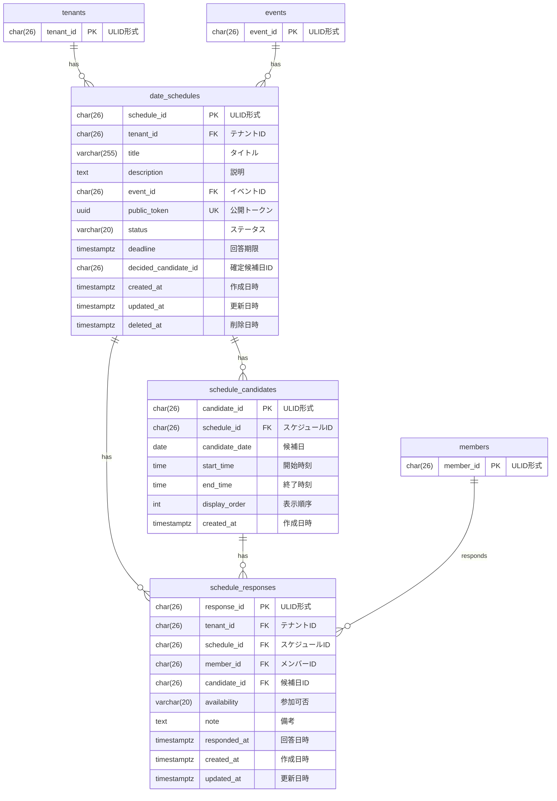

# 日程調整 データモデル

## 概要

日程調整ドメインのデータベーススキーマを定義する。
公開トークンによる回答収集と、複数候補日への参加可否の管理を実現する。

## ER図

## テーブル定義

### date_schedules テーブル

日程調整を管理するテーブル。

| カラム名 | データ型 | NULL | デフォルト | 説明 |
|----------|----------|------|------------|------|
| schedule_id | CHAR(26) | NO | - | 主キー（ULID形式） |
| tenant_id | CHAR(26) | NO | - | テナントID（FK） |
| title | VARCHAR(255) | NO | - | タイトル |
| description | TEXT | YES | NULL | 説明 |
| event_id | CHAR(26) | YES | NULL | イベントID（FK、オプション） |
| public_token | UUID | NO | - | 公開トークン（UUID v4、一意） |
| status | VARCHAR(20) | NO | 'open' | ステータス（open/closed/decided） |
| deadline | TIMESTAMPTZ | YES | NULL | 回答期限 |
| decided_candidate_id | CHAR(26) | YES | NULL | 確定した候補日ID |
| created_at | TIMESTAMPTZ | NO | CURRENT_TIMESTAMP | 作成日時 |
| updated_at | TIMESTAMPTZ | NO | CURRENT_TIMESTAMP | 更新日時 |
| deleted_at | TIMESTAMPTZ | YES | NULL | 削除日時（ソフトデリート） |

**外部キー**:
- `tenant_id` → `tenants(tenant_id)` （暗黙のCASCADE）
- `event_id` → `events(event_id)` （暗黙のRESTRICT）

**制約**:
- `UNIQUE(public_token)`

**インデックス**:
- `idx_date_schedules_tenant`: `(tenant_id) WHERE deleted_at IS NULL`
- `idx_date_schedules_token`: `(public_token)`

### schedule_candidates テーブル

日程調整の候補日を管理するテーブル。

| カラム名 | データ型 | NULL | デフォルト | 説明 |
|----------|----------|------|------------|------|
| candidate_id | CHAR(26) | NO | - | 主キー（ULID形式） |
| schedule_id | CHAR(26) | NO | - | スケジュールID（FK） |
| candidate_date | DATE | NO | - | 候補日 |
| start_time | TIME | YES | NULL | 開始時刻（オプション） |
| end_time | TIME | YES | NULL | 終了時刻（オプション） |
| display_order | INT | NO | 0 | 表示順序 |
| created_at | TIMESTAMPTZ | NO | CURRENT_TIMESTAMP | 作成日時 |

**外部キー**:
- `schedule_id` → `date_schedules(schedule_id)` ON DELETE CASCADE

**インデックス**:
- `idx_schedule_candidates_schedule`: `(schedule_id)`

### schedule_responses テーブル

日程調整回答を管理するテーブル。

| カラム名 | データ型 | NULL | デフォルト | 説明 |
|----------|----------|------|------------|------|
| response_id | CHAR(26) | NO | - | 主キー（ULID形式） |
| tenant_id | CHAR(26) | NO | - | テナントID（FK） |
| schedule_id | CHAR(26) | NO | - | スケジュールID（FK） |
| member_id | CHAR(26) | NO | - | メンバーID（FK） |
| candidate_id | CHAR(26) | NO | - | 候補日ID（FK） |
| availability | VARCHAR(20) | NO | - | 参加可否（available/unavailable/maybe） |
| note | TEXT | YES | NULL | 備考 |
| responded_at | TIMESTAMPTZ | NO | CURRENT_TIMESTAMP | 回答日時 |
| created_at | TIMESTAMPTZ | NO | CURRENT_TIMESTAMP | 作成日時 |
| updated_at | TIMESTAMPTZ | NO | CURRENT_TIMESTAMP | 更新日時 |

**外部キー**:
- `tenant_id` → `tenants(tenant_id)` （暗黙のCASCADE）
- `schedule_id` → `date_schedules(schedule_id)` ON DELETE CASCADE
- `member_id` → `members(member_id)` （暗黙のRESTRICT）
- `candidate_id` → `schedule_candidates(candidate_id)` ON DELETE CASCADE

**制約**:
- `uq_schedule_response_member_candidate`: `UNIQUE(schedule_id, member_id, candidate_id)`

**インデックス**:
- `idx_schedule_responses_schedule`: `(schedule_id)`
- `idx_schedule_responses_member`: `(member_id)`

## マイグレーションファイル

- `009_create_schedule_tables.up.sql`: date_schedules, schedule_candidates, schedule_responses テーブル作成

## 備考

### 公開トークンについて

公開トークンはUUID v4形式を使用し、認証なしでアクセス可能なURLを生成するために使用する。
推測困難なランダム値であるため、URLを知っている人のみがアクセスできる。

### 回答の上書き仕様

同一スケジュール×メンバー×候補日の組み合わせはUNIQUE制約により1件のみ。
回答を更新する場合はUPSERT（ON CONFLICT DO UPDATE）で上書きする。

### 候補日の削除時の挙動

`schedule_id` → `date_schedules` および `candidate_id` → `schedule_candidates` に ON DELETE CASCADE を設定しているため、
日程調整や候補日を削除すると、関連する回答も自動的に削除される。

### 日程確定（decided）について

- `decided_candidate_id` には確定した候補日のIDが格納される
- `status` が 'decided' に変更されると、その日程調整は完了となる
- 確定後は回答の受付も終了する

### 出欠確認（attendance）との違い

| 観点 | 出欠確認 | 日程調整 |
|------|---------|---------|
| 目的 | 特定日程への出欠回答 | 複数候補から開催日を決定 |
| 回答形式 | attending/absent（2択） | available/unavailable/maybe（3択） |
| 対象日 | 対象日（target_dates） | 候補日（candidates） |
| ステータス | open/closed | open/closed/decided |
| 最終アクション | 締切のみ | 日程確定も可能 |
