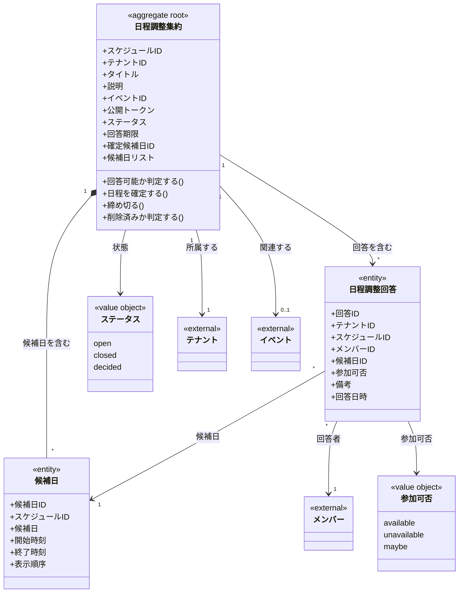

# 日程調整ドメインモデル

## 概要

日程調整ドメインは、イベント開催日を調整するための機能を定義する。
複数の候補日を提示し、メンバーが参加可否を回答することで、最適な開催日を決定できる。

## 主要な概念

### 日程調整集約（DateSchedule Aggregate）（集約ルート）

日程調整の集約ルート。
複数の候補日を含み、公開トークンを使用して回答を収集する。

**属性**:
- scheduleID: ULID形式の一意識別子
- tenantID: 所属するテナントのID
- title: タイトル（必須、255文字以内）
- description: 説明（オプション）
- eventID: 関連するイベントのID（オプション）
- publicToken: 公開トークン（UUID v4形式、一意）
- status: ステータス（open/closed/decided）
- deadline: 回答期限（オプション）
- decidedCandidateID: 確定した候補日のID（オプション）
- candidates: 候補日のリスト（集約内で保持）
- createdAt: 作成日時
- updatedAt: 更新日時
- deletedAt: 削除日時（ソフトデリート）

**ドメインメソッド**:
- `CanRespond(now)`: 回答可能かどうかを判定（ステータスと期限をチェック）
- `Decide(candidateID, now)`: 開催日を決定し、ステータスをdecidedに変更
- `Close(now)`: ステータスをclosedに変更
- `IsDeleted()`: 論理削除されているかを判定

### 候補日（CandidateDate）（エンティティ）

日程調整の候補となる日付を表すエンティティ。
集約ルート（DateSchedule）の内部に保持される。

**属性**:
- candidateID: ULID形式の一意識別子
- scheduleID: 親スケジュールのID
- candidateDate: 候補日（DATE）
- startTime: 開始時刻（オプション、TIME）
- endTime: 終了時刻（オプション、TIME）
- displayOrder: 表示順序
- createdAt: 作成日時

### 日程調整回答（DateScheduleResponse）（エンティティ）

メンバーの回答を表すエンティティ。
各候補日に対して個別に参加可否を回答する。

**属性**:
- responseID: ULID形式の一意識別子
- tenantID: 所属するテナントのID
- scheduleID: 親スケジュールのID
- memberID: 回答者のメンバーID
- candidateID: 候補日ID
- availability: 参加可否（available/unavailable/maybe）
- note: 備考（オプション）
- respondedAt: 回答日時
- createdAt: 作成日時
- updatedAt: 更新日時

## 値オブジェクト

### Status（ステータス）

日程調整のステータスを表す値オブジェクト。

| 値 | 説明 |
|-----|------|
| open | 回答受付中 |
| closed | 締切（確定なし） |
| decided | 日程確定 |

**メソッド**:
- `IsOpen()`: 受付中かどうかを判定
- `IsClosed()`: 締切かどうかを判定
- `IsDecided()`: 確定済みかどうかを判定

### Availability（参加可否）

候補日への参加可否を表す値オブジェクト。

| 値 | 説明 |
|-----|------|
| available | 参加可能 |
| unavailable | 参加不可 |
| maybe | 未定・要相談 |

## ドメインモデル図



## 日程調整フロー

```
1. 管理者が日程調整を作成（候補日を設定）
   ↓
2. 公開トークンを含むURLをメンバーに共有
   ↓
3. メンバーが公開URLにアクセス（認証不要）
   ↓
4. 各候補日に対して参加可否を回答
   ↓
5. 回答はUPSERTで保存（同一メンバー×候補日で上書き）
   ↓
6. 管理者が結果を確認
   ↓
7. 管理者が開催日を決定（Decide）
```

## 制約条件と業務ルール

### テナント境界制約

1. **テナント分離**: 日程調整は必ず1つのテナントに属する
2. **メンバー参照**: 回答を提出できるのは同じテナント内のメンバーのみ

### 日程調整制約

1. **タイトル必須**: title は必須、255文字以内
2. **公開トークン一意性**: publicToken は全体で一意（UUID v4）
3. **候補日必須**: 作成時に少なくとも1つの候補日が必要
4. **ステータス遷移**:
   - open → closed（締切、確定なし）
   - open → decided（日程確定）
   - closed/decided からは変更不可

### 候補日制約

1. **スケジュール所属**: 候補日は必ず1つの日程調整に属する
2. **CASCADE削除**: 日程調整削除時、候補日も削除される
3. **時刻オプション**: startTime/endTime は両方ともオプション

### 回答制約

1. **一意性**: 同一スケジュール×メンバー×候補日で1回答のみ
2. **上書き可能**: 既存回答がある場合はUPSERTで上書き
3. **回答可否**: statusがopenかつ期限内の場合のみ回答可能
4. **候補日必須**: 回答には必ず候補日IDが必要

### 公開トークンの特性

1. **UUID v4形式**: 推測困難なランダムトークン
2. **認証不要**: トークンさえあれば誰でもアクセス可能
3. **直接アクセス**: URLに含めて共有可能

### 日程確定（Decide）のルール

1. **一度のみ**: 確定後は変更不可
2. **候補日検証**: 確定する候補日IDは、その日程調整の候補日でなければならない
3. **ステータス変更**: decidedに変更され、decidedCandidateIDが設定される
