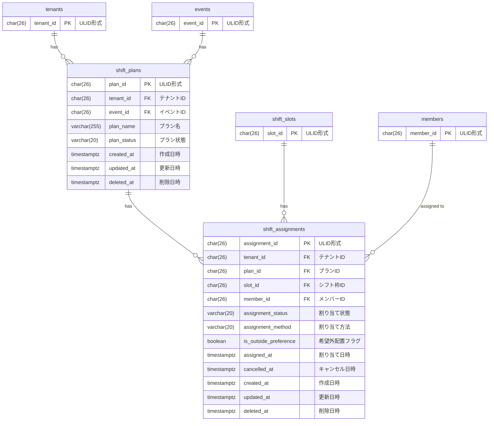

# シフト計画と割り当て データモデル

## 概要

シフト計画と割り当てドメインのデータベーススキーマを定義する。
シフト計画による配置管理と、手動割り当ての両方をサポートする。

## ER図

## テーブル定義

### shift_plans テーブル

シフト計画を管理するテーブル。

| カラム名 | データ型 | NULL | デフォルト | 説明 |
|----------|----------|------|------------|------|
| plan_id | CHAR(26) | NO | - | 主キー（ULID形式） |
| tenant_id | CHAR(26) | NO | - | テナントID（FK） |
| event_id | CHAR(26) | NO | - | イベントID（FK） |
| plan_name | VARCHAR(255) | NO | - | プラン名 |
| plan_status | VARCHAR(20) | NO | 'draft' | プラン状態（draft/published/finalized） |
| created_at | TIMESTAMPTZ | NO | CURRENT_TIMESTAMP | 作成日時 |
| updated_at | TIMESTAMPTZ | NO | CURRENT_TIMESTAMP | 更新日時 |
| deleted_at | TIMESTAMPTZ | YES | NULL | 削除日時（ソフトデリート） |

**外部キー**:
- `fk_shift_plans_tenant`: `tenant_id` → `tenants(tenant_id)` ON DELETE CASCADE
- `fk_shift_plans_event`: `event_id` → `events(event_id)` ON DELETE CASCADE

**制約**:
- `shift_plans_status_check`: `plan_status IN ('draft', 'published', 'finalized')`
- `shift_plans_name_check`: `LENGTH(plan_name) >= 1`

**インデックス**:
- `idx_shift_plans_tenant_event`: `(tenant_id, event_id) WHERE deleted_at IS NULL`

### shift_assignments テーブル

シフト割り当てを管理するテーブル。

| カラム名 | データ型 | NULL | デフォルト | 説明 |
|----------|----------|------|------------|------|
| assignment_id | CHAR(26) | NO | - | 主キー（ULID形式） |
| tenant_id | CHAR(26) | NO | - | テナントID（FK） |
| plan_id | CHAR(26) | YES | NULL | プランID（FK、手動割り当ての場合NULL） |
| slot_id | CHAR(26) | NO | - | シフト枠ID（FK） |
| member_id | CHAR(26) | NO | - | メンバーID（FK） |
| assignment_status | VARCHAR(20) | NO | 'confirmed' | 割り当て状態（confirmed/cancelled） |
| assignment_method | VARCHAR(20) | NO | 'manual' | 割り当て方法（auto/manual） |
| is_outside_preference | BOOLEAN | NO | false | 希望外配置フラグ |
| assigned_at | TIMESTAMPTZ | NO | CURRENT_TIMESTAMP | 割り当て日時 |
| cancelled_at | TIMESTAMPTZ | YES | NULL | キャンセル日時 |
| created_at | TIMESTAMPTZ | NO | CURRENT_TIMESTAMP | 作成日時 |
| updated_at | TIMESTAMPTZ | NO | CURRENT_TIMESTAMP | 更新日時 |
| deleted_at | TIMESTAMPTZ | YES | NULL | 削除日時（ソフトデリート） |

**外部キー**:
- `fk_shift_assignments_tenant`: `tenant_id` → `tenants(tenant_id)` ON DELETE CASCADE
- `fk_shift_assignments_plan`: `plan_id` → `shift_plans(plan_id)` ON DELETE SET NULL
- `fk_shift_assignments_slot`: `slot_id` → `shift_slots(slot_id)` ON DELETE CASCADE
- `fk_shift_assignments_member`: `member_id` → `members(member_id)` ON DELETE RESTRICT

**制約**:
- `shift_assignments_status_check`: `assignment_status IN ('confirmed', 'cancelled')`
- `shift_assignments_method_check`: `assignment_method IN ('auto', 'manual')`
- `shift_assignments_cancelled_consistency`: `(assignment_status = 'cancelled' AND cancelled_at IS NOT NULL) OR (assignment_status = 'confirmed' AND cancelled_at IS NULL)`

**インデックス**:
- `idx_shift_assignments_slot_member_confirmed_unique`: `UNIQUE(slot_id, member_id, assignment_status) WHERE assignment_status = 'confirmed' AND deleted_at IS NULL`
- `idx_shift_assignments_tenant_member_status`: `(tenant_id, member_id, assignment_status) WHERE deleted_at IS NULL`
- `idx_shift_assignments_slot_status`: `(slot_id, assignment_status) WHERE deleted_at IS NULL`
- `idx_shift_assignments_plan`: `(plan_id) WHERE deleted_at IS NULL`
- `idx_shift_assignments_assigned_at`: `(assigned_at DESC) WHERE deleted_at IS NULL`

## マイグレーションファイル

- `004_create_shift_plans_and_assignments.up.sql`: shift_plans, shift_assignments テーブル作成
- `016_allow_null_plan_id_in_assignments.up.sql`: shift_assignments の plan_id を NULL 許可に変更

## 備考

### プラン状態（plan_status）について

| 状態 | 説明 |
|------|------|
| draft | 下書き状態。運営が調整中 |
| published | 公開状態。メンバーが確認可能 |
| finalized | 確定状態。最終決定済み |

### 割り当て状態（assignment_status）について

| 状態 | 説明 |
|------|------|
| confirmed | 確定済み。有効な割り当て |
| cancelled | キャンセル済み。履歴として保持 |

### 割り当て方法（assignment_method）について

| 方法 | 説明 |
|------|------|
| auto | 自動割当機能で生成 |
| manual | 運営が手動で追加 |

### plan_id の NULL 許可について

`plan_id` は NULL を許可しており、以下のケースに対応する：

1. **計画に紐づく割り当て**: `plan_id` が設定される
2. **手動直接割り当て**: `plan_id` が NULL で、シフト計画を経由せずに直接割り当て

これにより、シフト計画を使用しない簡易的な運用もサポートする。

### 希望外配置フラグについて

`is_outside_preference` は以下の場合に true となる：

1. メンバーが対象営業日にシフト希望を提出していない
2. メンバーが希望を提出しているが、配置されたシフト枠を希望していない

運営判断で希望外の配置を行った記録として保持される。

### メンバー削除時の挙動

`fk_shift_assignments_member` に `ON DELETE RESTRICT` を設定しているため、
割り当てが存在するメンバーは削除できない。
これにより、シフト履歴の整合性を保証している。

### 重複配置の防止

`idx_shift_assignments_slot_member_confirmed_unique` により、
同じシフト枠に同じメンバーを重複して確定割り当てすることはできない。
ただし、`cancelled` 状態の履歴レコードは保持される。
