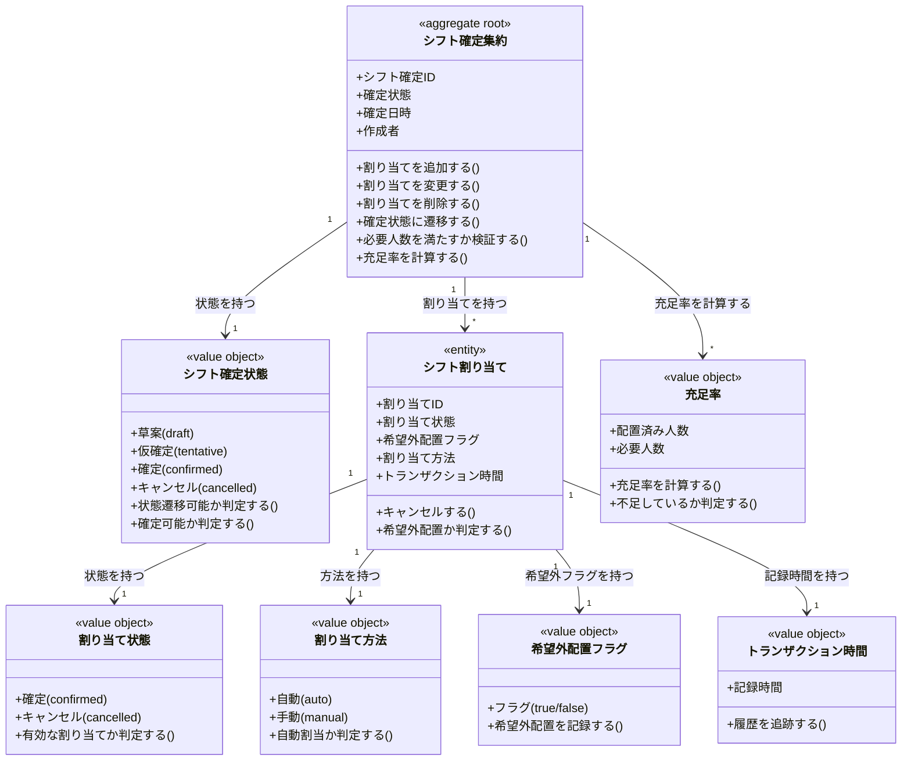

# シフト確定と割り当てドメインモデル

## 概要

シフト確定と割り当てドメインは、集まったシフト希望と営業枠定義に基づき、運営が各枠に誰を配置するかを決定し、その結果を最終的な配置計画として管理する。
シフト案（暫定的な配置案）からシフト確定（最終承認された配置結果）への状態遷移を管理し、自動割当と手動調整の両方に対応する責務を持つ。
ポジション適性・希望優先度・キャストバランス・インスタンス間人数バランスを考慮した配置決定と、希望外配置・必要人数不足枠の警告・記録を実現する。

## 主要な概念

### シフト確定集約（Shift Plan Aggregate）（集約ルート）

運営が作成した最終的な配置計画を表す集約ルート。
特定の営業日に対するシフト割り当て全体を束ね、草案→仮確定→確定の状態遷移と、各枠への人員配置の整合性を保証する。
確定状態・確定日時・作成者を保持し、シフト割り当ての追加・変更・削除を管理する。

### シフト確定状態（Shift Plan Status）（区分オブジェクト）

シフト確定のライフサイクルを表す区分オブジェクト。
草案（draft）・仮確定（tentative）・確定（confirmed）・キャンセル（cancelled）を識別し、状態遷移のルールをカプセル化する。

### シフト割り当て（Shift Assignment）（エンティティ）

シフト確定における各枠への具体的なメンバー配置を表すエンティティ。
シフト枠・メンバー・割り当て状態（確定/キャンセル）・希望外配置フラグ・割り当て方法（自動/手動）を保持し、配置の変更履歴を管理する。

### 割り当て状態（Assignment Status）（区分オブジェクト）

シフト割り当てのライフサイクルを表す区分オブジェクト。
確定（confirmed）・キャンセル（cancelled）を識別し、有効な割り当てを判定する基準となる。

### 割り当て方法（Assignment Method）（区分オブジェクト）

シフト割り当ての生成方法を表す区分オブジェクト。
自動（auto）・手動（manual）を識別し、自動割当と手動調整を明確に区別する。

### 希望外配置フラグ（Outside Preference Flag）（値オブジェクト）

メンバーが希望を出していない枠への配置を表す値オブジェクト。
希望外配置の場合に true となり、運営判断で配置を強行したことを記録する。

## シフト確定状態の詳細

### 1. 草案（Draft）

- **対象**: シフト案作成直後の、運営が調整中の状態
- **特徴**: 自動割当と手動調整が可能であり、メンバーには公開されない
- **例**: 店長が自動割当を実行し、手動で微調整している段階

### 2. 仮確定（Tentative）

- **対象**: 運営が一旦配置を完了したが、最終確認前の状態
- **特徴**: 変更が容易であり、最終調整が可能
- **例**: 店長が一旦割り当てを完了し、副店長に最終確認を依頼している段階

### 3. 確定（Confirmed）

- **対象**: シフト割り当てが確定し、メンバーに通知済みの状態
- **特徴**: 変更には監査ログ記録と再通知が必要
- **例**: 全メンバーに確定通知が送信され、出勤準備が始まった状態

### 4. キャンセル（Cancelled）

- **対象**: 営業日自体が中止になった、またはシフト確定を取り消した状態
- **特徴**: シフト割り当ては履歴として残るが、有効な配置としては扱われない
- **例**: 悪天候により営業日が中止になった場合

## 割り当て状態の詳細

### 1. 確定（Confirmed）

- **対象**: シフト枠への配置が有効な状態
- **特徴**: シフト確定時に有効な割り当てとして扱われる
- **例**: ボブがカウンターAに配置された状態

### 2. キャンセル（Cancelled）

- **対象**: 配置が取り消された状態
- **特徴**: 履歴として保持されるが、有効な割り当てとしては扱われない
- **例**: ボブが急遽欠席し、配置がキャンセルされた状態

## 割り当て方法の詳細

### 1. 自動（Auto）

- **対象**: システムが自動割当機能で生成した配置
- **特徴**: 希望を出したメンバーの中から、ポジション適性・希望優先度を考慮して配置
- **例**: 自動割当機能が、カウンターAを第1希望としたボブを配置した場合

### 2. 手動（Manual）

- **対象**: 運営が手動で追加・変更した配置
- **特徴**: 運営の判断により配置されたことを明示
- **例**: 店長が、自動割当で埋まらなかったテーブルEにチャーリーを手動配置した場合

## シフト確定の状態遷移

### 正常な状態遷移フロー

```
1. 草案（Draft）
   ↓ 自動割当実行
   ↓ 手動調整
   ↓
2. 仮確定（Tentative）
   ↓ 最終確認
   ↓
3. 確定（Confirmed）
```

### キャンセルへの遷移

```
草案（Draft）→ キャンセル（Cancelled）
または
仮確定（Tentative）→ キャンセル（Cancelled）
または
確定（Confirmed）→ キャンセル（Cancelled）
```

### 状態遷移の制約

```
許可される遷移:
- Draft → Tentative
- Draft → Confirmed
- Draft → Cancelled
- Tentative → Confirmed
- Tentative → Cancelled
- Confirmed → Cancelled

禁止される遷移:
- Tentative → Draft（仮確定から草案に戻すことはできない）
- Confirmed → Draft（確定から草案に戻すことはできない）
- Confirmed → Tentative（確定から仮確定に戻すことはできない）
- Cancelled → その他（キャンセル後に復活することはできない）
```

## シフト割り当ての自動割当と手動調整

### 自動割当のロジック

```
1. 希望抽出
   - 対象営業日にシフト希望を提出したメンバーを抽出
   - 希望状態が「提出済み」で、最新の有効な希望を使用

2. ポジション適性評価
   - メンバーの過去の配置実績からポジション適性を評価
   - IL経験者、カウンター得意、テーブル得意などの情報を考慮

3. 希望優先度考慮
   - 希望の強さ（強/中/弱）を考慮
   - 希望順位（第1希望/第2希望/第3希望）を考慮

4. バランス考慮
   - キャストのバランス（新人とベテランの組み合わせ）
   - インスタンス間の人数バランス

5. 割り当て生成
   - 各シフト枠に対して最適なメンバーを割り当て
   - 割り当て方法を「自動（auto）」として記録
```

### 手動調整のフロー

```
1. 既存割り当ての参照
   - 自動割当で生成された割り当てを確認

2. 割り当ての追加
   - 自動割当で埋まらなかった枠に手動でメンバーを追加
   - 割り当て方法を「手動（manual）」として記録

3. 割り当ての変更
   - 既存の割り当てをキャンセル（assignment_status = 'cancelled'）
   - 新しい割り当てを作成（assignment_status = 'confirmed'）

4. 割り当ての削除
   - 既存の割り当てをキャンセル（assignment_status = 'cancelled'）
```

## 希望外配置の警告と記録

### 希望外配置の判定

```
以下の場合、「希望外配置」として扱われる：

1. メンバーが対象営業日にシフト希望を提出していない
2. メンバーが希望を提出しているが、配置されたシフト枠を希望していない
```

### 希望外配置の処理フロー

```
1. 配置試行
   - 運営が希望外のメンバーを配置しようとする

2. 警告表示
   - 「メンバーXはこの営業日に希望を出していません」
   - 「メンバーYはこの枠を希望していません」

3. 運営判断
   - 配置を強行する場合: is_outside_preference = true で記録
   - 配置を取りやめる場合: 他のメンバーを選択

4. 記録
   - 希望外配置フラグが true として記録され、後から追跡可能
```

## 必要人数不足枠の警告

### 充足率の計算

```
充足率 = 配置済み人数 ÷ 必要人数

例:
- カウンターA: 必要人数 2人、配置済み 1人 → 充足率 50%（不足）
- カウンターB: 必要人数 1人、配置済み 1人 → 充足率 100%（充足）
- カウンターC: 必要人数 1人、配置済み 0人 → 充足率 0%（未配置）
```

### 不足枠の警告フロー

```
1. 確定試行
   - 運営がシフト確定を「確定（Confirmed）」に変更しようとする

2. 充足率チェック
   - 全シフト枠の充足率を計算

3. 警告表示（充足率 < 100%の枠がある場合）
   - 「カウンターA: 1/2人（不足）」
   - 「カウンターC: 0/1人（未配置）」

4. 運営判断
   - 確定を強行する場合: 「不足枠あり」として記録
   - 確定を延期する場合: 手動調整で枠を埋める
```

## ドメインモデル図



## 制約条件と業務ルール

### シフト確定制約

1. **シフト確定の所属**: シフト確定は必ず1つのテナントと1つの営業日に属する
2. **シフト確定の一意性**: 同一営業日に対して、有効なシフト確定（plan_status != 'cancelled'）は1件のみ存在する
3. **作成者の権限**: シフト確定の作成者は、作成時点で店長または副店長ロールを持つメンバーでなければならない
4. **確定日時の記録**: シフト確定が「確定（Confirmed）」状態になった日時は必ず記録される

### シフト確定状態制約

1. **状態遷移の順序性**: 状態遷移は定義された遷移ルールに従わなければならない
2. **後戻り禁止**: 仮確定→草案、確定→仮確定、確定→草案への遷移は禁止される
3. **キャンセル後の復活禁止**: キャンセル状態から他の状態への遷移は禁止される

### シフト割り当て制約

1. **割り当ての所属**: シフト割り当ては必ず1つのシフト確定・1つのシフト枠・1つのメンバーに属する
2. **営業日の整合性**: シフト割り当てが参照するシフト枠の営業日は、シフト確定の営業日と一致しなければならない
3. **枠の重複配置禁止**: 同一シフト枠に対して、有効なシフト割り当て（assignment_status = 'confirmed'）は1件のみ存在する
4. **時間帯の重複配置禁止**: 同一メンバーが同一営業日の同一時間帯に複数のシフト枠に配置されることはできない
5. **トランザクション時間の記録**: シフト割り当ての作成・変更は必ずトランザクション時間を記録し、履歴を追跡可能にする

### 配置と希望の整合性制約

1. **希望範囲内配置の原則**: 原則として、配置はメンバーが出勤可能として申告した営業日の範囲内で行う
2. **希望外配置の記録**: 希望外の配置を行う場合、is_outside_preference = true として記録する
3. **希望外配置の警告**: 希望外配置を試行する際は、運営に警告を表示する

### 必要人数制約

1. **充足率の定義**: 充足率 = 配置済み人数 ÷ 必要人数
2. **不足枠の警告**: シフト確定時に充足率 < 100%の枠がある場合、運営に警告を表示する
3. **不足枠の記録**: 不足枠ありで確定した場合、その事実を記録する

### 自動割当制約

1. **希望提出者限定**: 自動割当は、対象営業日にシフト希望を提出したメンバーのみを対象とする
2. **希望状態の確認**: 希望状態が「提出済み」で、最新の有効な希望のみを使用する
3. **割り当て方法の記録**: 自動割当で生成された割り当ては、assignment_method = 'auto' として記録する

### 手動調整制約

1. **運営権限**: 手動調整は、店長または副店長ロールを持つメンバーのみが実行可能
2. **割り当て方法の記録**: 手動調整で生成された割り当ては、assignment_method = 'manual' として記録する
3. **変更履歴の保持**: 割り当て変更時、既存の割り当てはキャンセル状態として履歴に保持される

### テナント境界制約

1. **テナント分離**: シフト確定・シフト割り当ては必ず1つのテナントに属し、テナント間でのデータ参照・変更は禁止される
2. **一貫性の保証**: シフト確定→営業日、シフト割り当て→シフト枠、シフト割り当て→メンバーの参照は同一テナント内でのみ許可される

