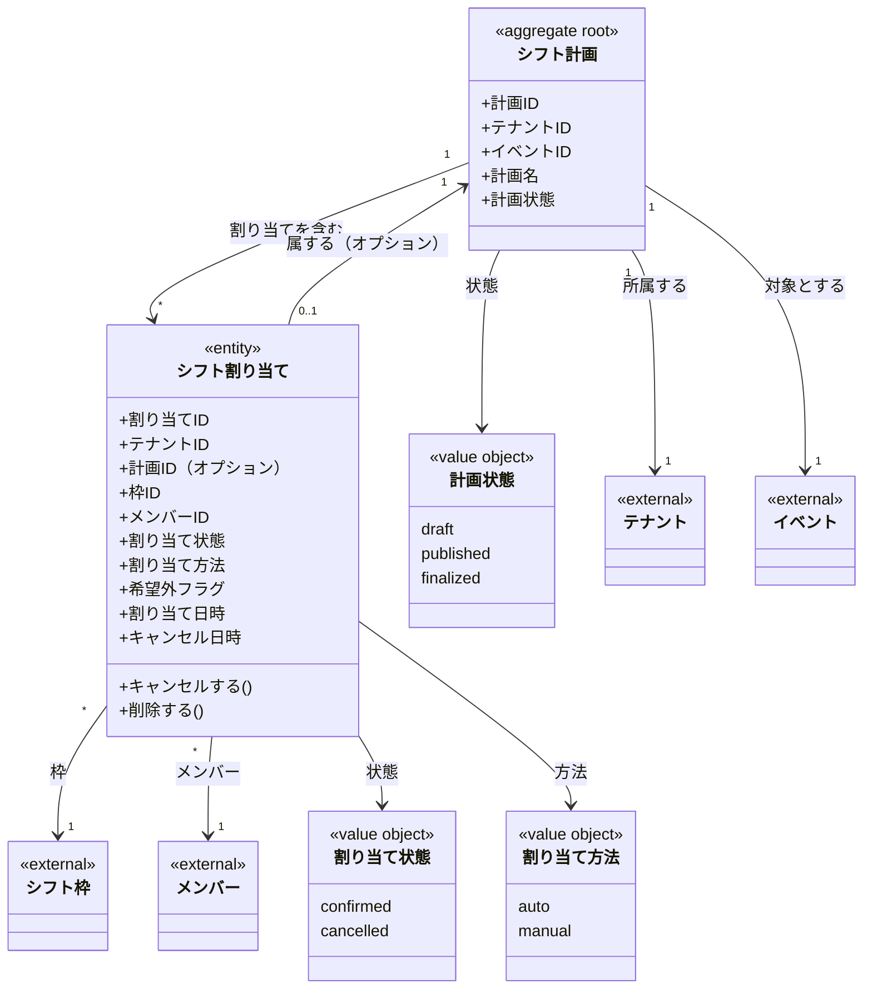

# シフト計画と割り当てドメインモデル

## 概要

シフト計画と割り当てドメインは、シフト枠へのメンバー配置を管理する。
シフト計画による一括管理と、計画を経由しない直接割り当ての両方をサポートする。
自動割当と手動調整の両方に対応し、希望外配置の記録も行う。

## 主要な概念

### シフト計画（ShiftPlan）（集約ルート）

イベントに対するシフト配置計画を表す集約ルート。
複数のシフト割り当てを束ね、計画の状態管理を行う。

**属性**:
- planID: ULID形式の一意識別子
- tenantID: 所属するテナントのID
- eventID: 対象イベントのID
- planName: 計画名（必須、1文字以上）
- planStatus: 計画状態（draft/published/finalized）
- createdAt: 作成日時
- updatedAt: 更新日時
- deletedAt: 削除日時（ソフトデリート）

### 計画状態（PlanStatus）（値オブジェクト）

シフト計画のライフサイクルを表す値オブジェクト。

| 状態 | 説明 |
|------|------|
| draft | 下書き。運営が調整中 |
| published | 公開。メンバーが確認可能 |
| finalized | 確定。最終決定済み |

### シフト割り当て（ShiftAssignment）（エンティティ）

シフト枠へのメンバー配置を表すエンティティ。
シフト計画に属することも、計画なしで直接割り当てることも可能。

**属性**:
- assignmentID: ULID形式の一意識別子
- tenantID: 所属するテナントのID
- planID: シフト計画のID（オプション、手動割り当ての場合NULL）
- slotID: シフト枠のID
- memberID: 割り当てられたメンバーのID
- assignmentStatus: 割り当て状態（confirmed/cancelled）
- assignmentMethod: 割り当て方法（auto/manual）
- isOutsidePreference: 希望外配置フラグ
- assignedAt: 割り当て日時
- cancelledAt: キャンセル日時（オプション）
- createdAt: 作成日時
- updatedAt: 更新日時
- deletedAt: 削除日時（ソフトデリート）

**ドメインメソッド**:
- `Cancel()`: 割り当てをキャンセル
- `Delete()`: 割り当てをソフトデリート
- `IsConfirmed()`: 確定済みかどうかを判定
- `IsCancelled()`: キャンセル済みかどうかを判定

## 値オブジェクト

### AssignmentStatus（割り当て状態）

シフト割り当ての状態を表す値オブジェクト。

| 状態 | 説明 |
|------|------|
| confirmed | 確定。有効な割り当て |
| cancelled | キャンセル。履歴として保持 |

### AssignmentMethod（割り当て方法）

シフト割り当ての生成方法を表す値オブジェクト。

| 方法 | 説明 |
|------|------|
| auto | 自動割当機能で生成 |
| manual | 運営が手動で追加 |

### IsOutsidePreference（希望外配置フラグ）

メンバーが希望を出していない枠への配置を表すフラグ。
希望外配置の場合に true となり、運営判断で配置を強行したことを記録する。

## ドメインモデル図



## シフト割り当てフロー

### 計画を使用する場合

```
1. シフト計画を作成（draft）
   ↓
2. 自動割当または手動で割り当てを追加
   ↓
3. 計画を公開（published）
   ↓
4. 計画を確定（finalized）
```

### 直接割り当ての場合

```
1. シフト枠を選択
   ↓
2. メンバーを割り当て（plan_id = NULL）
   ↓
3. 必要に応じてキャンセルまたは削除
```

## 割り当ての操作

### 割り当ての追加

```
1. シフト枠を選択
2. メンバーを選択
3. 割り当て方法を設定（auto/manual）
4. 希望外配置かどうかをチェック
5. 割り当てを作成（assignment_status = 'confirmed'）
```

### 割り当てのキャンセル

```
1. 既存の割り当てを取得
2. Cancel() メソッドを呼び出し
3. assignment_status = 'cancelled'、cancelled_at が設定される
4. 履歴として保持される
```

### 割り当ての削除

```
1. 既存の割り当てを取得
2. Delete() メソッドを呼び出し
3. deleted_at が設定される（ソフトデリート）
4. 検索結果から除外される
```

### キャンセルと削除の違い

| 操作 | 用途 | 履歴 |
|------|------|------|
| キャンセル | メンバーが出席できなくなった場合など | UIで表示可能、履歴として残る |
| 削除 | 誤って作成した割り当てを削除 | 検索から除外、履歴から除外 |

## 制約条件と業務ルール

### シフト計画制約

1. **計画の所属**: シフト計画は必ず1つのテナントと1つのイベントに属する
2. **計画名必須**: plan_name は必須、1文字以上
3. **計画状態**: draft → published → finalized の順で遷移

### シフト割り当て制約

1. **枠・メンバー必須**: slot_id と member_id は必須
2. **計画オプション**: plan_id は NULL 許可（手動直接割り当て対応）
3. **重複配置禁止**: 同一シフト枠×同一メンバーで有効な割り当て（confirmed）は1件のみ
4. **キャンセル整合性**: cancelled 状態の場合は cancelled_at が必須
5. **confirmed 整合性**: confirmed 状態の場合は cancelled_at は NULL

### テナント境界制約

1. **テナント分離**: シフト計画・シフト割り当ては必ず1つのテナントに属する
2. **参照整合性**: シフト枠とメンバーは同一テナント内でのみ参照可能

### 希望外配置の記録

1. **フラグの意味**: is_outside_preference = true は運営判断による希望外配置を示す
2. **追跡可能**: 希望外配置は後から検索・集計可能

### メンバー削除時の挙動

`fk_shift_assignments_member` に `ON DELETE RESTRICT` を設定しているため、
割り当てが存在するメンバーは削除できない。

