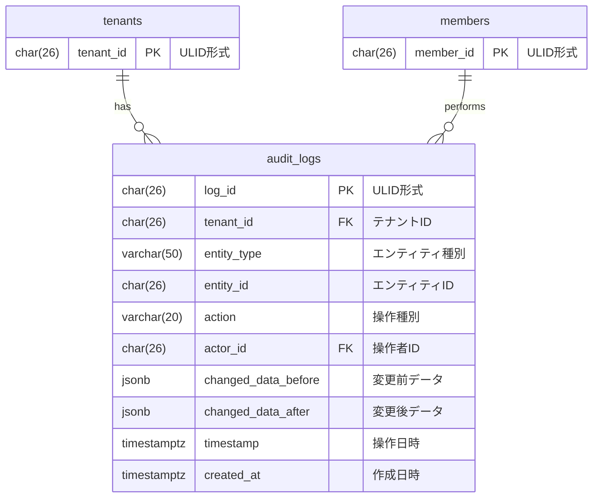

# 監査ログ データモデル

## 概要

監査ログドメインのデータベーススキーマを定義する。
エンティティに対する変更操作の履歴を記録し、追跡可能性を実現する。

## ER図



## テーブル定義

### audit_logs テーブル

エンティティの変更履歴を管理するテーブル。

| カラム名 | データ型 | NULL | デフォルト | 説明 |
|----------|----------|------|------------|------|
| log_id | CHAR(26) | NO | - | 主キー（ULID形式） |
| tenant_id | CHAR(26) | NO | - | テナントID（FK） |
| entity_type | VARCHAR(50) | NO | - | エンティティ種別 |
| entity_id | CHAR(26) | NO | - | 対象エンティティのID |
| action | VARCHAR(20) | NO | - | 操作種別（CREATE/UPDATE/DELETE） |
| actor_id | CHAR(26) | NO | - | 操作者メンバーID（FK） |
| changed_data_before | JSONB | YES | NULL | 変更前データ |
| changed_data_after | JSONB | YES | NULL | 変更後データ |
| timestamp | TIMESTAMPTZ | NO | CURRENT_TIMESTAMP | 操作日時 |
| created_at | TIMESTAMPTZ | NO | CURRENT_TIMESTAMP | 作成日時 |

**外部キー**:
- `fk_audit_logs_tenant`: `tenant_id` → `tenants(tenant_id)` ON DELETE CASCADE
- `fk_audit_logs_actor`: `actor_id` → `members(member_id)` ON DELETE RESTRICT

**制約**:
- `audit_logs_action_check`: `action IN ('CREATE', 'UPDATE', 'DELETE')`
- `audit_logs_entity_type_check`: `entity_type IN ('events', 'recurring_patterns', 'event_business_days', 'shift_slots', 'shift_plans', 'shift_assignments', 'members', 'positions', 'availabilities')`

**インデックス**:
- `idx_audit_logs_tenant_entity`: `(tenant_id, entity_type, entity_id, timestamp DESC)` - エンティティごとの変更履歴検索用
- `idx_audit_logs_tenant_actor`: `(tenant_id, actor_id, timestamp DESC)` - 操作者ごとの履歴検索用
- `idx_audit_logs_timestamp`: `(timestamp DESC)` - 時系列検索用
- `idx_audit_logs_tenant_action`: `(tenant_id, action, timestamp DESC)` - 特定アクション検索用

## マイグレーションファイル

- `006_create_audit_logs.up.sql`: audit_logs テーブル作成

## 備考

### 操作種別（action）について

| 操作 | 説明 | changed_data_before | changed_data_after |
|------|------|---------------------|-------------------|
| CREATE | 新規作成 | NULL | 作成されたデータ |
| UPDATE | 更新 | 変更前のデータ | 変更後のデータ |
| DELETE | 削除 | 削除前のデータ | NULL |

### エンティティ種別（entity_type）について

| 種別 | 説明 |
|------|------|
| events | イベント |
| recurring_patterns | 定期パターン |
| event_business_days | 営業日 |
| shift_slots | シフト枠 |
| shift_plans | シフト計画 |
| shift_assignments | シフト割り当て |
| members | メンバー |
| positions | ポジション |
| availabilities | 出勤可否（将来実装） |

### changed_data_before/after の例

**CREATE操作の場合**:
```json
// before: null
// after:
{
  "slot_id": "01ABCDEF...",
  "member_id": "01GHIJKL...",
  "assignment_status": "confirmed",
  "assignment_method": "manual"
}
```

**UPDATE操作の場合**:
```json
// before:
{
  "assignment_status": "confirmed",
  "cancelled_at": null
}
// after:
{
  "assignment_status": "cancelled",
  "cancelled_at": "2025-01-15T10:30:00Z"
}
```

**DELETE操作の場合**:
```json
// before:
{
  "slot_id": "01ABCDEF...",
  "member_id": "01GHIJKL...",
  "assignment_status": "confirmed"
}
// after: null
```

### イミュータブル設計について

監査ログは監査証跡として機能するため、以下の設計原則を採用している：

1. **削除不可**: `deleted_at` カラムを持たない（ソフトデリートも不可）
2. **更新不可**: アプリケーションレベルで更新を禁止
3. **挿入のみ**: INSERT操作のみが許可される

### 操作者削除時の挙動

`fk_audit_logs_actor` に `ON DELETE RESTRICT` を設定しているため、
操作履歴が存在するメンバーは削除できない。
これにより、監査証跡の整合性を保証している。

### テナント削除時の挙動

`fk_audit_logs_tenant` に `ON DELETE CASCADE` を設定しているため、
テナントが削除されると、関連する監査ログも自動的に削除される。
（テナント全体のデータ削除はGDPR対応などのケースを想定）

### MVP実装について

現在はMVP段階のため、重要操作（ShiftAssignment CREATE）のみを記録対象としている。
将来のバージョンで対象範囲を拡大予定。

### インデックス設計の意図

| インデックス | ユースケース |
|-------------|-------------|
| idx_audit_logs_tenant_entity | 「このシフト枠の変更履歴を見たい」 |
| idx_audit_logs_tenant_actor | 「この管理者が行った操作一覧を見たい」 |
| idx_audit_logs_timestamp | 「最近の操作一覧を見たい」 |
| idx_audit_logs_tenant_action | 「今日作成されたレコード一覧を見たい」 |
