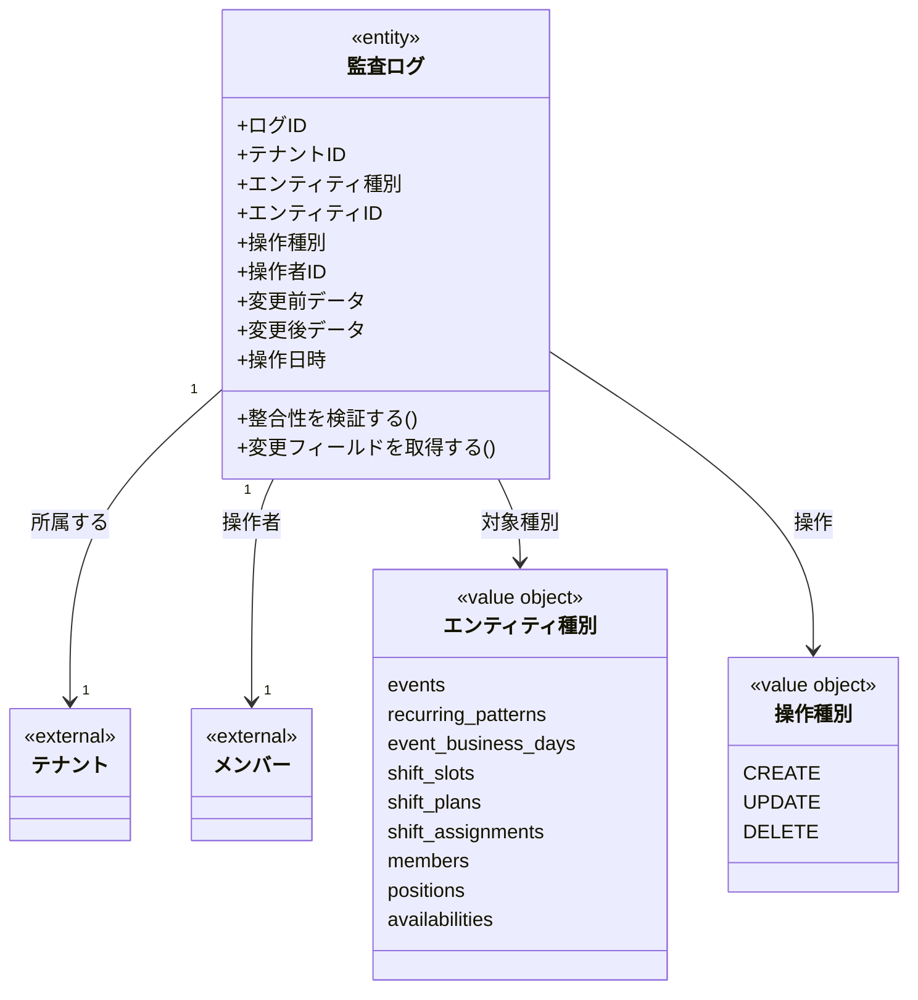

# 監査ログ ドメインモデル

## 概要

監査ログドメインは、システム内のエンティティに対する重要な操作履歴を管理する。
「誰が」「いつ」「何を」「どのように」変更したかを追跡可能にし、問題調査やセキュリティ監査を支援する。

## 主要な概念

### 監査ログ（AuditLog）（エンティティ）

エンティティに対する変更操作を記録するログエントリ。
一度作成されたら変更・削除されないイミュータブルなレコード。

**属性**:
- logID: ULID形式の一意識別子
- tenantID: 所属するテナントのID
- entityType: 操作対象のエンティティ種別
- entityID: 操作対象のエンティティID
- action: 操作種別（CREATE/UPDATE/DELETE）
- actorID: 操作者のメンバーID
- changedDataBefore: 変更前のデータ（JSONB）
- changedDataAfter: 変更後のデータ（JSONB）
- timestamp: 操作日時
- createdAt: レコード作成日時

**ドメインメソッド**:
- `IsValid()`: 監査ログの整合性を検証
- `GetChangedFields()`: 変更されたフィールドの一覧を取得

## 値オブジェクト

### EntityType（エンティティ種別）

監査対象となるエンティティの種別を表す値オブジェクト。

| 種別 | 説明 |
|------|------|
| events | イベント |
| recurring_patterns | 定期パターン |
| event_business_days | 営業日 |
| shift_slots | シフト枠 |
| shift_plans | シフト計画 |
| shift_assignments | シフト割り当て |
| members | メンバー |
| positions | ポジション |
| availabilities | 出勤可否（将来実装） |

### Action（操作種別）

操作の種類を表す値オブジェクト。

| 操作 | 説明 | before | after |
|------|------|--------|-------|
| CREATE | 新規作成 | NULL | 作成データ |
| UPDATE | 更新 | 変更前データ | 変更後データ |
| DELETE | 削除 | 削除前データ | NULL |

## ドメインモデル図



## 監査ログ記録フロー

```
1. エンティティに対する操作が発生
   ↓
2. 操作者情報（actor_id）を取得
   ↓
3. 変更前データを取得（UPDATE/DELETEの場合）
   ↓
4. 操作を実行
   ↓
5. 変更後データを取得（CREATE/UPDATEの場合）
   ↓
6. 監査ログを作成・保存
```

## 検索ユースケース

### エンティティの変更履歴検索

```
1. entity_type と entity_id を指定
2. タイムスタンプ降順でログを取得
3. 各変更の詳細を表示
```

### 操作者の活動履歴検索

```
1. actor_id を指定
2. タイムスタンプ降順でログを取得
3. 操作者のすべての活動を表示
```

### 特定操作の検索

```
1. action（CREATE/UPDATE/DELETE）を指定
2. 期間でフィルタリング
3. 該当する操作ログを取得
```

## 制約条件と業務ルール

### イミュータブル制約

1. **変更禁止**: 監査ログは一度作成されたら変更不可
2. **削除禁止**: 監査ログは削除不可（物理削除もソフトデリートもなし）
3. **タイムスタンプ自動記録**: timestamp は自動的に記録される

### データ整合性制約

1. **操作者必須**: actor_id は必須（すべての操作に操作者が必要）
2. **操作者検証**: actor_id は有効なメンバーIDでなければならない
3. **変更データ整合性**:
   - CREATE: changed_data_before = NULL、changed_data_after = 必須
   - UPDATE: changed_data_before = 必須、changed_data_after = 必須
   - DELETE: changed_data_before = 必須、changed_data_after = NULL

### テナント境界制約

1. **テナント分離**: 監査ログは必ず1つのテナントに属する
2. **参照整合性**: 操作者（actor_id）は同一テナント内のメンバー

### 削除時の挙動

- `fk_audit_logs_actor` に `ON DELETE RESTRICT` を設定
- 操作履歴が存在するメンバーは削除できない（監査証跡の保全）

## MVP実装について

現在はMVP段階のため、以下の重要操作のみを記録対象としている：

- **ShiftAssignment CREATE**: シフト割り当ての新規作成

将来のバージョンで、以下を追加予定：

- ShiftAssignment UPDATE/DELETE
- ShiftSlot CREATE/UPDATE/DELETE
- Member CREATE/UPDATE/DELETE
- その他のエンティティ操作
