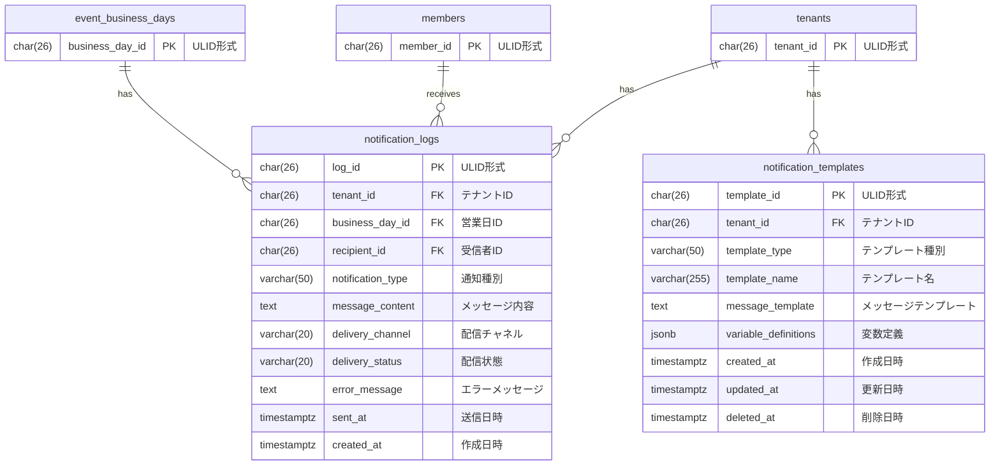

# 通知とリマインド データモデル

## 概要

通知とリマインドドメインのデータベーススキーマを定義する。
通知テンプレートの管理と、通知送信履歴の記録を実現する。

## ER図



## テーブル定義

### notification_templates テーブル

通知メッセージのテンプレートを管理するテーブル。

| カラム名 | データ型 | NULL | デフォルト | 説明 |
|----------|----------|------|------------|------|
| template_id | CHAR(26) | NO | - | 主キー（ULID形式） |
| tenant_id | CHAR(26) | NO | - | テナントID（FK） |
| template_type | VARCHAR(50) | NO | - | テンプレート種別 |
| template_name | VARCHAR(255) | NO | - | テンプレート名 |
| message_template | TEXT | NO | - | メッセージテンプレート |
| variable_definitions | JSONB | NO | '{}' | 変数定義 |
| created_at | TIMESTAMPTZ | NO | CURRENT_TIMESTAMP | 作成日時 |
| updated_at | TIMESTAMPTZ | NO | CURRENT_TIMESTAMP | 更新日時 |
| deleted_at | TIMESTAMPTZ | YES | NULL | 削除日時（ソフトデリート） |

**外部キー**:
- `fk_notification_templates_tenant`: `tenant_id` → `tenants(tenant_id)` ON DELETE CASCADE

**制約**:
- `notification_templates_type_check`: `template_type IN ('shift_recruitment', 'deadline_reminder', 'shift_confirmed', 'attendance_reminder', 'urgent_help')`
- `notification_templates_name_check`: `LENGTH(template_name) >= 1`

**インデックス**:
- `idx_notification_templates_tenant_type_unique`: `UNIQUE (tenant_id, template_type) WHERE deleted_at IS NULL`

### notification_logs テーブル

通知送信履歴を管理するテーブル。

| カラム名 | データ型 | NULL | デフォルト | 説明 |
|----------|----------|------|------------|------|
| log_id | CHAR(26) | NO | - | 主キー（ULID形式） |
| tenant_id | CHAR(26) | NO | - | テナントID（FK） |
| business_day_id | CHAR(26) | YES | NULL | 営業日ID（FK、営業日関連の場合のみ） |
| recipient_id | CHAR(26) | NO | - | 受信者メンバーID（FK） |
| notification_type | VARCHAR(50) | NO | - | 通知種別 |
| message_content | TEXT | NO | - | 送信メッセージ内容 |
| delivery_channel | VARCHAR(20) | NO | - | 配信チャネル（Discord/Email/WebPush） |
| delivery_status | VARCHAR(20) | NO | 'pending' | 配信状態（success/failed/pending） |
| error_message | TEXT | YES | NULL | エラーメッセージ（失敗時） |
| sent_at | TIMESTAMPTZ | YES | NULL | 送信日時 |
| created_at | TIMESTAMPTZ | NO | CURRENT_TIMESTAMP | 作成日時 |

**外部キー**:
- `fk_notification_logs_tenant`: `tenant_id` → `tenants(tenant_id)` ON DELETE CASCADE
- `fk_notification_logs_business_day`: `business_day_id` → `event_business_days(business_day_id)` ON DELETE SET NULL
- `fk_notification_logs_recipient`: `recipient_id` → `members(member_id)` ON DELETE CASCADE

**制約**:
- `notification_logs_type_check`: `notification_type IN ('shift_recruitment', 'deadline_reminder', 'shift_confirmed', 'attendance_reminder', 'urgent_help')`
- `notification_logs_channel_check`: `delivery_channel IN ('Discord', 'Email', 'WebPush')`
- `notification_logs_status_check`: `delivery_status IN ('success', 'failed', 'pending')`
- `notification_logs_sent_consistency`: `(delivery_status IN ('success', 'failed') AND sent_at IS NOT NULL) OR (delivery_status = 'pending' AND sent_at IS NULL)`

**インデックス**:
- `idx_notification_logs_recipient_sent_at`: `(recipient_id, sent_at DESC) WHERE sent_at IS NOT NULL`
- `idx_notification_logs_tenant_business_day_type`: `(tenant_id, business_day_id, notification_type) WHERE business_day_id IS NOT NULL`
- `idx_notification_logs_tenant_type_sent`: `(tenant_id, notification_type, sent_at DESC)`

## マイグレーションファイル

- `005_create_notification_tables.up.sql`: notification_logs, notification_templates テーブル作成

## 備考

### 通知種別（notification_type）について

| 種別 | 説明 |
|------|------|
| shift_recruitment | シフト募集開始通知 |
| deadline_reminder | 締切リマインダー |
| shift_confirmed | シフト確定通知 |
| attendance_reminder | 出勤リマインダー |
| urgent_help | 緊急ヘルプ要請 |

### 配信チャネル（delivery_channel）について

| チャネル | 説明 |
|----------|------|
| Discord | Discord Webhook経由 |
| Email | メール送信 |
| WebPush | Webプッシュ通知 |

### 配信状態（delivery_status）について

| 状態 | 説明 |
|------|------|
| pending | 送信待ち |
| success | 送信成功 |
| failed | 送信失敗（error_message に詳細） |

### 送信日時の整合性

`notification_logs_sent_consistency` 制約により:
- `success` または `failed` の場合は `sent_at` が必須
- `pending` の場合は `sent_at` は NULL

### 変数定義（variable_definitions）の例

```json
{
  "member_name": {"type": "string", "description": "メンバー名"},
  "shift_date": {"type": "date", "description": "シフト日"},
  "shift_time": {"type": "string", "description": "シフト時刻"}
}
```

### MVP実装について

現在はMVP段階のため、テーブルは作成されているが、実際の利用は最小限（ログ出力stub）。
本格的な通知機能は将来のバージョンで実装予定。

### 通知頻度制御について

通知頻度の制御は `idx_notification_logs_recipient_sent_at` インデックスを使用して、
「過去N分以内に同一受信者への通知が何件あるか」を高速にカウントする。
上限回数を超えた通知は送信をスキップする（アプリケーションロジックで制御）。
