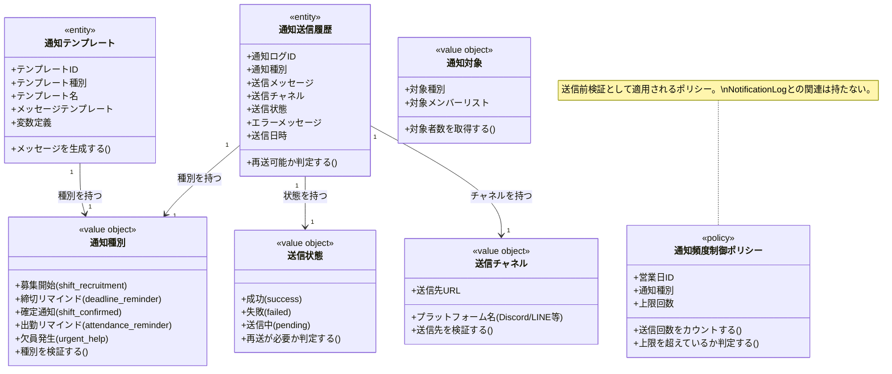

# 通知とリマインドドメインモデル

## 概要

通知とリマインドドメインは、シフトに関する情報をメンバーに伝えるための通知メッセージの生成・送信・履歴管理を担う。
シフト募集・締切・確定・出勤リマインド・欠員発生など、各通知種別に応じた適切な対象者とタイミングで通知を送信し、運営からメンバーへの情報共有を実現する責務を持つ。
通知頻度の制御と送信履歴の記録により、過度な通知の防止と問題発生時の追跡を可能にする。

## 主要な概念

### 通知テンプレート（Notification Template）（エンティティ）

通知メッセージのテンプレートを表すエンティティ。
テンプレート種別（募集開始/締切リマインド/確定通知/出勤リマインド/欠員発生）・テンプレート名・メッセージテンプレート・変数定義を保持し、通知メッセージの生成元として機能する。

### 通知送信履歴（Notification Log）（エンティティ）

送信された通知の履歴を表すエンティティ。
送信対象メンバー・営業日（該当する場合）・通知種別・送信メッセージ・送信チャネル・送信状態（成功/失敗/送信中）・送信日時を保持し、「誰にいつ何を通知したか」を追跡可能にする。

### 通知種別（Notification Type）（区分オブジェクト）

通知の目的を表す区分オブジェクト。
募集開始（shift_recruitment）・締切リマインド（deadline_reminder）・確定通知（shift_confirmed）・出勤リマインド（attendance_reminder）・欠員発生（urgent_help）を識別し、通知対象の判定とメッセージ生成の分岐を決定する種別を示す。
実際の対象者検索とメッセージ生成ロジックはドメインサービス側で実装される。

### 送信状態（Delivery Status）（区分オブジェクト）

通知送信の結果を表す区分オブジェクト。
成功（success）・失敗（failed）・送信中（pending）を識別し、再送の必要性を判定する基準となる。

### 送信チャネル（Delivery Channel）（値オブジェクト）

通知を送信するチャネルを表す値オブジェクト。
Discord・LINE・Twitterなどのプラットフォームを識別し、送信先の決定に使用される。

### 通知対象（Notification Target）（値オブジェクト）

通知を受け取る対象のグループを表す値オブジェクト。
テナント全員・特定イベントのキャストのみ・確定シフトに入っているメンバーのみ・補欠待機メンバーのみを識別し、送信対象の特定に使用される。

## 通知種別の詳細

### 1. シフト募集開始（Shift Recruitment）

- **対象**: 応募資格を持つメンバー全員（在籍中のキャスト・スタッフ）
- **タイミング**: 希望期間を「募集開始」状態にした時
- **例**: 「【シフト募集開始】12月通常営業分のシフト募集を開始しました。提出期限: 2025-11-29 23:59」

### 2. シフト提出締切リマインド（Deadline Reminder）

- **対象**: シフト希望を未提出のメンバー
- **タイミング**: 提出期限の数日前／当日
- **例**: 「【締切リマインド】12月通常営業分のシフト提出期限は本日23:59です。」

### 3. シフト確定通知（Shift Confirmed）

- **対象**: 確定シフトに配置されたメンバー
- **タイミング**: シフトが確定状態になった時
- **例**: 「【シフト確定】2025-11-13のシフトが確定しました: カウンターA 21:30-23:00」

### 4. 営業日前リマインド（Attendance Reminder）

- **対象**: 確定シフトに配置されたメンバー
- **タイミング**: 営業日の前日／当日数時間前
- **例**: 「【リマインド】明日2025-11-13 21:30からの営業があります。ご確認ください。」

### 5. 欠員発生通知（Urgent Help）

- **対象**: 補欠・待機メンバーまたは応募対象者全員
- **タイミング**: シフト割り当てがキャンセルされた時
- **例**: 「【緊急募集】2025-11-13 カウンターA 21:30-23:00 に欠員が発生しました。ヘルプ募集中です。」

## 送信状態の詳細

### 1. 成功（Success）

- **対象**: 通知が正常に送信された状態
- **特徴**: 再送の必要はない
- **例**: Discord APIが正常にメッセージを送信し、200 OKを返した場合

### 2. 失敗（Failed）

- **対象**: 通知の送信が失敗した状態
- **特徴**: エラーメッセージが記録され、手動または自動で再送が必要
- **例**: Discord APIがエラーを返した場合（Invalid webhook URL、Rate limit exceeded など）

### 3. 送信中（Pending）

- **対象**: 通知の送信処理が進行中の状態
- **特徴**: 送信完了後に成功または失敗に遷移する
- **例**: 非同期送信処理をキューに登録し、まだ送信が完了していない場合

## 通知対象の判定ルール

### テナント全員

```
対象: テナントに所属する全メンバー
条件:
- メンバー状態が「在籍中」であること
- ロールは問わない

例: シフト募集開始通知（全員に知らせる必要がある場合）
```

### 特定イベントのキャストのみ

```
対象: 特定イベントに関連するキャストロールを持つメンバー
条件:
- メンバー状態が「在籍中」であること
- ロールが「キャスト」であること
- 対象イベントに関連すること（明示的な紐づけまたは過去の配置実績）

例: シフト募集開始通知（特定イベント限定の募集）
```

### 確定シフトに入っているメンバーのみ

```
対象: 特定営業日の確定シフトに配置されているメンバー
条件:
- 対象営業日のシフト確定が「確定」状態であること
- シフト割り当てが「確定」状態であること

例: シフト確定通知、出勤リマインド
```

### 補欠・待機メンバーのみ

```
対象: 希望を出したが配置されなかったメンバー
条件:
- 対象営業日にシフト希望を提出していること
- 確定シフトに配置されていないこと
- メンバー状態が「在籍中」であること

例: 欠員発生通知（補欠募集）
```

## 通知頻度制御ポリシー

通知頻度制御は、過度な通知を防ぐためのドメインポリシーとして実装される。
FrequencyControlは「通知ログが従うべきルール」であり、通知ログ自身が頻度制御ポリシーを所有するのではなく、通知送信時にこのポリシーがドメインサービス側で適用される。

### 頻度制御のルール

```
制御単位: 同一営業日 × 同一通知種別
上限回数: 2回（運営で設定可能）

カウント方法:
- notification_logs の business_day_id と notification_type で集計
- sent_at が直近N日以内のレコードをカウント

判定:
- カウント >= 上限回数: 送信をスキップ
- カウント < 上限回数: 送信を実行

実装方針:
- FrequencyControl はドメインサービスまたはポリシーオブジェクトとして実装
- NotificationLog との関連は持たず、送信前の検証として機能
```

### 頻度制御の具体例

```
【ケース1: 2回目のリマインドは送信される】
- 営業日: 2025-11-13
- 通知種別: attendance_reminder
- 既存送信: 1回（前日リマインド）
- 新規送信: 2回目（当日リマインド） → 送信される

【ケース2: 3回目のリマインドは送信されない】
- 営業日: 2025-11-13
- 通知種別: attendance_reminder
- 既存送信: 2回（前日リマインド、当日午前リマインド）
- 新規送信: 3回目（当日午後リマインド） → スキップされる

理由: 同一営業日×同一通知種別の上限（2回）に達している
```

## 通知メッセージの生成フロー

### テンプレートベースの生成

```
1. 通知トリガー発生
   - 例: シフトが確定状態に変更された

2. 通知種別の決定
   - 例: shift_confirmed

3. テンプレート取得
   - tenant_id と template_type でテンプレートを検索
   - 例: 「【シフト確定】{{business_date}}のシフトが確定しました: {{position_name}} {{start_time}}-{{end_time}}」

4. 変数の置き換え
   - business_date: 2025-11-13
   - position_name: カウンターA
   - start_time: 21:30
   - end_time: 23:00

5. 最終メッセージ生成
   - 例: 「【シフト確定】2025-11-13のシフトが確定しました: カウンターA 21:30-23:00」
```

## 通知送信履歴の記録フロー

### 送信成功時

```
1. 通知送信実行
   - Discord APIにメッセージを送信

2. 送信結果取得
   - Discord APIが200 OKを返す

3. 送信履歴記録
   - notification_logs に以下を記録:
     - member_id: 送信先メンバーID
     - notification_type: shift_confirmed
     - message_content: 送信したメッセージ
     - delivery_channel: Discord
     - delivery_status: success
     - sent_at: 送信日時
```

### 送信失敗時

```
1. 通知送信実行
   - Discord APIにメッセージを送信

2. 送信結果取得
   - Discord APIがエラーを返す（例: 400 Bad Request）

3. 送信履歴記録（失敗）
   - notification_logs に以下を記録:
     - member_id: 送信先メンバーID
     - notification_type: shift_confirmed
     - message_content: 送信しようとしたメッセージ
     - delivery_channel: Discord
     - delivery_status: failed
     - error_message: Discord API error: Invalid webhook URL
     - sent_at: 送信試行日時

4. 再送処理（手動または自動）
   - 運営が送信履歴を確認し、手動で再送
   - または、バッチ処理で自動再送
```

## ドメインモデル図



## 制約条件と業務ルール

### 通知テンプレート制約

1. **テンプレートの所属**: 通知テンプレートは必ず1つのテナントに属する
2. **テンプレート種別の一意性**: 同一テナント内で同じテンプレート種別の通知テンプレートは1件のみ存在する
3. **変数定義の妥当性**: メッセージテンプレート内の変数は、変数定義（JSON）で定義されたものと一致しなければならない

### 通知送信履歴制約

1. **送信履歴の所属**: 通知送信履歴は必ず1つのテナントと1つのメンバーに属する
2. **営業日の関連**: 営業日に関連する通知の場合、business_day_idは必須
3. **送信日時の記録**: 送信日時は必ず記録され、送信履歴の追跡に使用される
4. **失敗時のエラーメッセージ**: 送信状態が「失敗」の場合、エラーメッセージは必須

### 通知対象制約

1. **在籍中メンバー限定**: 通知対象は在籍中（member_status = 'active'）のメンバーのみ
2. **休止中・退店メンバー除外**: 休止中・退店のメンバーには通知を送信しない
3. **対象者0人の扱い**: 通知対象が0人の場合、通知処理は正常終了するが実際の送信は行わない

### 通知頻度制約

1. **頻度制御の単位**: 通知頻度は「同一営業日 × 同一通知種別」ごとにカウントする
2. **上限回数の遵守**: 上限回数を超えた通知は送信をスキップする
3. **スキップ理由の記録**: 頻度上限によりスキップされた場合、その理由をログに記録する

### 送信チャネル制約

1. **チャネル設定の必須性**: 通知を送信するには、対象チャネルの設定（APIキー、Webhook URLなど）が事前に登録されている必要がある
2. **チャネル別の送信ロジック**: 各チャネル（Discord、LINEなど）に応じた送信ロジックを実装する
3. **送信先の検証**: 送信先URLの妥当性を事前に検証する

### 再送制約

1. **失敗時の再送**: 送信状態が「失敗」の場合、手動または自動で再送が可能
2. **再送回数の制限**: 自動再送は最大3回までなど、再送回数に上限を設ける
3. **再送履歴の記録**: 再送の際も新しい送信履歴として記録される

### テナント境界制約

1. **テナント分離**: 通知テンプレート・通知送信履歴は必ず1つのテナントに属し、テナント間でのデータ参照・変更は禁止される
2. **一貫性の保証**: 通知送信履歴→メンバー、通知送信履歴→営業日の参照は同一テナント内でのみ許可される

