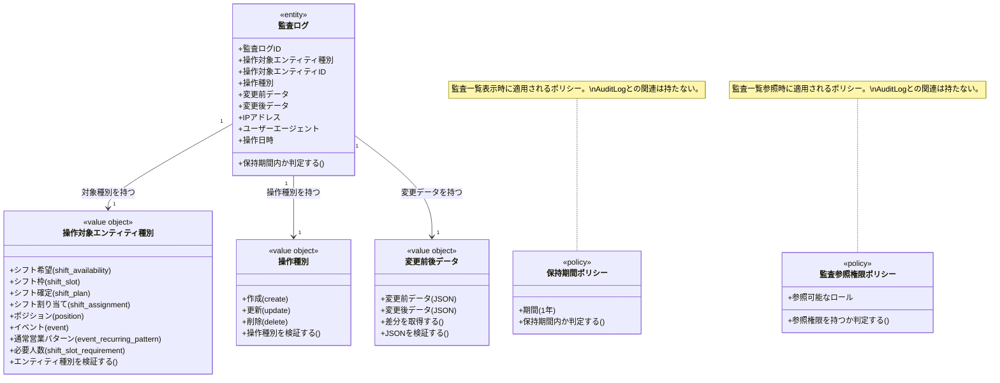

# 監査と履歴ドメインモデル

## 概要

監査と履歴ドメインは、シフト管理における重要な操作（シフト希望の提出・修正、シフト確定の変更、設定変更など）の履歴を記録し、後から経緯を確認できるようにする。
「誰がいつ何を操作したか」を追跡可能にすることで、トラブル発生時の問題切り分けと説明責任を果たす責務を持つ。
運営ロール（店長・副店長）のみが詳細な監査情報を参照でき、保持期間（1年）を過ぎたログはアーカイブまたは削除される。

## 主要な概念

### 監査ログ（Audit Log）（エンティティ）

シフト管理における重要な操作を記録するエンティティ。
操作日時・操作ユーザー・操作対象エンティティ（種別とID）・操作種別（作成/更新/削除）・変更前後のデータ（JSON形式）を保持し、操作履歴の追跡を可能にする。

### 操作対象エンティティ種別（Entity Type）（区分オブジェクト）

監査ログの対象となる業務オブジェクトの種別を表す区分オブジェクト。
シフト希望（shift_availability）・シフト枠（shift_slot）・シフト確定（shift_plan）・シフト割り当て（shift_assignment）・ポジション（position）・イベント（event）などを識別し、監査対象の分類を決定する。

### 操作種別（Action Type）（区分オブジェクト）

監査ログの操作内容を表す区分オブジェクト。
作成（create）・更新（update）・削除（delete）を識別し、操作の性質を示す。

### 変更前後データ（Change Data）（値オブジェクト）

操作によって変更されたデータを表す値オブジェクト。
変更前データ（before_data）と変更後データ（after_data）をJSON形式で保持し、何がどう変わったかを記録する。

### 保持期間ポリシー（Retention Period Policy）（ポリシー）

監査ログを保持する期間を定めるドメインポリシー。
現時点では1年と設定され（PdM確認済み）、期限を過ぎたログは参照対象から除外される。
監査ログ自身が保持期間を所有するのではなく、監査一覧機能の実装側で適用される。

## 操作対象エンティティ種別の詳細

### 1. シフト希望（Shift Availability）

- **対象**: メンバーが提出したシフト希望
- **記録される操作**: 新規作成、修正、削除（取下げ）
- **例**: ボブが12月5日のシフト希望を提出した

### 2. シフト枠（Shift Slot）

- **対象**: 営業日のシフト枠
- **記録される操作**: シフト枠の追加、削除、必要人数の変更
- **例**: 店長がカウンターAの必要人数を1人から2人に変更した

### 3. シフト確定（Shift Plan）

- **対象**: シフト確定の状態
- **記録される操作**: 草案から確定への状態変更、確定からキャンセルへの変更
- **例**: 店長が2025-11-13のシフトを確定状態に変更した

### 4. シフト割り当て（Shift Assignment）

- **対象**: 各枠への具体的なメンバー配置
- **記録される操作**: メンバーの配置、変更、削除（キャンセル）
- **例**: 店長がカウンターAのボブをチャーリーに変更した

### 5. ポジション（Position）

- **対象**: イベントのポジション定義
- **記録される操作**: ポジションの追加、変更、削除
- **例**: 店長が特別営業用に「司会」ポジションを追加した

### 6. イベント（Event）

- **対象**: イベントの基本情報
- **記録される操作**: イベント名の変更、説明の変更
- **例**: 店長がイベント名を「シトロンヴェール」から「シトロンヴェール Ver.2」に変更した

### 7. 通常営業パターン（Event Recurring Pattern）

- **対象**: 通常営業の反復パターン
- **記録される操作**: 曜日・時間帯の変更
- **例**: 店長が通常営業の時間帯を21:30-23:00から21:00-23:30に変更した

### 8. シフト枠必要人数（Shift Slot Requirement）

- **対象**: シフト枠の必要人数設定
- **記録される操作**: 必要人数の変更
- **例**: 店長がカウンターAの必要人数を1人から2人に変更した

## 操作種別の詳細

### 1. 作成（Create）

- **対象**: 新しいエンティティの作成操作
- **特徴**: before_data は空オブジェクト `{}`
- **例**: ボブがシフト希望を新規提出した

### 2. 更新（Update）

- **対象**: 既存エンティティの変更操作
- **特徴**: before_data と after_data の両方が記録される
- **例**: 店長がシフト確定を草案から確定に変更した

### 3. 削除（Delete）

- **対象**: エンティティの削除操作
- **特徴**: after_data は削除状態を表すデータ（例: `{"deleted": true}`）
- **例**: 店長がポジション「司会」を削除した

## 変更前後データの記録例

### シフト確定の状態変更

```json
{
  "before_data": {
    "plan_status": "draft"
  },
  "after_data": {
    "plan_status": "confirmed",
    "confirmed_at": "2025-11-10 15:30:00"
  }
}
```

### シフト割り当ての変更

```json
{
  "before_data": {
    "member_id": "018f1234-0000-0000-0000-0000000000A2",
    "assignment_status": "confirmed"
  },
  "after_data": {
    "member_id": "018f1234-0000-0000-0000-0000000000A3",
    "assignment_status": "confirmed"
  }
}
```

### シフト希望の新規作成

```json
{
  "before_data": {},
  "after_data": {
    "business_day_id": "018f1234-0000-0000-0000-000000000020",
    "availability_status": "submitted",
    "submitted_at": "2025-11-28 15:00:00"
  }
}
```

## 監査ログの記録フロー

### シフト確定操作の監査

```
1. ユーザー操作
   - 店長が2025-11-13のシフトを「確定」状態に変更

2. 操作前の状態取得
   - plan_status: "draft"

3. 操作実行
   - plan_status を "confirmed" に更新
   - confirmed_at を記録

4. 監査ログ記録
   - actor_member_id: 店長のメンバーID
   - entity_type: "shift_plan"
   - entity_id: シフト確定ID
   - action_type: "update"
   - before_data: {"plan_status": "draft"}
   - after_data: {"plan_status": "confirmed", "confirmed_at": "2025-11-10 15:30:00"}
   - occurred_at: 操作日時
```

### シフト割り当て変更の監査

```
1. ユーザー操作
   - 店長がカウンターAのボブをチャーリーに変更

2. 既存割り当てのキャンセル
   - 監査ログ記録（削除操作）
     - action_type: "update"
     - before_data: {"member_id": "ボブ", "assignment_status": "confirmed"}
     - after_data: {"assignment_status": "cancelled"}

3. 新しい割り当ての作成
   - 監査ログ記録（作成操作）
     - action_type: "create"
     - before_data: {}
     - after_data: {"member_id": "チャーリー", "assignment_status": "confirmed"}
```

## 保持期間の管理

### 保持期間の設定

```
保持期間: 1年（PdM確認済み）
基準日: occurred_at（操作日時）

判定:
- occurred_at が現在日時から1年以内: 参照対象
- occurred_at が現在日時から1年以前: 参照対象外（アーカイブまたは削除）
```

### 保持期間外ログの扱い

```
【ケース1: 参照時に保持期間をチェック】
- 監査ログ一覧を表示する際、occurred_at >= (現在日時 - 1年) のログのみを抽出
- 保持期間外のログは一覧に表示されない

【ケース2: 定期的なアーカイブ処理】
- 毎月1回、occurred_at が1年以前のログを別テーブルにアーカイブ
- アーカイブ後、元のテーブルからは削除

【ケース3: 物理削除】
- 運営方針により、アーカイブせずに物理削除する場合もある
```

## 監査一覧機能のポリシー

監査ログの参照権限と保持期間は、監査ログエンティティ自身が保持するのではなく、監査一覧機能のポリシーとして実装される。
これらは「誰がどの範囲の監査ログを見られるか」を制御するドメインポリシーである。

### 監査参照権限ポリシー（Audit Permission Policy）

#### 権限レベル

```
【運営ロール（店長・副店長）】
- 詳細な監査ログを全て参照可能
- 操作ユーザー、変更内容の詳細、IPアドレス、ユーザーエージェントなどを確認可能

【一般キャスト・スタッフ】
- 監査ログの詳細情報を参照不可
- 「参照権限がありません」エラーが表示される
- または、監査ログ機能自体へのアクセスが制限される
```

#### 参照権限チェックのフロー

```
1. ユーザーが監査ログ一覧画面にアクセス

2. ロールチェック
   - ユーザーのロールを取得
   - 店長または副店長か判定

3. 権限判定
   - 店長または副店長: 監査ログ一覧を表示
   - それ以外: 「参照権限がありません」エラーを表示
```

### 保持期間ポリシー（Retention Period Policy）

監査ログ一覧の表示時に、保持期間ポリシーが適用される。

## ドメインモデル図



## 制約条件と業務ルール

### 監査ログ制約

1. **監査ログの所属**: 監査ログは必ず1つのテナントと1つの操作ユーザー（メンバー）に属する
2. **操作日時の記録**: 操作日時（occurred_at）は必ず記録される
3. **操作ユーザーの記録**: 操作を行ったメンバー（actor_member_id）は必ず記録される
4. **操作対象の記録**: 操作対象エンティティの種別（entity_type）とID（entity_id）は必ず記録される

### 操作対象エンティティ制約

1. **エンティティ種別の妥当性**: entity_type は定義された種別（shift_availability、shift_slot、shift_planなど）のいずれかでなければならない
2. **エンティティIDの存在性**: entity_id が指すエンティティは、記録時点で存在する必要がある（ただし、削除操作後は存在しなくてもよい）

### 変更前後データ制約

1. **JSON形式の妥当性**: before_data と after_data は有効なJSON形式でなければならない
2. **作成操作のbefore_data**: 作成操作の場合、before_data は空オブジェクト `{}` でなければならない
3. **削除操作のafter_data**: 削除操作の場合、after_data は削除状態を表すデータ（例: `{"deleted": true}`）でなければならない
4. **更新操作の差分**: 更新操作の場合、before_data と after_data は異なる内容でなければならない

### 保持期間制約

1. **保持期間の定義**: 監査ログの保持期間は1年とする（PdM確認済み）
2. **保持期間の基準**: 保持期間は occurred_at を基準に判定する
3. **保持期間外の扱い**: occurred_at が現在日時から1年以前のログは参照対象から除外される
4. **アーカイブまたは削除**: 保持期間を過ぎたログは、運営方針に応じてアーカイブまたは削除される

### 監査参照権限制約

1. **運営ロール限定**: 監査ログの詳細情報は、運営ロール（店長・副店長）のみが参照できる
2. **一般キャスト除外**: 一般キャスト・スタッフは監査ログの詳細情報を参照できない
3. **権限チェックの実施**: 監査ログ参照時、必ずロールベースの権限チェックを実施する

### 監査対象操作の範囲

1. **シフト希望関連**: シフト希望の新規作成、修正、削除（取下げ）は必ず記録される
2. **シフト確定関連**: シフト確定の状態変更（草案→確定、確定→キャンセル）は必ず記録される
3. **シフト割り当て関連**: シフト割り当ての追加、変更、削除（キャンセル）は必ず記録される
4. **設定変更関連**: イベント設定、ポジション設定、営業枠テンプレートの変更は必ず記録される

### テナント境界制約

1. **テナント分離**: 監査ログは必ず1つのテナントに属し、テナント間でのデータ参照・変更は禁止される
2. **一貫性の保証**: 監査ログ→操作ユーザー（メンバー）の参照は同一テナント内でのみ許可される

### IPアドレス・ユーザーエージェントの記録

1. **任意項目**: IPアドレスとユーザーエージェントは任意項目（NULL可）
2. **記録推奨**: セキュリティ上、記録することが推奨される
3. **プライバシー考慮**: 記録する場合、プライバシーポリシーに従う

